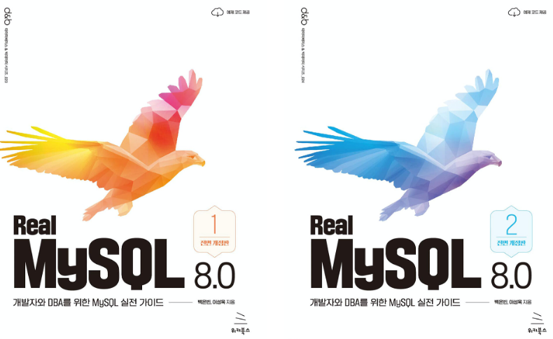

# Real MySQL

## 개요
- 참여자: 김정용, 조용현
- 목적: Real MySQL 8.0 정리 및 공유

## 파일 작성
- root에 해당 챕터에 해당하는 directory 생성 **(chapter_1)**
- 챕터 directory 내부에 README.md 생성하여 markdown으로 내용 작성
- 챕터 directory 내부에 **images** directory 생성하여 이미지 저장

