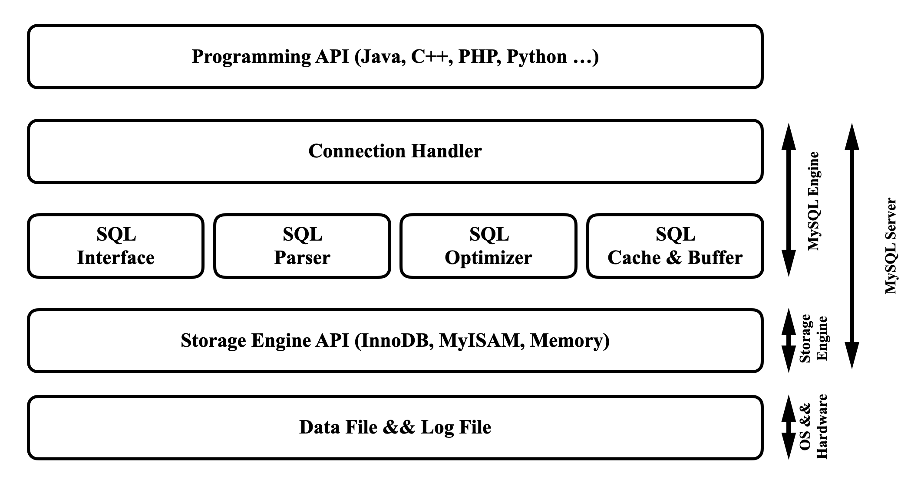
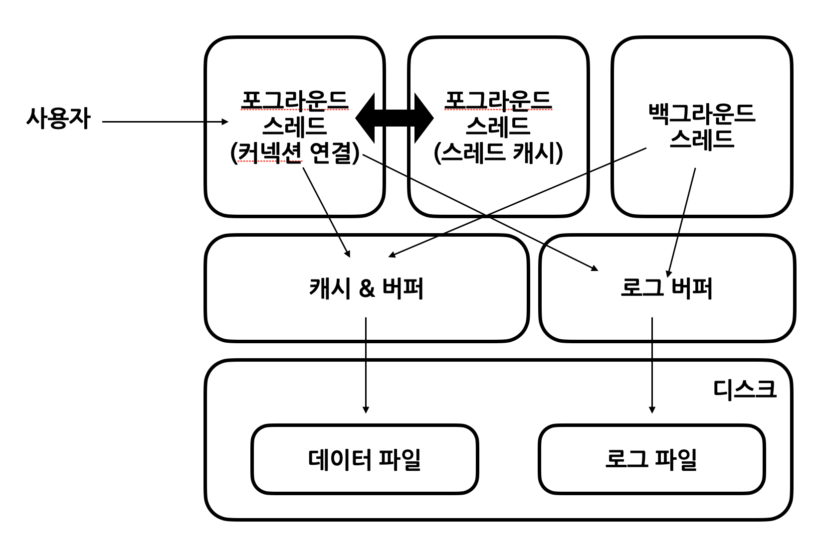
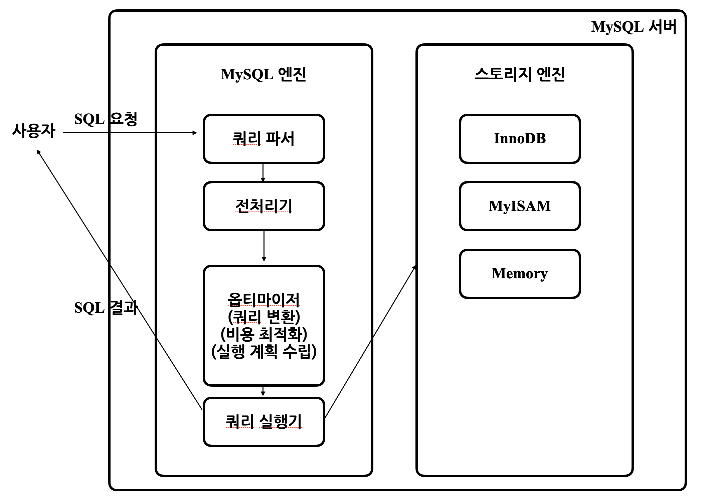
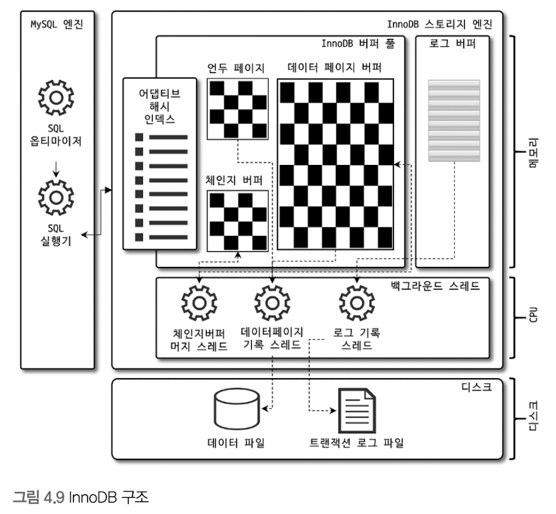
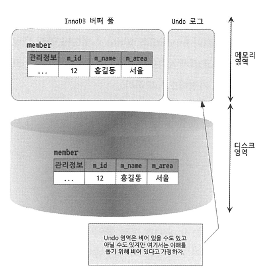
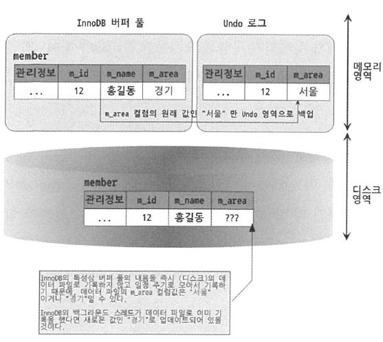
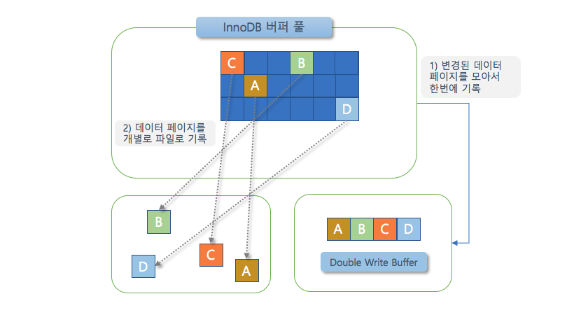
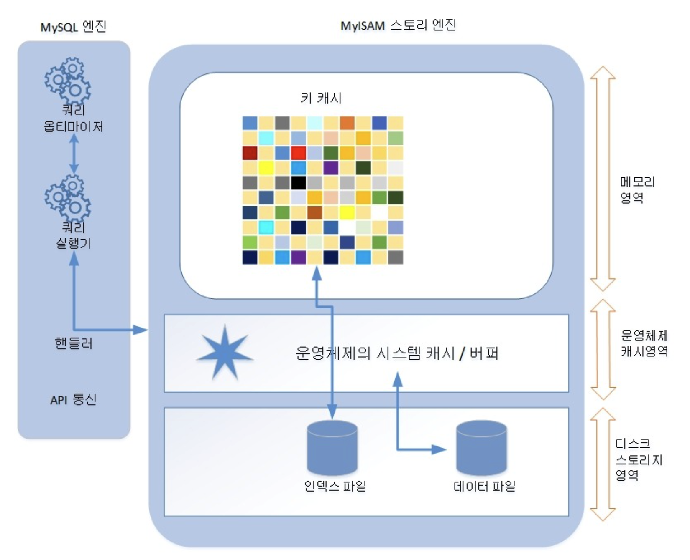

# 아키텍쳐

MySQL은 MySQL 엔진과 MySQL 스토리지 엔진으로 구성된다

이번 장에서는 MySQL 스토리지 엔진으로 자주 쓰이는 InnoDB 스토리지 엔진 및 MyISAM 스토리지 엔진에 대해서 알아본다

## MySQL 엔진 아키텍쳐
### MySQL의 전체 구조

#### MySQL 엔진
MySQL 엔진은 클라이언트로부터의 접속 및 쿼리 요청을 처리하는 커넥션 핸들러와 SQL 파서 및 전처리기, 쿼리의 최적화된 실행을 위한 옵티마이저가 중심을 이룬다.
#### 스토리지 엔진
스토리지 엔진은 실제 데이터를 디스크 스토리지에 저장하거나 디스크 스토리지로부터 데이터를 읽어오는 부분을 전담한다.
스토리지 엔진은 여러개를 동시에 사용할 수 있으며, 각 스토리지 엔진은 성능 향상을 위해 키 캐시(MyISAM)나 InnoDB 버퍼 풀(InnoDB)과 같은 기능을 내장하고 있다.
#### 핸들러 API
핸들러 요청 : MySQL 엔진의 쿼리 실행기에서 각 스토리지 엔진에 보내는 쓰기 또는 읽기 요청
```SQL
SHOW GLOBAL STATUS LIKE \'Handler%\';
```
위 명령을 통해 핸들러 요청 횟수를 확인할 수 있다.

### MySQL 스레딩 구조

> ```해당 모델은 커뮤니티 에디션 기준이며 다른 버전에서는 스레드 풀 모델을 사용할 수도 있다.``` 
MySQL 서버에서 실행중인 스레드 목록은 다음 명령어를 통해 확인할 수 있다.
```SQL
SELECT thread_id, name, type, processlist_user, processlist_host
FROM performance_schema.threads ORDER BY type, thread_id;
```

#### 포그라운드 스레드(클라이언트 스레드)
최소한 MySQL 서버에 접속된 클라이언트 수만큼 존재하며, 주로 클라이언트 사용자가 요청하는 쿼리 문장을 처리한다.
클라이언트 사용자가 작업을 마치고 커넥션을 종료하면 해당 커넥션을 담당하던 스레드는 다시 스레드 캐시로 되돌아간다.
이때 이미 스레드 캐시에 일정 개수 이상의 대기 중인 스레드가 있으면 스레드 캐시에 넣지 않고 스레드를 종료시켜 일정 개수의 스레드만 스레드 캐시에 존재하게 한다.
스레드 캐시에 유지할 수 있는 최대 스레드 개수는 thread_cache_size 시스템 변수로 설정한다.

포그라운드 스레드는 데이터를 MySQL의 데이터 버퍼나 캐시로부터 가져오며 버퍼나 캐시에 없는 경우에는 직접 디스크의 데이터나 인덱스 파일로부터 데이터를 읽어와서 작업을 처리한다.
MyISAM 테이블은 디스크 쓰기 작업까지 포그라운드 스레드가 처리하지만 InnoDB 테이블은 데이터 버퍼나 캐시까지만 포그라운드 스레드가 처리하고, 나머지 버퍼로부터 디스크까지 기로하는 작업은 백그라운드 스레드가 처리한다.

#### 백그라운드 스레드
MyISAM의 경우에는 별로 해당 사항이 없는 부분이지만 InnoDB는 다음과 같이 여러 가지 작업이 백그라운드로 처리된다.
- 인서트 버퍼를 병합하는 스레드
- 로그를 디스크로 기록하는 스레드
- InnoDB 버퍼 풀의 데이터를 디스크에 기록하는 스레드
- 데이터를 버퍼로 읽어오는 스레드
- 잠금이나 데드락을 모니터링하는 스레드

특히 주요한 기능을 하는 로그 스레드(2번째)와 쓰기 스레드(3번째)가 중요한데,
MySQL 5.5해당 스레드의 개수를 innodb_write_io_threads와 innodb_read_io_threads 시스템 변수를 통해 2개 이상 설정이 가능하다.
사용자의 요청을 처리하는 도중 데이터의 쓰기 작업은 지연되어 처리 될 수 있지만 데이터의 읽기 작업은 절대 지연될 수 없다.
그래서 일반적인 상용 DBMS에는 대부분 쓰기 작업을 버퍼링해서 일괄 처리하는 기능이 탑재되어 있으며, InnoDB또한 이러한 방식으로 처리한다.
하지만 MyISAM은 그렇지 않고 사용자 스레드가 쓰기 작업까지 함께 처리하도록 설계되어 있다.
이러한 이유로 MyISAM에서 일반적인 쿼리는 쓰기 버퍼링 기능을 사용할 수 없다.

### 메모리 할당 및 사용 구조
- MySQL 서버
  - 글로벌 메모리 영역
    - InnoDB 버퍼 풀
    - MyISAM 키 캐시
    - 바이너리 로그 버퍼
    - 리두 로그 버퍼
    - 테이블 캐시
  - 세션(커넥션) 메모리 영역
    - 조인 버퍼
    - 정렬 버퍼
    - 네트워크 버퍼
    - 리드 버퍼

#### 글로벌 메모리 영역
스레드 수와 무관하며 일반적으로 하나의 메모리 공간만 할당된다.
글로벌 메모리 영역은 개수에 상관 없이 모든 스레드에 의해 공유된다.

#### 로컬 메모리 영역
MySQL 서버상에 존재하는 클라이언트 스레드가 쿼리를 처리하는 데 사용하는 메모리 영역이다.
로컬 메모리는 각 클라이언트 스레드별로 독립적으로 할당되며 절대 공유되어 사용되지 안흔 다는 특징이 있다.
로컬 메모리의 중요한 특징은 각 쿼리의 용도별로 필요할 때만 공간이 할당되고 필요하지 않은 경우에는 MySQL이 메모리 공간을 할당조차 하지 않을 수도 있다는 점이다.
그리고 로컬 메모리 공간은 커넥션이 열려 있는 종안 계속 할당된 상태로 남아 있는 공간도 있고(커넥션 버퍼나 결과 버퍼) 그렇지 않고 쿼리를 실행하는 순간에만 할당했다가 다시 해제하는 공간(소트 버퍼나 조인 버퍼)도 있다.

### 플러그인 스토리지 엔진 모델
MySQL은 플러그인을 통해 다양한 부가기능을 제공하는데 스토리지 엔진도 플러그인에 속한다.
MySQL서버에서 지원되는 스토리지 엔진은 `SHOW ENGINES;`를 통해 확인할 수 있다.
해당 명령어를 통해 본 결과 값중 Support 칼럼에는 4가지 값이 표현되는데 의미하는 바는 다음과 같다.

- YES: MySQL 서버에 해당 스토리지 엔진이 포함돼 있고, 사용 가능으로 활성화된 상태임
- DEFAULT: 'YES'와 동일한 상태이지만 필수 스토리지 엔진임을 의미함(즉, 이 스토리지 엔진이 없으면 MySQL이 시작되지 않을 수도 있음을 의미한다)
- NO: 현재 MySQL 서버에 포함되지 않았음을 의미함
- DISABLED: 현재 MySQL 서버에는 포함됐지만 파라미터에 의해 비활성화된 상태임

### 컴포넌트
MySQL 8.0부터는 기존의 플로그인 아키텍처를 대체하기 위해 컴포넌트 아키텍처가 지원된다.
컴포넌트는 플러그인의 단점을 개선했다.

- 플러그인은 오직 MySQL 서버와 인터페이스할 수 있고, 플러그인끼리는 통신할 수 없음
- 플러그인은 MySQL 서버의 변수나 함수를 직접 호출하기 때문에 안전하지 않음(캡슐화 안됨)
- 플러그인은 상호 의존 관계를 설정할 수 없어서 초기화가 어려움

### 쿼리 실행 구조

#### 쿼리 파서
사용자 요청으로 들어온 쿼리 문장을 토큰으로 분리해 트리 형태의 구조로 만들어 내는 작업을 진행. 쿼리 문장의 문법 오류는 이 과정에서 발견된다.
#### 전처리기
파서 과정에서 만들어진 파서 트리를 기반으로 쿼리 문장에 구조적인 문제점이 있는지 확인한다.
각 토큰을 테이블 이름이나 칼럼 이름, 또는 내장 함수와 같은 개체를 매핑해 해당 객체의 존재 여부와 객체의 접근 권한 등을 확인하는 과정을 이 단계에서 수행한다.
실제 존재하지 않거나 권한 상 사용할 수 없는 개체의 토큰은 이 단계에서 걸러진다.
#### 옵티마이저
사용자의 요청으로 들어온 쿼리 문장을 저렴한 비용으로 가장 빠르게 처리할지를 결정하는 역할을 담당한다.
#### 실행 엔진
실행 엔진은 만들어진 계획대로 각 핸들러에게 요쳥해서 받은 결과를 또 다른 핸들러의 요청입력으로 연결하는 역할을 수행한다.
#### 핸들러(스토리지 엔진)
MySQL 서버의 가장 밑단에서 MySQL 실행 엔진의 요청에 따라 데이터를 디스크로 저장하고 디스크로부터 읽어 오는 역할을 담당한다.

### 복제
해당 내용은 16장에서 살펴보도록 한다
### 쿼리 캐시
동일 SQL 쿼리에 대해서 빠른 성능을 제공하지만, 테이블의 데이터가 변경될 경우 캐시에 저장된 결과 중에서 변경된 테이블과 관련된 것들은 모두 삭제함으로써 심각한 동시 처리 성능 저하를 유발한다.
결국 MySQL 8.0이상에서는 쿼리 캐시는 MySQL 서버 기능에서 완전히 제거되고, 관련된 시스템 변수도 모두 제거됐다.
### 스레드 풀
MySQL 서버 엔터프라이즈 에디션에서만 제공된다.
스레드 풀은 내부적으로 사용자의 요청을 처리하는 스레드 개수를 줄여서 동시 처리되는 요청이 많다 하더라도 MySQL 서버의 CPU가 제한된 개수의 스레드 처리에만 집중할 수 있게 해서 서버의 자원 소모를 줄이는 것이 목적이다.
하지만 실제 서비스에서 스레드 풀이 눈에 띄는 성능 향상을 보여준 경우는 드물다.

### 트랜잭션 지원 메타데이터
기존 MySQL에서는 테이블의 구조 정보와 스토어드 프로그램 등의 정보(데이터 딕셔너리 또는 메타데이터)를 파일 기반으로 관리했다.
하지만 이런 파일 기반의 메타데이터는 생성 및 변경 작업이 트랜잭션을 지원하지 않기 때문에 테이블의 생성 또는 변경 도중에 MySQL 서버가 비정상적으로 종료되면 일관되지 않은 상태로 남는 문제가 있었다.

MySQL 8.0 버전부터는 이러한 문제점을 해결하기 위해 테이블의 구조 정보나 스토어드 프로그램의 코드 관련 정보를 모두 InnoDB의 테이블에 저장하도록 개선됐다. 
해당 정보들은 mysql.ibd라는 이름의 테이블스페이스에 저장되는데, 이러한 이유로 MySQL서버의 데이터 디렉터리에 존재하는 mysql.ibd라는 파일은 다른 *.ibd 파일과 함께 특별히 주의해야한다.
한편 MySQL 서버에서 InnoDB 스토리지 엔진을 사용하는 테이블은 메타 정보가 InnoDB 테이블 기반의 딕셔너리에 저장되지만 MyISAM이나 CSV 등과 같은 스토리지 엔진의 메타 정보는 여전히 저장할 공간이 필요하다.
MySQL 서버는 InnoDB 스토리지 엔진 이외의 스토리지 엔진을 사용하는 테이블들을 위해 SDI(Serialized Dictionary Information)파일을 사용한다.

## InnoDB 스토리지 엔진 아키텍처
InnoDB는 MySQL에서 사용할 수 있는 스토리지 엔진 중 거의 유일하게 레코드 기반의 잠금을 제공하며, 그 때문에 높은 동시성 처리가 가능하고 안정적이며 성능이 뛰어나다.


### 프라이머리 키에 의한 클러스터링
InnoDB의 모든 테이블은 기본적으로 프라이머리 키를 기준으로 클러스터링되어 저장된다.
프라이머리 키 값의 순서대로 디스크에 저장되며, 모든 세컨더리 인덱스는 레코드의 주소 대신 프라이머리 키 값을 논리적인 주소로 사용한다.
결과적으로 쿼리의 실행 계획에서 프라이머리 키는 기본적으로 다른 보조 인덱스에 비해 비중이 높게 설정된다.

### 외래 키 지원
InnoDB에서 외래 키는 부모 테이블과 자식 테이블 모두 해당 칼럼에 인덱스 생성이 필요하고,
변경 시에는 반드시 부모 테이블이나 자식 테이블에 데이터가 있는지 체크하는 작업이 필요하므로 잠금이 여러 테이블로 전파되고,
그로 인해 데드락이 발생할 때가 많으므로 개발할 때도 외래 키의 존재에 주의하는 것이 좋다.

외래 키가 복잡하게 얽힌 경우나 서비스에 문제가 있어서 긴급하게 뭔가 조치를 해야하는 상황에서 외래키 관련 문제가 생긴다면 foreign_key_checks 시스템 변수를 OFF로 설정하면 외래 키 관계에 대한 체크 작업을 일시적으로 멈출 수 있다.

### MVCC(Multi Version Concurrency Control)
MVCC의 가장 큰 목적은 잠금을 사용하지 않는 일관된 읽기를 제공하는 데 있다.
InnoDB는 언두 로그(Undo log)를 이용해 이 기능을 구현한다.
다음과 같은 쿼리를 실행했다고 했을 때
```SQL
mysql > CREATE TABLE member (
    m_id INT NOT NULL,
    m_name VARCHAR(20) NOT NULL,
    m_area VARCHAR(100) NOT NULL,
    
    PRIMARY KEY (m_id),
    INDEX ix_area (m_area)
);

mysql > INSERT INTO member (m_id, m_name, m_area) VALUES (12, '홍길동', '서울');
mysql > COMMIT;
```
데이터베이스의 상태는 아래와 같다.

여기서 다음과 같이 UPDATE를 실행하게 되면
```SQL
mysql > UPDATE member SET m_area='경기' WHERE m_id=12;
```

위와 같이 변하게 되는데 이때 디스크 데이터 파일에는 체크포인트나 InnoDB의 Write 스레드에 의해 새로운 값으로 업데이트돼 있을 수도 있고 아닐 수도 있다.
만약 이런 상황에서 다른 사용자가 다음 쿼리를 실행하면 결과값이 어떻게 나타날까?
```SQL
mysql > SELECT * FROM member WHERE m_id=12;
```
이에 대한 결과는 MySQL 서버의 시스템 변수(transaction_isolation)에 설정된 격리수준(Isolation level)에 따라 다르다.
격리 수준이 READ_UNCOMMITED인 경우에는 InnoDB 버퍼 풀이나 데이터 파일로부터 변경되지 않은 데이터를 읽어서 반환한다.
즉 데이터가 커밋됐든 아니든 변경된 상태의 데이터를 반환한다.
그렇지 않고 READ_COMMITTED나 그 이상의 격리 수준(REPEATABLE_READ, SERIALIZABLE)인 경우에는 아직 커밋되지 않았기 때문에 InnoDB 버퍼 풀이나 데이터 파일에 있는 내용 대신 변경되기 이전의 내용을 보관하고 있는 언두 영역의 데이터를 반환한다.
이러한 과정을 DBMS에서는 MVCC라고 표현한다.

### 잠금 없는 일관된 읽기(Non-Locking Consistent Read)
격리 수준이 SERIALIZABLE이 아닌 READ_UNCOMMITED, READ_COMMITTED, REPEATABLE_READ 수준인 경우 INSERT와 연결되지 않은 순수한 읽기 작업은 다른 트랜잭션의 변경 작업과 관계없이 항상 잠금ㅇ르 대기하지 않고 바로 실행된다.
> ```
오랜 시간 동안 활성 상태인 트랜잭션으로 인해 MySQL 서버가 느려지거나 문제가 발생할 때가 있는데,
바로 이러한 일관된 읽기를 위해 언두 로그를 삭제하지 못하고 계속 유지해야하기 때문에 발생하는 문제이다.
``` 

### 자동 데드락 감지
InnoDB 스토리지 엔진은 내부적으로 잠금이 교착 상태에 빠지지 않았는지 체크하기 위해 잠금 대기 목록을 그래프(Wait-For List)형태로 관리한다.
InnoDB 스토리지 엔진은 데드락 감지 스레드를 가지고 있어서 데드락 감지 스레드가 주기적으로 잠금 대기 그래프를 검사해 교착 상태에 빠진 트랜잭션들을 찾아서 그중 하나를 강제 종료한다.
이때 어느 트랜잭션을 먼저 강제 종료할 것인지를 판단하는 기준은 트랜잭션의 언두 로그 양이며,
언두 로그 레코드를 더 적게 가진 트랜잭션이 일반적으로 롤백의 대상이 된다.
참고로 InnoDB 스토리지 엔진은 사위 레이어인 MySQL 엔진에서 관리되는 테이블 잠금은 볼 수가 없어서 데드락 감지가 불확실할 수도 있는데,
innodb_table_locks 시스템 변수를 활성화하면 InnoDB 스토리지 엔진 내부의 레코드 잠금뿐만 아니라 테이블 레벨의 잠금까지 감지할 수 있게 된다.
한편 동시 처리 스레드가 매우 많아지거나 각 트랜잭션이 가진 잠금의 개수가 많아지면 데드락 감지 스레드가 느려질 수 있는데,
이런 문제점을 해결하기 위해 MySQL 서버는 innodb_deadlock_detect 시스템 변수를 제공하며, 이를 OFF로 설정하면 데드락 감지 스레드가 더는 작동하지 않게 된다.
여기에 innodb_lock_wait_timeout 시스템 변수를 활성화하면 데드락 상황에서 일정 시간이 지나면 자동으로 요청이 실패하고 에러 메시지를 반환하게 된다.

### 자동화된 장애 복구
InnoDB에는 손실이나 장애로부터 데이터를 보호하기 위한 여러 가지 메커니즘이 탑재돼 있다.
그러한 메커니즘을 이용해 MySQL 서버가 시작될 때 완료되지 못한 트랜잭션이나 디스크에 일부만 기록된 데이터 페이지 등에 대한 일련의 복구 작업이 자동으로 진행된다.
InnoDB 스토리지 엔진은 매우 견고해서 데이터 파일이 손상되거나 MySQL 서버가 시작되지 못하는 경우는 거의 발생하지 않는다.
하지만 복구가 쉽지 않는 경우도 있는데 InnoDB 데이터 파일은 기본적으로 MySQL 서버가 시작될 때 항상 자동 복구를 수행하므로 이럴 때 자동 복구를 멈추고 MySQL 서버가 종료된다.
이때는 MySQL 서버의 설정 파일에 innodb_force_recovery 시스템 변수를 설정해서 MySQL 서버를 시작해야 한다.
이 설정 값은 MySQL 서버가 시작될 때 InnoDB 스토리지 엔진이 데이터 파일이나 로그 파일의 손상 여부 검사 과정을 선별적으로 진행할 수 있게 한다.

- InnoDB의 로그 파일이 손상됐다면 6으로 설정하고 MySQL 서버를 기동한다.
- InnoDB 테이블의 데이터 파일이 손상됐다면 1로 설정하고 MySQL 서버를 기동한다.
- 어떤 부분이 문제인지 알 수 없다면 innodb_force_recovery 설정값을 1부터 6까지 변경하면서 MySQL을 재시작해본다.
즉 innodb_force_recovery 설정값을 1로 설정한 후 MySQL 서버를 재시작해 보고, MySQL이 시작되지 않으면 다시 2로 설정하고 재시작해 보는 방식이다.
innodb_force_recovery 값이 커질수록 그만큼 심각한 상황이어서 데이터 손실 가능성이 커지고 복구 가능성은 적어진다.

일단 MySQL 서버가 기동되고 InnoDB 테이블이 인식된다면 mysqldump를 이용해 데이터를 가능한 만큼 백업하고 그 데이터로 MySQL 서버의 DB와 테이블을 다시 생성하는 것이 좋다.
InnoDB의 복구를 위해 innodb_force_recovery 옵션에 설정 가능한 값은 1부터 6까지인데 이에 대해 알아보자

- 1(SRV_FORCE_IGNORE_CORRUPT)

InnoDB의 테이블스페이스의 데이터나 인덱스 페이지에서 손상된 부분이 발견돼도 무시하고 MySQL 서버를 시작한다. 에러 로그 파일에 Database page corruption on disk or a failed 메시지가 출력될 때는
대부분 이 경우에 해당한다. 이때는 mysqldump 프로그램이나 SELECT INTO OUTFILE... 명령을 이용해 덤프해서 데이터페이스를 다시 구축하는 것이 좋다.

- 2(SRV_FORCE_NO_BACKGROUND)

InnoDB는 쿼리의 처리를 위해 여러 종류의 백그라운드 스레드를 동시에 사용한다. 이 복구 모드에서는 이러한 백그라운드 스레드 가운데 메인스레드를 시작하지 않고 MySQL 서버를 시작한다.
InnoDB는 트랜잭션의 롤백을 위해 언두 데이터를 관리하는데, 트랜잭션이 커밋되어 불필요한 언두 데이터는 InnoDB의 메인 스레드에 의해 주기적으로 삭제된다.
InnoDB의 메인 스레드가 언두 데이터를 삭제하는 과정에서 장애가 발생한다면 이 모드로 복구하면 된다.

- 3(SRV_FORCE_NO_TRX_UNDO)

InnoDB에서 트랜잭션이 실행되면 롤백에 대비해 변경 전의 데이터를 언두 영역에 기록한다. 일반적으로 MYSQL서버는 다시 시작하면서 언두 영역의 데이터를 먼저 데이터 파일에 적용하고 그 다음 리두 로그의 내용을 다시 덮어써서 장애 시점의
데이터 상태를 만들어낸다. 그리고 정상적인 MySQL 서버의 시작에는 최종적으로 커밋되지 않은 트랜잭션은 롤백을 수행하지만 innodb_force_recovery가 3으로 설정되면 커밋되지 않은 트랜잭션의 작업을 롤백하지 않고 그대로 놔둔다.
즉 커밋되지 않고 종료된 트랜잭션은 계속 그 상태로 남아있게 MySQL 서버를 시작하는 모드다. 이때도 우선 MySQL 서버가 시작되면 mysqldump를 이용해 데이터를 백업해서 다시 데이터베이스를 구축하는 것이 좋다.

- 4(SRV_FORCE_NO_IBUF_MERGE)

InnoDB는 INSERT, UPDATE, DELETE 등의 데이터 변경으로 인한 인덱스 변경 작업을 상황에 따라 즉시 처리할 수도 있고
인서트 버퍼에 저장해두고 나중에 처리할 수도 있다. 이렇게 인서트 버퍼에 기록된 내용은 언제 데이터 파일에
병합될지 알 수 없다. MySQL을 종료해도 병합되지 않을 수 있는데, 만약 MySQL이 재시작되면서 인서트 버퍼의 손상을 감지하면 InnoDB는 에러를 발생시키고 MySQL 서버는 시작하지 못한다.

이때 innodb_force_recovery를 4로 설정하면 InnoDB 스토리지 엔진이 인서트 버퍼의 내용을 무시하고 강제로 MySQL이 시작되게 한다.
인서트 버퍼는 실제 데이터와 관련된 부분이 아니라 인덱스에 관련된 부분이므로 테이블을 덤프한 후 다시 데이터베이스를 구축하면 데이터의 손실 없이 복구할 수 있다.

- 5(SRV_FORCE_NO_UNDO_LOG_SCAN)

MySQL 서버가 장애나 정상적으로 종료되는 시점에 진행 중인 트랜잭션이 있었다면 MySQL은 그냥 단순히 그 커넥션을 강제로 끊어버리고 별도의 정리 작업 없이 종료한다.
MySQL이 다시 시작하면 InnoDB 엔진은 언두 레코드를 이용해 데이터 페이지를 복구하고 리두 로그를 적용해 종료 시점이나 장애 발생 시점의 상태를 재현해 낸다.
그리고 InnoDB는 마지막으로 커밋되지 않은 트랜잭션에서 변경한 작업은 모두 롤백 처리한다.
그런데 InnoDB의 언두 로그를 사용할 수 없다면 InnoDB 엔진의 에러로 MySQL 서버를 시작할 수 없다.
이때 innodb_force_recovery 옵션을 5로 설정하면 InnoDB 엔진이 언두 로그를 모두 무시하고 MySQL을 시작할 수 있다.
하지만 이 모드로 복구되면 MySQL 서버가 종료되던 시점에 커밋되지 않았던 작업도 모두 커밋된 것처럼 처리되므로 실제로는 잘못된 데이터가 데이터베이스에 남는 것이라고 볼 수 있다.
이때도 mysqldump를 이용해 데이터를 백업하고, 데이터베이스를 새로 구축해야 한다.

- 6(SRV_FORCE_NO_LOG_REDO)

InnoDB 스토리지 엔진의 리두 로그가 손상되면 MySQL 서버가 시작되지 못한다.
이 복구 모드로 시작하면 InnoDB엔진은 리두 로그를 모두 무시한 채로 MySQL 서버가 시작된다.
또한 커밋됐다 하더라도 리두 로그에만 기록되고 데이터 파일에 기록되지 않은 데이터는 모두 무시된다.
즉 마지막 체크 포인트 시점의 데이터만 남게 된다.
이때는 기존 InnoDB의 리두 로그는 모두 삭제하고 MySQL 서버를 시작하는 것이 좋다.
MySQL 서버가 시작하면서 리두 로그가 없으면 새로 생성하므로 별도로 파일을 만들 필요는 없다.
이때도 mysqldump를 이용해 데이터를 모두 백업해서 MySQL 서버를 새로 구축하는 것이 좋다.

위와 같이 진행했음에도 MySQL 서버가 시작되지 않으면 백업을 이용해 다시 구축하는 방법밖에 없다.
백업이 있다면 마지막 백업으로 데이터베이스를 새로 구축하고, 바이너리 로그를 사용해 최대한 장애 시점까지의 데이터를 복구할 수도 있다.
마지막 풀 백업 시점부터 장애 시점까지의 바이너리 로그가 있다면 InnoDB의 복구를 이용하는 것보다 풀 백업과 바이너리 로그로 복구하는 편이 데이터 손실이 더 적을 수 있다.
백업은 있지만 복제의 바이너리 로그가 없거나 손실됐다면 마지막 백업 시점까지만 복구할 수 있다.

### InnoDB 버퍼 풀
InnoDB 스토리지 엔진에서 가장 핵심적인 부분으로, 디스크의 데이터 파일이나 인덱스 정보를 메모리에 캐시해 두는 공간이다.
쓰기 작업을 지연시켜 일괄 작업으로 처리할 수 있게 해주는 버퍼 역할도 같이 한다.

#### 버퍼 풀의 크기 설정
버퍼 풀 크기에 대한 명확한 가이드는 없다. 다행히 MySQL 5.7 버전부터 InnoDB 버퍼 풀의 크기를 동적으로 조절할 수 있게 되어,
가능하면 InnoDB 버퍼 풀의 크기를 적절히 작은 값으로 설정해서 조금씩 상황을 봐 가면서 증가시키는 방법이 최적이다.
InnoDB 버퍼 풀은 innodb_buffer_pool_size 시스템 변수로 크기를 설정할 수 있다.
가능하면 버퍼의 크기를 줄이는 작업은 하지 않도록 주의하자.

#### 버퍼 풀의 구조
InnoDB 스토리지 엔진은 버퍼 풀이라는 거대한 메모리 공간을 페이지 크기(innodb_page_size 시스템 변수에 설정된)의 조각으로 쪼개어 InnoDB 스토리지 엔진이 데이터를 필요로 할 때 해당 데이터 페이지를 읽어서 각 조각에 저장한다.
버퍼 풀의 페이지 크기 조각을 관리하기 위해 InnoDB 스토리지 엔진은 크게 LRU(Least Recently Used) 리스트와 플러시 리스트 그리고 프리 리스트라는 3개의 자료구조를 관리한다.
프리 리스트는 InnoDB 버퍼 풀에서 실제 사용자 데이터로 채워지지 않은 비어 있는 페이지들의 목록이며, 사용자의 쿼리가 새롭게 디스크의 데이터 페이지를 읽어와야 하는 경우 사용된다.
LRU는 다음과 같은 구조를 띄고 있는데, 엄밀하게 LRU와 MRU(Most Recently Used) 리스트가 결합된 형태라고 보면 된다.

LRU 리스트를 관리하는 목적은 디스크로부터 한 번 읽어온 페이지를 최대한 오랫동안 InnoDB 버퍼 풀의 메모리에 유지해서 디스크 읽기를 최소화하는 것이다. InnoDB 스토리지 엔진에서 데이터를 찾는 과정은 다음과 같다.

1. 필요한 레코드가 저장된 데이터 페이지가 버퍼 풀에 있는지 검사
  A. InnoDB 어댑티브 해시 인덱스를 이용해 페이지를 검색
  B. 해당 테이블의 인덱스(B-Tree)를 이용해 버퍼 풀에서 페이지를 검색
  C. 버퍼 풀에 이미 데이터 페이지가 있었다면 해당 페이지의 포인터를 MRU 방향으로 승급
2. 디스크에서 필요한 데이터 페이지를 버퍼 풀에 적재하고, 적재된 페이지에 대한 포인터를 LRU 헤더 부분에 추가
3. 버퍼 풀의 LRU 헤더 부분에 적재된 데이터 페이지가 실제로 읽히면 MRU 헤더 부분으로 이동
4. 버퍼 풀에 상주하는 데이터 페이지는 사용자 쿼리가 얼마나 최근에 접근했었는지에 따라 나이가 부여되며,
버퍼 풀에 상주하는 동안 쿼리에서 오랫동안 사용되지 않으면 데이터 페이지에 부여된 나이가 오래되고 결국 해당 페이지는 버퍼 풀에서 제거된다.
버퍼 풀의 데이터 페이지가 쿼리에 의해 사용되면 나이가 초기화되어 다시 젊어지고 MRU의 헤더 부분으로 옮겨진다.
5. 필요한 데이터가 자주 접근됐다면 해당 페이지의 인덱스 키를 어댑티브 해시 인덱스에 추가

그래서 처음 한 번 읽힌 데이터 페이지가 이후 자주 사용된다면 그 데이터 페이지는 InnoDB 버퍼 풀의 MRU 영역에서 계속 살아남게 되고,
반대로 거의 사용되지 않는다면 새롭게 디스크에서 읽히는 데이터 페이지들에 밀려서 LRU의 끝으로 밀려나 결국은 InnoDB 버퍼 풀에서 제거될 것이다.

플러시 리스트는 디스크로 동기화되지 않은 데이터를 가진 데이터 페이지(이를 더티 페이지라고 함)의 변경 시점 기준의 페이지 목록을 관리한다.
일단 한 번 데이터 변경이 가해진 데이퍼 페이지는 플러시 리스트에 관리되고 특정 시점이 되면 디스크로 기록돼야 한다.
데이터가 변경되면 InnoDB는 변경 내용을 리두 로그에 기록하고 버퍼 풀의 데이터 페이지에도 변경 내용을 반영한다.
그래서 리두 로그의 각 엔트리는 특정 데이터 페이지와 연결된다.
하지만 리두 로그가 디스크로 기록됐다고 해서 데이터 페이지가 디스크로 기록됐다는 것을 항상 보장하지는 않는다.
때로는 그 반대의 경우도 발생할 수 있는데, InnoDB 스토리지 엔진은 체크포인트를 발생시켜 디스크의 리두 로그와 데이터 페이지의 상태를 동기화하게 된다.

#### 버퍼 풀과 리두 로그
InnoDB의 버퍼 풀과 리두 로그는 매우 밀접한 관계를 맺고 있다.
InnoDB의 버퍼 풀은 데이터 베이스 서버의 성능 향상을 위해 데이터 캐시와 쓰기 버퍼링이라는 두 가지 용도가 있는데, 버퍼 풀의 메모리 공간만 단순히 늘리는 것은 데이터 캐시 기능만 향상시키는 것이다.
InnoDB 버퍼 풀의 쓰기 버퍼링 기능까지 향상시키려면 InnoDB 버퍼 풀과 리두 로그와의 관계를 먼저 이해해야 한다.
InnoDB의 버퍼 풀은 디스크에서 읽은 상태로 전혀 변경되지 않은 클린페이지와 함께 더티 페이지도 가지고 있다.
더티 페이지는 디스크와 메모리의 데이터 상태가 다르기 때문에 언젠가는 디스크로 기록돼야 한다.
하지만 더티 페이지는 버퍼 풀에 무한정 머무를 수 있는 것은 아니다.
InnoDB 스토리지 엔진에서 리두 로그는 1개이상의 고정 크기 파일을 연결해서 순환 고리 처럼 사용한다.
즉 데이터 변경이 계속 발생하면 리두 로그 파일에 기록됐던 로그 엔트리는 어느 순간 다시 새로은 로그 엔트리로 덮어 쓰인다.
그래서 InnoDB 스토리지 엔진은 전체 리두 로그 파일에서 재사용 가능한 공간과 당장 재사용 불가능한 공간을 구분해서 관리해야 하는데, 재사용 불가능한 공간을 활성 리두 로그라고 한다.
리두 로그 파일의 공간은 계속 순한되어 재사용되지만 매번 기록될 때마다 로그 포지션은 계속 증가된 값을 갖게 되는데, 이를 LSN(Log Sequence Number)이라고 한다.
InnoDB 스토리지 엔진은 주기적으로 체크포인트 이벤트를 발생시켜 리두 로그와 버퍼 풀의 더티 페이지를 디스크로 동기화화는데,
이렇게 발생한 체크포인트 중 가장 최근 체크포인트 지점의 LSN이 활성 리두 공간의 시작점이 된다.
하지만 활성 리두 로그 공간의 마지막은 계속해서 증가하기 때문에 체크포인트와 무관하다.
그리고 가장 최근의 체크포인트의 LSN과 마지막 리두 로그 엔트리의 LSN의 차이를 체크포인트 에이지라고 한다.
즉 체크포인트 에이지는 활성 리두 공간의 크기를 일컫는다.
InnoDB 버퍼 풀의 더티 페이지는 특정 리두 로그 엔트리와 관계를 가지고,
체크포인트가 발생하면 체크포인트 LSN보다 작은 리두 로그 엔트리와 관련된 더티 페이지는 모두 디스크로 동기화돼야 한다.
물론 당연히 체크포인트 LSN보다 작은 LSN 값을 가진 리두 로그 엔트리도 디스크로 동기화돼야 한다.
> ```버퍼 풀의 크기가 100GB 이하의 MySQL 서버에서는 리두 로그 파일의 전체 크기를 대략 5~10GB 수준으로 선택하고 필요할 때마다 조금씩 늘려가면서 최적값을 선택하는 것이 좋다.``` 

#### 버퍼 풀 플러시(Buffer Pool Flush)
> ```InnoDB 스토리지 엔진의 더티 페이지의 디스크 쓰기 동기화와 관련된 시스템 설정을 살펴보겠지만 특별히 서비스를 운영할 때 성능 문제가 발생하지 않는 상태라면 굳이 이 시스템 변수들을 조정할 필요는 없다.``` 
InnoDB 스토리지 엔진은 버퍼 풀에서 아직 디스크로 기록되지 않은 더티 페이지들을 성능상의 악영향 없이 디스크에 동기화하기 위해 다음과 같이 2개의 플러시 기능을 백그라운드로 실행한다.
- 플러시 리스트 플러시
- LRU 리스트 플러시

##### 플러시 리스트 플러시
InnoDB 스토리지 엔진은 주기적으로 플러시 리스트 플러시 함수를 호출해서 플러시 리스트에서 오래전에 변경된 데이터 페이지 순서대로 디스크에 동기화하는 작업을 수행한다.
이때 언제부터 얼마나 많은 더티 페이지를 한 번에 디스크로 기록하느냐에 따라 사용자의 쿼리 처리가 악영향을 받지 않으면서 부드럽게 처리된다.
이를 위해 InnoDB 스토리지 엔진은 다음과 같은 시스템 변수들을 제공한다.

- innodb_page_cleaners
- innodb_max_dirty_pages_pct_lwm
- innodb_max_dirty_pages_pct
- innodb_io_capacity
- innodb_io_capacity_max
- innodb_flush_neighbors
- innodb_adaptive_flushing
- innodb_adaptive_flushing_lwm

InnoDB 스토리지 엔진에서 더티 페이지를 디스크로 동기화하는 스레드를 클리너 스레드라고 하는데,
innodb_page_cleaners 시스템 변수는 클리너 스레드의 개수를 조정할 수 있게 해준다.
InnoDB 스토리지 엔진은 여러 개의 InnoDB 버퍼 풀 인스턴스를 동시에 사용할 수 있는데,
innodb_page_cleaners 설정값이 버퍼 풀 인스턴스 개수보다 많은 경우에는 innodb_buffer_pool_instances 설정값으로 자동으로 변경한다.
즉 하나의 클리너 스레드가 하나의 버퍼 풀 인스턴스를 처리하도록 자동으로 맞춰준다.
하지만 innodb_page_cleaners 시스템 변수의 설정 값이 버퍼 풀 인스턴스 개수보다 적은 경우에는 하나의 클리너 스레드가 여러 개의 버퍼 풀 인스턴스를 처리한다.
따라서 가능하면 innodb_page_cleaners 설정값은 innodb_buffer_pool_instances 설정값과 동일한 값으로 설정하자.

InnoDB 버퍼 풀은 클린 페이지뿐만 아니라 사용자의 DML에 의해 변경된 더티 페이지도 함께 가지고 있다.
여기서 InnoDB 버퍼 풀은 한계까 있기 때문에 무한정 더티 페이지를 그대로 유지할 수 없다.
기본적으로 InnoDB 스토리지 엔진은 전체 버퍼 풀이 가진 페이지의 90%까지 더티 페이지를 가질 수 있는데, 때로는 이 값이 너무 높을 수도 있다.
이런 경우에는 innodb_max_dirty_pages_pct라는 시스템 설정 변수를 이용해 더티 페이지의 비율을 조정할 수 있다.
일반적으로 InnoDB 버퍼 풀은 더티 페이지를 많이 가지고 있을수록 디스크 쓰기 작업을 버퍼링함으로써 여러 번의 데스크 쓰기를 한번으로 줄이는 효과를 극대화할 수 있다.
그래서 innodb_max_dirty_pages_pct 시스템 설정은 가능하면 기본값을 유지하는 것이 좋다.

여기서 한 가지 더 문제점이 발생하는데, InnoDB 버퍼 풀에 더티 페이지가 많으면 많을수 디스크 쓰기 폭발 현상이 발생할 가능성이 높아진다.
InnoDB 스토리지 엔진은 innodb_io_capacity 시스템 변수에 설정된 값을 기준으로 더티 페이지 쓰기를 실행한다.
하지만 디스크로 기록되는 더티 페이지 개수보다 더 많은 더티 페이지가 발생하면 버퍼 풀에 더티 페이지가 계속 증가하게 되고,
어느 순간 더티 페이지의 비율이 90%를 넘어가면 InnoDB 스토리지 엔진은 급작스럽게 더티 페이지를 디스크로 기록해야 한다고 판단한다.
그래서 급작스럽게 디스크 쓰기가 폭증하는 현상이 발생한다.
이런 문제를 완화하기 위해 InnoDB 스토리지 엔진에서는 innodb_max_dirty_pages_pct_lwmd이라는 시스템 설정 변수를 이용해 일정 수준 이상의 더티 페이지가 발생하면 조금씩 더티 페이지를 디스크로 기록하게 하고 있다.

innodb_io_capacity와 innodb_io_capacity_max 시스템 변수는 각 데이터베이스 서버에서 어느 정도의 디스크 일고 쓰기 가능한지를 설정하는 값이다.
innodb_io_capacity는 일반적인 상황에서 디스크가 적절히 처리할 수 있는 수준의 값을 설정하며,
innodb_io_capacity_max는 디스크가 최대의 성능을 발휘할 때 어느 정도의 디스크 읽고 쓰기가 가능한지를 설정한다.
InnoDB 스토리지 엔진은 어댑티브 플러시라는 기능을 제공한다.
어댑티브 플러시는 innodb_adaptive_flushing 시스템 변수로 켜고 끌 수 있는데, 기본값은 사용이다.
이 기능을 활성화하면 InnoDB 스토리지 엔진은 단순히 버퍼 풀의 더티 페이지 비율이나 innodb_io_capacity, innodb_io_capacity_max 설정값에 의존하지 않고 새로운 알고리즘을 사용한다.

마지막으로 innodb_flush_neighbors 시스템 변수는 더티 페이지를 디스크에 기록할 때 디스크에서 근접한 페이지 중에서 더티 페이지가 있다면 InnoDB 스토리지 엔진이 함께 묶어서 디스크로 기록하게
해주는 기능을 활성화할지 결정한다. HDD에서는 크게 의미가 있지만 SSD에서는 비활성 모드로 유지하는 것이 좋다.

##### LRU 리스트 플러시

InnoDB 스토리지 엔진은 LRU 리스트에서 사용 빈도가 낮은 데이터 페이지들을 제거해서 새로운 페이지들을 읽어올 공간을 만들어야하는데,
이를 위해 LRU 리스트 플러시 함수가 사용된다.
InnoDB 스토리지 엔진은 LRU 리스트의 끝부분부터 시작해서 최대 innodb_lru_scan_depth 시스템 변수에 설정된 개수만큼 페이지들을 스캔한다.
InnoDB 스토리지 엔진은 이때 스캔하면서 더티 페이지는 디스크에 동기화하게 하며, 클린 페이지는 즉시 프리 리스트 페이지로 옮긴다.
InnoDB 스토리지 엔진은 InnoDB 버퍼 풀 인스턴스 별로 최대 innodb_lru_scan_depth 개수만큼 스캔하기 때문에 실질적으로 LRU 리스트의 스캔은 innodb_buffer_pool_instances * innodb_lru_scan_depth 수만큼 수행한다.

#### 버퍼 풀 상태 백업 및 복구
MySQL 5.6 버전 부터는 버퍼 풀 덤프 및 적재 기능이 도입되어 워밍업 없이 빠른 쿼리 요청 시간을 보여준다.
서버 점검이나 기타 작업을 위해 MySQL 서버를 재시작해야 하는 경우 MySQL 서버를 셧다운하기 전에 innodb_buffer_pool_dump_now 시스템 변수를 이용해 현재 InnoDB 버퍼 풀의 상태를 백업할 수 있다.
```SQL
// MySQL 서버 셧다운 전에 버퍼 풀의 상태 백업
mysql > SET GLOBAL innodb_buffer_pool_dump_now=ON;
// MySQL 서버 재시작 후, 백업된 버퍼 풀의 상태 복구
mysql > SET GLOBAL innodb_buffer_pool_load_now=ON;
// 버퍼 풀 복구 과정 진행 정도 확인
mysql > SHOW STATUS LIKE 'Innodb_buffer_pool_dump_status'\G
// 버퍼 풀 복구 과정 중지
mysql > SET GLOBAL innodb_buffer_pool_load_abort=ON;
```

보통 InnoDB 스토리지 엔진에서 MySQL 서버가 셧다운 되기 직전에 버퍼 풀의 백업을 실행하고,
MySQL 서버가 시작되면 자동으로 백업된 버퍼 풀의 상태를 복구할 수 있는 기능을 제공한다.
버퍼 풀의 백업과 복구를 자동화하려면 innodb_buffer_pool_dump_at_shutdown 과 innodb_buffer_pool_load_at_startup 설정을 MySQL 서버의 설정파일에 넣어두면 된다.

#### 버퍼 풀의 적재 내용 확인
MySQL 5.6 버전부터 MySQL 서버의 information_schema 데이터베이스의 innodb_buffer_page 테이블을 이용해 InnoDB 버퍼 풀의 메모리에 어떤 테이블의 페이지들이 적재돼 있는지 확인할 수 있었다.
하지만 InnoDB 버퍼 풀이 큰 경우에는 이 테이블 조회가 상당히 큰 부하를 일으키면서 서비스 쿼리가 많이 느려지는 문제가 있었다.
MySQL 8.0 버전에서는 이러한 문제점을 해결하기 위해 information_schema 데이터베이스에 innodb_cached_indexes 테이블이 새로 추가됐다.
이를 이용하여 테이블의 인덱스별로 데이터 페이지가 얼마나 InnoDB 버퍼 풀에 적재돼 있는지  확인할 수 있다.
다만 아직 MySQL 서버는 개별 인덱스별로 전체 페이지 개수가 몇 개인지는 사용자에게 알려주지 않기 때문에 information_schema의 테이블을 이용해도 테이블의 인덱스별로 페이지가 InnoDB 버퍼 풀에 적재된 비율은 확인할 수 없다.

### Dobule Write Buffer
InnoDB 스토리지 엔진의 리두 로그는 리두 로그 공간의 낭비를 막기 위해 페이지의 변경된 내용만 기록한다.
이로 인해 InnoDB의 스토리지 엔진에서 더티 페이지를 디스크 파일로 플러시할 때 일부만 기록되는 문제가 발생하면 그 페이지 내용은 복구하지 못랄 수 있다.
이렇게 페이지가 일부만 기록되는 현상을 파셜 페이지 또는 톤 페이지 라고 하는데, 이런 현상은 하드웨어의 오작동이나 시스템의 비정상 종료 등으로 발생할 수 있다.

InnoDB 스토리지 엔진에서는 이 같은 문제를 막기 위해 Double-Write 기법을 이용한다. 


DoubleWrite 기능을 사용할지 여부는 innodb_doublewrite 시스템 변수로 제어할 수 있다.

### 언두 로그
언두 로그의 사용

- 트랜잭션 보장

트랜잭션이 롤백되면 트랜잭션 도중 변경된 데이터를 변경 전 데이터로 복구해야하는데,
이때 언두 로그에 백업해둔 이전 버전의 데이터를 이용해 복구한다.

- 격리 수준 보장

특정 커넥션에서 데이터를 변경하는 도중에 다른 커넥션에서 데이터를 조회하면 트랜잭션 격리 수준에 맞게 변경중인 레코드를
읽지 않고 언두 로그에 백업해둔 데이터를 읽어서 반환하기도 한다.

#### 언두 로그 레코드 모니터링

다음과 같이 MySQL 서버의 언두 로그 레코드 건수를 확인할 수 있다.
```SQL
// MySQL 서버의 모든 버전에서 사용 가능한 명령
mysql > SHOW ENGINE INNODB STATUS \G

// MySQL 8.0 버전에서 사용 가능한 명령
mysql > SELECT count
        FROM information_schema.innodb_metrics
        WHERE SUBSYSTEM='transaction' AND NAME='trx_rseg_history_len';
```

#### 언두 테이블스페이스 관리
MySQL 8.0 이상부터 언두 로그는 항상 시스템 테이블스페이스 외부의 별도 로그 파일에 기록된다.

하나의 언두 테이블스페이스는 1개 이상 128개 이하의 롤백 세그먼트를 가지며, 롤백 세그먼트는 1개 이상의 언두 슬롯을 가진다.
하나의 롤백 세그먼트는 InnoDB 페이지 크기를 16바이트로 나눈 값의 개수만큼의 언두 슬롯을 가진다.
하나의 트랜잭션이 필요로 하는 언두 슬롯의 개수는 트랜잭션이 실행하는 INSERT, UPDATE, DELETE 문장의 특성에 따라 최대 4개까지의 언두 슬롯을 사용하게 된다.
대략 하나의 트랜잭션이 2개의 언두 슬롯을 필요로 한다고 가정한다.
최대 동시 처리 가능한 트랜잭션의 개수는 다음 수식으로 예측해 볼 수 있다.
```
최대 동시 트랜잭션 수 = (InnoDB 페이지 크기) / 16 * (롤백 세그먼트 개수) * (언두 테이블 스페이스 개수)
```

MySQL 8.0 이전까지는 한 번 생성된 언두 로그는 변경이 허용되지 않고 정적으로 사용됐지만 이후에는 CREATE UNDO TABLESPACE나 DROP TABLESPACE 같은 명령으로 동적인 명령이 가능하다.

언두 테이블스페이스 공간을 필요한 만큼만 남기고 불필요하거나 과도하게 할당된 공간을 운영체제로 반납하는 것을 'Undo tablespace truncate'라고 한다.
자동과 수동 두가지의 방법이 있는데 두가지 방법 무도 MySQL 8.0부터 지원된다.

- 자동 모드: 트랜잭션이 데이터를 변경하면 이전 버전의 데이터를 언두 로그로 기록하는데, 트랜잭션이 커밋되면 더 이상 언두로그에 복사된 이전 값은 불필요해진다.
InnoDB 스토리지 엔진의 퍼지스레드는 주기적으로 깨어나서 언두 로그 공간에서 불필요해진 언두 로그를 삭제하는 작업을 실행하는데,
이 작업을 언두 퍼지라고한다. MySQl 서버의 innodb_undo_log_truncate 시스템 변수가 ON으로 설정되면, 퍼지 스레드는 주기적으로 언두 로그 파일에서 사용되지 않는 공간을 잘라내고 운영체제로 반납하게 된다.
언두 로그 파일을 잘라내는 작업을 더 빈번하게 또는 덜 빈번하게 실행되게 하려면 innodb_purge_rseg_truncate_frequency 시스템 변수 값을 조정하면 된다.

- 수동 모드: innodb_undo_log_truncate 시스템 변수가 OFF로 설정되어 언두 로그 파일의 잘라내기가 자동으로 실행되지 않거나 예상보다 자동 모드로 언두 테이블스페이스의 공간 반납이 부진한 경우에는 언두 테이블스페이스를 비활성화해서
언두 테이블스페이스가 더이상 사용되지 않도록 설정하면 퍼지 스레드는 비활성 상태의 언두 테이블 스페이스를 찾아서 불필요한 공간을 잘라내고 운영체제로 해당 공간을 반납하게 된다.
반납이 완료되면 언두 테이블스페이스를 다시 활성화환다. 그리고 수동 모드는 언두 테이블스페이스가 최소 3개 이상은 돼야 작동한다는 것도 기어해두자

### 체인지 버퍼

InnoDB는 변경해야 할 인덱스 페이지가 버퍼 풀에 있으면 바로 업데이트를 수행하지만
그렇지 않고 디스크로부터 읽어와서 업데이트해야 한다면 이를 즉시 실행하지 않고 임시공간에 저장해두고
바로 사용자에게 결과를 반환하는 형태로 성능을 향상시키게 되는데, 이때 사용하는 임시 메모리 공간을 체인지 버퍼라고 한다.

중복 여부 체크가 필요한 유니크 인덱스는 체인지 버퍼를 사용할 수 없다.
체인지 버퍼에 임시로 저장된 인덱스 레코드 조각은 이후 백그라운드 스레드에 의해 병합되는데,
이 스레드를 체인지 버퍼 머지 스레드라고 한다.

MySQL 5.5부터 innodb_change_buffering이라는 시스템 변수가 새로 도입되어 작업의 종류별로 체인지 버퍼를 활성화 할 수 있으며,
체인지 버퍼가 비효율적일 때는 체인지 버퍼를 사용하지 않게 설정할 수 있게 개선됐다.

innodb_change_buffering 시스템 변수에 설정할 수 있는 값은 다음과 같다.

- all : 모든 인덱스 관련 작업(insert + deletes + purges)을 버퍼링
- none : 버퍼링 안함
- inserts : 인덱스에 새로운 아이템을 추가하는 작업만 버퍼링
- deletes: 인덱스에서 기존 아이템을 삭제하는 작업(삭제됐다는 마킹 작업)만 버퍼링
- changes: 인덱스에 추가하고 삭제하는 작업만(inserts + deletes) 버퍼링
- purges: 인덱스 아이템을 영구적으로 삭제하는 작업만 버퍼링(백그라운드 작업)

### 리두 로그 및 로그 버퍼

리두 로그는 하드웨어나 소프트웨어 등 여러 가지 문제점으로 인해 MySQL 서버가 비정상적으로 종료됐을 때 데이터 파일에 기록되지 못한 데이터를 잃지 않게 해주는 안전장치다.

MySQL 서버가 비정상 종료되는 경우 InnoDB 스토리지 엔진의 데이터 파일은 다음과 같은 두 가지 종류의 일관되지 않은 데이터를 가질 수 있다.

1. 커밋됐지만 데이터 파일에 기록되지 않은 데이터
2. 롤백됐지만 데이터 파일에 이미 기록된 데이터

1번의 경우는 리두 로그를 통해 복구가 가능하며, 2번의 경우는 언두 로그 및 리두 로그가 필요하다

데이터베이스 서버에서 리두 로그는 트랜잭션이 커밋되면 즉시 디스크로 기록되도록 시스템 변수를 설정하는 것을 권장한다.
하지만 이는 많은 부하를 유발할 수 있기 때문에 InnoDB 스토리지 엔진에서 리두 로그를 어느 주기로 디스크에 동기화할지를 결정하는
innodb_flush_log_at_trx_commit 시스템 변수를 제공한다. 이 시스템 변수는 다음과 같은 값을 가질 수 있다.

- innodb_flush_log_at_trx_commit = 0
1초에 한 번씩 리두 로그를 디스크로 기록하고 동기화를 실행한다.
- innodb_flush_log_at_trx_commit = 1
매번 트랜잭션이 커밋될 때마다 디스크로 기록되고 동기화까지 수행한다.
- innodb_flush_log_at_trx_commit = 2
매번 트랜잭션이 커밋될 때마다 디스크로 기록은 되지만 실질적인 동기화는 1초에 한 번씩 실행된다.

InnoDB 스토리지 엔진의 리두 로그 파일의 크기는 innodb_log_file_size 시스템 변수로 결정하며, innodb_log_files_in_group 시스템 변수는 리두 로그 파일의 개수를 결정한다.

#### 리두 로그 아카이빙
MySQL 8.0 버전부터 InnoDB 스토리지 엔진의 리두 로그를 아카이빙할 수 있는 기능이 추가됐다.
백업 툴이 리두 로그 아카이빙을 사용하려면 먼저 MySQL 서버에서 아카이빙된 리두 로그가 저장될 디렉터리를 innodb_redo_log_archive_dirs 시스템 변수에 설정해야하며,
이 디렉터리는 운영체제의 MySQL 서버를 실행하는 유저만 접근이 가능해야 한다
``` SQL
mysql > SET GLOBAL innodb_redo_log_archive_dirs='backup:/var/log/mysql_redo_archive';
```
디렉터리가 준비되면 다음과 같이 리두 로그 아카이빙을 시작하도록 innodb_redo_log_archive_start UDF(사용자 정의 함수)를 실행하면 된다.
```SQL
mysql > DO innodb_redo_log_archive_start('backup','20200722');
```
첫번째 파라미터는 아카이빙할 디렉터리에 대한 레이블이며 두 번째 파라미터는 서브디렉터리의 이름이다.

innodb_redo_log_archive_start UDF를 실행한 세션이 계속 연결이 끊어지지 않고 유지돼야 리두 로그 아카이빙이 계속 실행된다.
만약 연결이 끊어진다면 리두 로그 아카이빙이 멈추고 아카이빙 파일도 자동으로 삭제해버린다.
작업이 완료되면 반드시 innodb_redo_log_archive_stop UDF를 호출해서 아카이빙을 정상적으로 종료해야 한다.

#### 리두 로그 활성화 및 비활성화

MySQL 8.0 버전 부터 수동으로 리두 로그를 활성화하거나 비활성화할 수 있게 됐다.
```
mysql > ALTER INSTNACE DISABLE INNODB REDO_LOG;
```

### 어댑티브 해시 인덱스
사용자가 수동으로 생성하는 인덱스가 아니라 InnoDB 스토리지 엔진에서 사용자가 자주 요청하는 데이터에 대해 자동으로 생성하는 인덱스이며,
사용자는 innodb_adaptive_hash_index 시스템 변수를 이용해서 활성화 여부를 설정할 수 있다.

InnoDB 스토리지 엔진은 자주 읽히는 데이터 페이지의 키 값을 이용해 해시 인덱스를 만들고, 필요할 때마다 어댑티브 해시 인덱스를 검색해서 레코드가 저장된 데이터 페이지를 즉시 찾아갈 수 있다.
해시 인덱스는 '인덱스 키 값'과 해당 인덱스 키 값이 저장된 '데이터 페이지 주소'의 쌍으로 관리되는데,
인덱스 키 값은 B-Tree 인덱스의 고유번호가 포함되는 이유는 InnoDB 스토리지 엔진에서 어댑티브 해시 인덱스는 하나만 존재하기 때문이다.

어댑티브 해시 인덱스가 성능 향상에 크게 도움이 되지 않는 경우도 있다.
- 디스크 읽기가 많은 경우
- 특정 패턴의 쿼리가 많은 경우(조인이나  LIKE 패턴 검색)
- 매우 큰 데이터를 가진 테이블의 레코드를 폭넓게 읽는 경우

그리고 다음과 같은 경우에는 성능 향상에 많은 도움이 된다.
- 디스크 데이터가 innoDB 버퍼 풀 크기와 비슷한 경우(디스크 읽기가 많지 않은 경우)
- 동등 조건 검색(동등 비교와 IN 연산자)이 많은 경우
- 쿼리가 데이터 중에서 일부 데이터에만 집중되는 경우

어댑티브 해시 인덱스의 도움을 많이 받을 수록 테이블 삭제 또는 변경작업은 더 오래 걸리기 때문에 이를 유념해서 사용하도록 하자.
어댐티브 해시 인덱스의 메모리 사용량은 다음과 같이 performance_schema를 이용해서 확인 가능하다.

```SQL
mysql> SELECT EVENT_NAME, CURRENT_NUMBER_OF_BYTES_USED
       FROM performance_schema.memory_summary_global_by_event_name
       WHERE EVENT_NAME='memory/innodb/adaptive hash index';
```

### InnoDB와 MyISAM, MEMORY 스토리지 엔진 비교
InnoDB가 좋다

## MyISAM 스토리지 엔진 아키텍처


### 키 캐시
MyISAM 키 캐시는 인덱스만을 대상으로 작동하며, 또한 인덱스의 디스크 쓰기 작업에 대해서만 부분적으로 버퍼링 역할을 한다.
key_buffer_size 를 통해 기본 키 캐시 공간의 크기를 설정할 수 있으며 제한 값 이상의 키 캐시를 할당하고 싶다면 별도의 명명된 키 캐시 공간을 설정하면 된다.

### 운영체제의 캐시 및 버퍼
MyISAM은 테이블의 데이터에 대해서는 디스크로부터의 I/O를 해결해 줄만한 어떠한 캐시나 버퍼링 기능도 제공하지않으므로 OS의 기능에 의존한다.

### 데이터 파일과 프라이머리 키(인덱스) 구조
MyISAM 테이블은 프라이머리 키에 의한 클러스터링 없이 데이터 파일이 힙 공간처럼 활용된다.
즉 INSERT 되는 순서대로 저장된다.
그리고 MyISAM 테이블에 저장되는 레코드는 모드 ROWID라는 물리적인 주소값을 가지는데, 프라이머리 키와 세컨더리 인덱스는 모두 데이터 파일에 저장된 레코드의 ROWID 값을 포인터로 가진다.
MyISAM 테이블에서 ROWID는 가변 길이와 고정 길이의 두 가지 방법으로 저장될 수 있다.

- 고정 길이 ROWID
자주 사용되지는 않지만 MyISAM 테이블을 생성할 때 MAX_ROWS 옵션을 사용할 수 있는데, MyISAM 테이블을 생성할 때 MAX_ROWS 옵션을 명시하면 MySQL 서버는 최대로 가질 수 있는 레코드가 한정된 테이블을 생성한다.
이렇게 MAX_ROWS 옵션에 의해 MyISAM 테이블이 가질 수 있는 레코드의 개수가 한정되면 MyISAM 테이블은 ROWID값으로 4바이트 정수를 사용한다.
이때 레코드가 INSERT된 순번이 ROWID로 사용된다.

- 가변 길이 ROWID
MyISAM 테이블을 생성할 때 MAX_ROWS 옵션을 설정하지 않으면 MyISAM 테이블의 ROWID는 최대 myisam_data_pointer_size 시스템 변수에 설정된 바이트 수만큼의 공간을 사용할 수 있다.
myisam_data_pointer_size 시스템 변수의 기본값은 7이므로 MyISAM 테이블의 ROWID는 2바이트부터 7바이트까지 가변적인 ROWID를 갖게 되는데,
그중에서 첫번째 바이트는 ROWID의 길이를 저장하는 용도로 사용하고 나머지 공간은 실제 ROWID를 저장하는데 사용한다. MyISAM 테이블이 가변적인 ROWID를 가지면 데이터 파일에서
레코드의 위치가 ROWID로 사용된다.

## MySQL 로그 파일
### 에러 로그 파일
에러 로그 파일의 위치는 MySQL 설정 파일(my.cnf)에서 log_error 라는 이름의 파라미터로 정의된 경로에 생성된다.
MySQL 설정 파일에 별도로 정의되지 않은 경우에는 데이터 디렉터리(datadir 파라미터에 설정된 디렉터리)에 .err라는 확장자가 붙은 파일로 생성된다.
다음과 같은 메시지들이 자주 보인다.
- MySQL이 시작하는 과정과 관련된 정보성 및 에러 메시지
- 마지막으로 종료할 때 비정상적으로 종료된 경우 나타나는 InnoDB의 트랜잭션 복구 메시지
- 쿼리 처리 도중에 발생하는 문제에 대한 에러 메시지
- 비정상적으로 종료된 커넥션 메시지
- InnoDB의 모니터링 또는 상태 조회 명령(SHOW ENGINE INNODB STATUS 같은) 결과 메시지
- MySQL의 종료 메시지

### 제너럴 쿼리 로그 파일
시간 단위로 실행됐던 쿼리의 내용이 모두 기록된다.
쿼리 로그 파일의 경로는 general_log_file 이라는 이름의 파라미터에 설정돼 있다.
또한 쿼리 로그를 파일이 아닌 테이블에 저장하도록 설정할 수 있으므로 이 경우에는 파일이 아닌 테이블을 SQL로 조회해서 검토해야 한다.
```SQL
mysql > SHOW GLOBAL VARIABLES LIKE 'general_log_file';
```
쿼리 로그를 파일로 저장할지 테이블로 저장할지는 log_output 파라미터로 결정된다.

### 슬로우 쿼리 로그
슬로우 쿼리 로그 파일에는 long_query_time 시스템 변수에 설정한 시간이상의 시간이 소요된 쿼리가 모두 기록된다.
이 또한 마찬가지로 log_output 옵션을 이용해 파일로 기록할지 테이블로 기록할지 선택할 수 있다.
슬로우 쿼리 로그에 출력되는 내용은 다음과 같다.

- 'Time' 항목은 쿼리가 시작된 시간이 아니라 쿼리가 종료된 시점을 의미한다.
- 'User@host'는 쿼리를 실행한 사용자의 계정이다.
- 'Query_time'은 쿼리가 실행되는 데 걸린 전체 시간을 의미한다. 'Lock_time'은 MySQL 엔진 레벨에서 관장하는 테이블 잠금에 대한 대기 시간만 표현한다.
- 'Rows_examined'는 이 쿼리가 처리되기 위해 몇 건의 레코드에 접근했는지를 의미하며, 'Rows_sent'는 실제 몇 건의 처리 결과를 클라이언트로 보냈는지를 의미한다.

일반적으로 슬로우 쿼리 또는 제너럴 로그 파일의 내용이 상당히 많아서 직접 쿼리를 하나씩 검토하기에는 시간이 너무 많이 걸리거나 어느 쿼리를 집중적으로 튜닝해야 할지 식별하기가
어려울 수도 있다. 이런 경우에는 Percona에서 개발한 Percona Toolkit의 pt-query-digest 스크립트를 이용하면 쉽게 빈도나 처리 성능별로 쿼리를 정렬해서 살펴볼 수 있다.

로그 파일의 분석이 완료되면 그 결과는 다음과 같이 3개의 그룹으로 나뉘어 저장된다.
- 슬로우 쿼리 통계
- 실행 빈도 및 누적 실행 시간 순 랭킹
- 쿼리별 실행 횟수 및 누적 실행 시간 상세 정보
