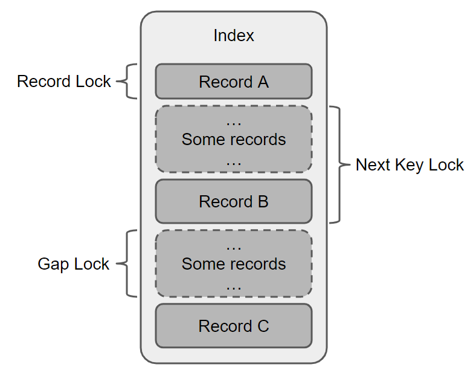
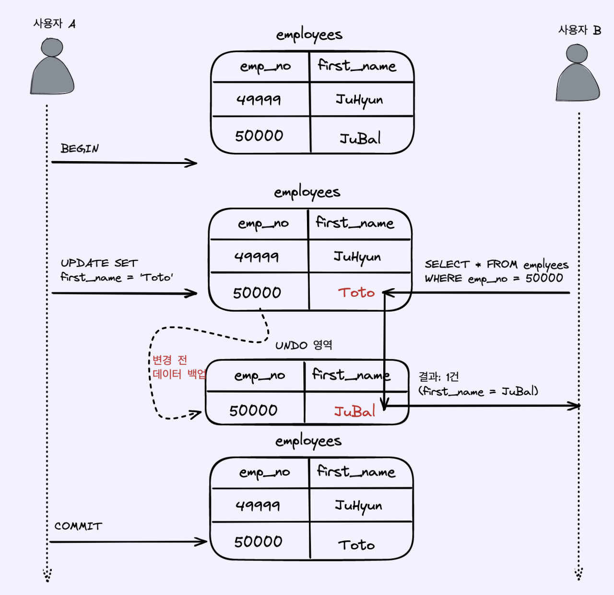
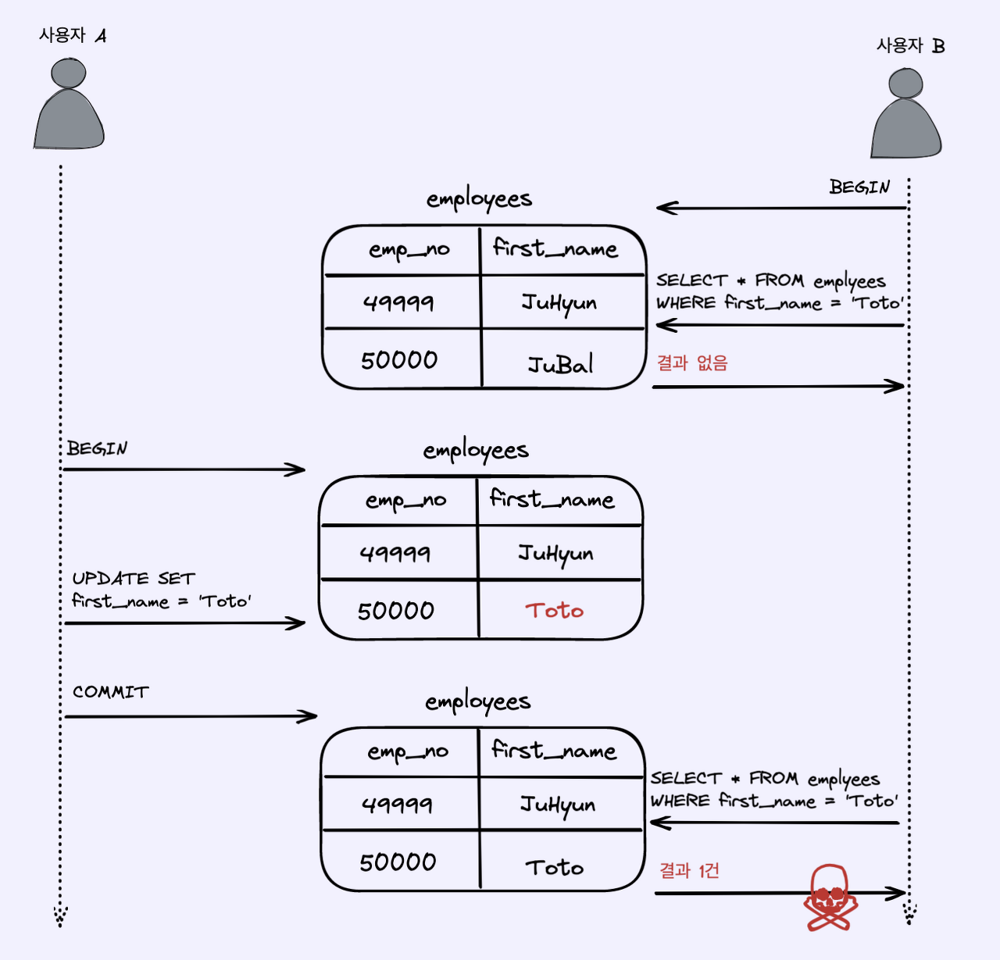
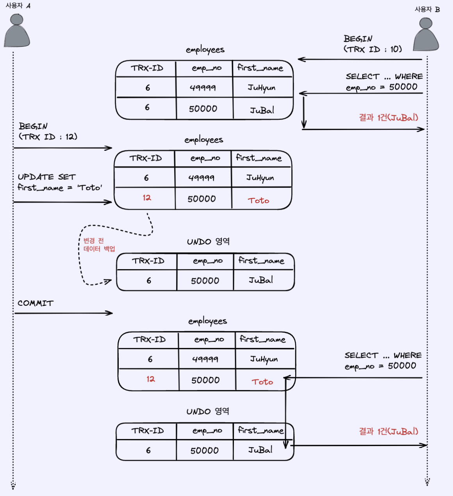
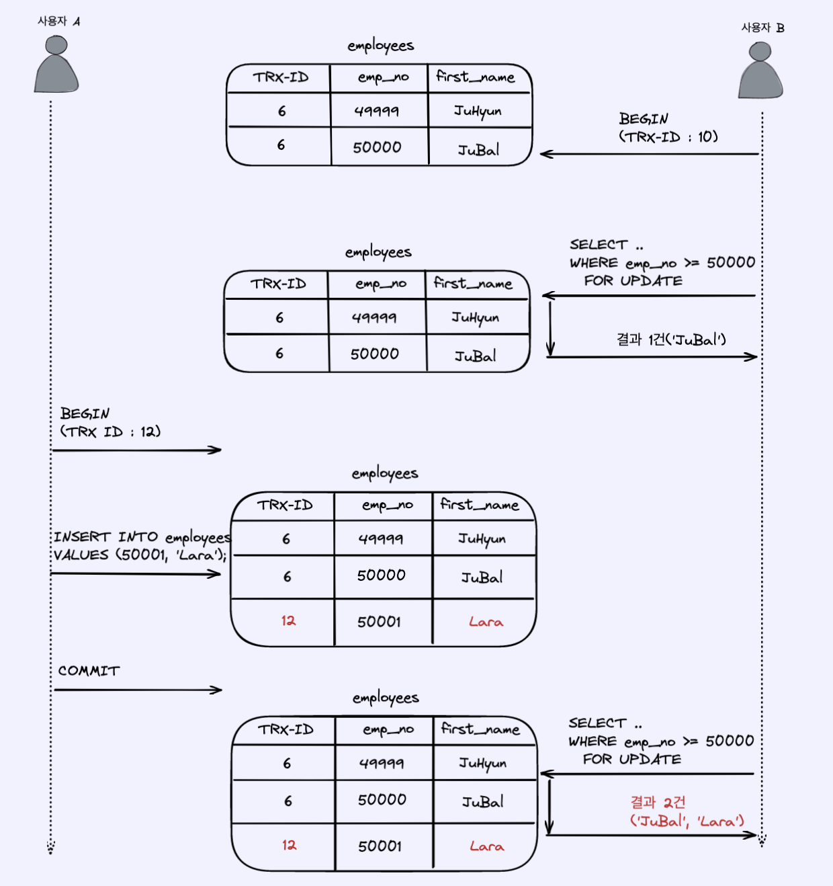

# 5. 트랜잭션과 잠금


#### 트랜잭션 (Transaction)
- 데이터 정합성을 보장하기 위한 기능.
- 논리적인 작업 셋을 묶어 처리하지 못할 경우에 원 상태로 복구.
- Partial update를 막아 작업의 완전성 보장.

#### 잠금 (Lock)
- 동시성을 제어하기 위한 기능.
- 여러 커넥션에서 동시에 동일한 자원을 요청할 경우, 한 시점에는 하나의 커넥션만 변경.
- 트랜잭션 내 / 트랜잭션 간의 작업 내용을 어떻게 공유 / 차단할 지 결정.

## 5.1 트랜잭션

### 5.1.1 MySQL에서의 트랜잭션


- 하나의 논리적인 작업 셋이 ```COMMIT```되어 100% 적용되거나 ```ROLLBACK```되어 아무것도 적용되지 않음을 보장.
- 

#### ex. 5.1.1
innoDB 테이블과 MyISAM 테이블의 동작 차이

```
// MyISAM

mysql> CREATE TABLE tab_mysam ( fdpk INT NOT NULL, PRIMARY KEY (fdpk) ) ENGINE=MyISAM;
mysql> INSERT INTO tab_mysam (fdpk) VALUSE (3);

// AUTO-COMMIT 활성화
mysql> SET autocommit=ON;
mysql> INSERT INTO tab_myisam (fdpk) VALUES (1), (2), (3);

mysql> SELECT * FROM tab_myisam
```
|fdpk|
|----|
|1   |
|2   |
|3   |

- 1, 2를 저장하고 3을 저장하다 실패.
- ```INSERT```가 실패했음에도 전체가 ```ROLLBACK``` 되지 않고 partial update가 일어남.
- Memory storage engine을 사용하더라도 이와 같이 동작.

```
// InnoDB

mysql> CREATE TABLE tab_mysam ( fdpk INT NOT NULL, PRIMARY KEY (fdpk) ) ENGINE=MyISAM;
mysql> INSERT INTO tab_mysam (fdpk) VALUSE (3);

// AUTO-COMMIT 활성화
mysql> SET autocommit=ON;
mysql> INSERT INTO tab_myisam (fdpk) VALUES (1), (2), (3);

mysql> SELECT * FROM tab_innodb
```
|fdpk|
|----|
|3   |

- 1, 2를 저장하고 3을 저장하다 실패.
- ```INSERT```가 실패로 인해 전체 transaction ```ROLLBACK```.


### 5.1.2 주의사항

Transation을 오래 점유하게 되면 성능 저하를 발생.
- Transaction과 관련 없는 작업은 transaction이 시작하기 전 처리.
- Transaction안에 network I/O 지양.
- 단순 조회 작업은 transaction에 포함 X.

## 5.2 MySQL 엔진의 잠금

#### 스토리지 엔진 레벨 잠금

#### MySQL 엔지 레벨 잠금
- 모든 스토리지 엔진에 영향.
- Metadata lock
- Named lock

### 5.2.1 글로벌 락

- ```FLUSH TABLES WITH READ LOCK``` 명령어를 통한 획득.
- MySQL에서 제공하는 잠금 중 가장 큰 범위.
- 한 세션에서 글로벌 락을 실행하게 되면 SELECT를 제외한 DDL 문장이나 DML 문장은 대기 상태.
- 영향 범위는 MySQL 서버 전체.
- MyISAM이나 MEMORY 테이블에 대해 mysqldump로 일관된 백업을 받아야할 때 사용.

```
DDL (Data definition language)
- CREATE
- ALTER
- DROP
- TRUNCATE
- RENAME

DML(Data manipulation language)
- INSERT
- UPDATE
- DELETE
```

### 백업락

- InnoDB는 transaction을 지원하기 때문에 일관된 데이터 상태를 위해 모든 데이터 변경 작업을 멈출 필요 X.
- 좀더 가벼운 글로벌 락의 필요.
- Xtrabackup / Enterprise backup 같은 백업 툴들의 안정성을 위한 도입.


백업락 획득 시 제한 
- 테이블의 스키마 / 사용자 인증 관련 정보 변경 불가.
- 데이터베이스 및 테이블 등 모든 객체 생성 / 변경 / 삭제.
- REPAIR TABLE과 OPTIMIZE TABLE 명령.
- 사용자 관리 및 비밀번호 변경.

기존 MySQL 복제 시 문제
- Global lock 이용 시 Replica server의 복제는 백업 시간만큼 지연.
- 백업 도중 스키마 변경 시 실패.
- 백업 락 도입 이후에는 복제 도중 DDL 명령시 일시 중지.

### 5.2.2 테이블 락

- 테이블 단위로 설정되는 잠금.
- 묵시적 / 명시적으로 테이블 락을 획득.

#### 잠금의 획득과 반환
- 획득: ```LOCK TABLES table_name [ READ | WRITE ]```

- 반환: ```UNLOCK TABLES```

#### 묵시적 테이블 락
- MyISAM / MEMORY의 경우 테이블에 데이터를 변경하는 쿼리 실행시 묵시적 테이블 잠금 동작.
- InnoDB는 스토리지 엔진 차원에서 레코드 기반 잠금을 제공하기 때문에 묵시적 테이블 잠금 동작 X.
- InnoDB의 스키마를 변경하는 DDL 쿼리의 경우 묵시적 테이블 락 동작.

### 5.2.3 네임드 락

- 임의의 문자열에 대해 잠금을 설정.
- 여러 서버의 동기화 처리에 사용

#### ex. 5.2.1
네임드 락의 사용 예시
- 아래 3개의 함수 모두 성공 시 1 / 실패시 0 or NULL 반환.
```
// mylock에 대해 잠금 획득.
// 이미 잠금을 사용 중이면 2초간 대기.
mysql> SELECT GET_LOCK('mylock', 2);

// mylock이라는 문자열에 대해 잠금이 설정돼 있는지 확인.
mysql> SELECT IS_FREE_LOCK('mylock');

// mylock에 대해 잠금 해제
mysql> SELECT RELEASE_LOCK('mylock');

// 모든 테이블 락에 대해 잠금 해제
mysql> SELECT RELEASE_ALL_LOCKS();
```

### 5.2.4 메타데이터 락

- 데이터베이스 객체의 이름이나 구조를 변경하는 경우 획득하는 잠금.
- 명시적으로 획득 / 해제 불가.

#### ex. 5.2.2
메타데이터 락 사용 예시
```
// 메타데이터 락을 통해 변경.
mysql> RENAME TABLE tb TO tb_backup , tb_new TO tb;

// 짧은 순간 tb 테이블이 없는 순간 발생.
mysql> RENAME TABLE tb TO tb_backup;
mysql> RENAME TABLE tb_new TO tb;
```
## 5.3 InnoDB 스토리지 엔진 잠금

- InnoDB 스토리지 엔진은 별도의 레코드 기반의 잠금 방식 제공.
- 이원화된 잠금 처리로 MySQL 명령을 통해 접근하기 어려움.
- infomation_schecma의 INNODB_TRX / INNODB_LOCKS, INNODB_LOCK_WAITS 테이블을 통해 조회.

### 5.3.1 InnoDB 스토리지 엔진의 잠금


#### 5.3.1.1 레코드 락

- 수정, 삽입, 삭제등의 다른 트랜잭션을 막는다.
- InnoDB 스토리지 엔진은 인덱스의 레코드를 잠금.
- 인덱스가 없는 테이블이더라도 자동 생성된 클러스터 인덱스를 통해 잠금 설정.
- 기본키나 유니크 키에 의한 변경 작업은 갭 락 없이 인덱스 레코드에만 락을 건다.

#### ex. 5.3.1
```
// c1=10인 인덱스 레코드에 락
// 수정, 삽입, 삭제 불가
SELECT c1 FROM t WHERE c1=10 FOR UPDATE;
```

#### 5.3.1.2 갭 락

- 레코드와 바로 인점한 레코드 사이의 간격만을 잠금.
- 레코드와 레코드 사이에 새로운 레코드가 INSERT되는 것을 제어.
- 넥스트 키 락의 일부로 사용.

#### 5.3.1.3 넥스트 키 락

- 레코드 락과 갭 락을 합쳐놓은 형태의 잠금.
- 인덱스 레코드도 잠그고 그 인덱스 레코드 앞, 뒤 갭도 잠근다.

#### ex. 5.3.2
```
// c1=15 인 레코드를 insert 하는 트랜잭션을 락 (레코드 락).
// c1=8인 레코드 인덱스가 있는 상태라면, c1=9인 레코드를 insert 락 (갭 락).
SELECT c1 FROM t WHERE c1 BETWEEN 10 AND 20 FOR UPDATE;
```

#### 5.3.1.4 자동 증가 락

- AUTO_INCREMENT 컬럼이 사용되는 테이블에서 레코드가 INSERT 되는 경우 사용.
- 명시적으로 획득 / 해제 불가.
- innodb_autoinc_lock_mode 시스템 변수를 통해서 작동 방식 변경.

#### reference: https://dev.mysql.com/doc/refman/5.7/en/innodb-auto-increment-handling.html

### 5.3.2 인덱스와 잠금

- InnoDB의 잠금은 인덱스의 레코드를 잠금.
- UPDATE시에 변경할 레코드를 찾기 위해 검색한 인덱스의 레코드에 모두 락을 걸어야함.
- 인덱스가 없다면 모든 레코드에 잠금 (풀스캔).

### 5.3.3 레코드 수준의 잠금 확인 및 해제

- MySQL 5.1 부터 레코드 잠금과 잠금 대기에 대한 조회 지원.
- ```KILL [process id]``` 명령어를 통해 프로세스 종료.

information_schema
- INNODB_TRAX, INNODB_LOCK, INNODB_LOCK_WAITS.
- deprecated 돼가는 중.

performance_schema
- data_locks, data_lock_waits

#### ex. 5.3.3


## 5.4 MySQL의 격리 수준

| 격리 수준       |DIRTY READ	|NON-REPEATABLE READ|PHANTOM READ       |
|----------------|-------------|--------------------|------------------|
|READ UNCOMMITTED|O            |O               	|O                 |
|READ COMMITTED	 |	           |O                 	|O                 | 
|REPEATABLE READ | 	 	       |                    |O (InnoDB는 발생 X)|
|SERIALIZABLE	 |	           |                    |                  |


## Read Uncommited
- 각 트랜잭션에서의 변경 내용이 COMMIT이나 ROLLBACK 여부에 상관 없이 다른 트랜잭션에서 보여지는 격리 수준.
- 작업 도중 문제가 발생하여 INSERT된 내용을 롤백해버린다 하더라도 다른 사용자는 롤백된 정보를 이용하여 처리.
- 일반적으로 사용 X.



## Dirty Read
- 트랜잭션에서 처리한 작업이 완료되지 않았음에도 불구하고 다른 트랜잭션에서 볼 수 있게 되는 현상.


## Read Commited
- 서비스에서 가장 많이 선택되는 격리 수준.
- 어떠한 트랜잭션에서 데이터를 변경하더라도 COMMIT이 완료된 데이터만 다른 트랜잭션에서 조회.
- Commit 전의 데이터는 UNDO 영역에서 조회.


## Non-Repeatable Read
- 동일한 SELECT 쿼리를 실행했을 때 항상 같은 결과를 보장해야 한다는 "REPEATABLE READ" 정합성에 어긋나는 현상.



## Repeatable Read
- MySQL의 InnoDB 스토리지 엔진에서 기본적으로 사용되는 격리 수준.
- NON-REPEATABLE READ 부정합이 발생 X.
- 언두 영역에 백업된 이전 데이터를 통해 동일한 트랜잭션 내에서는 동일한 결과 보장.
- MVCC(Multi Version Concurrency Control)를 보장하기 위해 실행중인 트랜잭션 가운데 가장 오래된 트랜잭션 번호보다 트랜잭션 번호가 앞선 언두 영역의 데이터는 삭제 X.



## Phantom Read
- 다른 트랜잭션에서 수행한 변경 작업에 의해 레코드가 보였다가 안보였다가 하는 현상.
- InnoDB는 MVCC를 통해 Repeatable Read에서도 Phantom Read 발생 X.




## Serializable

- 가장 단순한 격리 수준이면서 가장 엄격한 격리 수준.
- 한 트랜잭션에서 읽고 쓰는 레코드를 다른 트랜잭션에서는 절대 접근 X.
- 성능저하를 유발.


# Appendix

## Transaction / Lock 조회

### information_schema
Reference: https://dev.mysql.com/doc/refman/5.6/en/innodb-information-schema-examples.html
```
// Session A
BEGIN;
SELECT a FROM t FOR UPDATE;
SELECT SLEEP(100);
```

```
// Session B
SELECT b FROM t FOR UPDATE;
```

```
// Session C
SELECT c FROM t FOR UPDATE;
```

```
SELECT
  r.trx_id waiting_trx_id,
  r.trx_mysql_thread_id waiting_thread,
  r.trx_query waiting_query,
  b.trx_id blocking_trx_id,
  b.trx_mysql_thread_id blocking_thread,
  b.trx_query blocking_query
FROM       information_schema.innodb_lock_waits w
INNER JOIN information_schema.innodb_trx b
  ON b.trx_id = w.blocking_trx_id
INNER JOIN information_schema.innodb_trx r
  ON r.trx_id = w.requesting_trx_id;
```

| waiting_trx_id | waiting_thread | waiting_query              | blocking_trx_id | blocking_thread | blocking_query             |
|----------------|----------------|----------------------------|-----------------|-----------------|----------------------------|
| A4             | 6              | SELECT b FROM t FOR UPDATE | A3              | 5               | SELECT SLEEP(100)          |
| A5             | 7              | SELECT c FROM t FOR UPDATE | A3              | 5               | SELECT SLEEP(100)          |
| A5             | 7              | SELECT c FROM t FOR UPDATE | A4              | 6               | SELECT b FROM t FOR UPDATE |

### Current transaction
Reference: https://dev.mysql.com/doc/mysql-perfschema-excerpt/5.7/en/performance-schema-events-transactions-current-table.html
```
mysql> SELECT *
       FROM performance_schema.events_transactions_current LIMIT 1\G
*************************** 1. row ***************************
                      THREAD_ID: 26
                       EVENT_ID: 7
                   END_EVENT_ID: NULL
                     EVENT_NAME: transaction
                          STATE: ACTIVE
                         TRX_ID: NULL
                           GTID: 3E11FA47-71CA-11E1-9E33-C80AA9429562:56
                            XID: NULL
                       XA_STATE: NULL
                         SOURCE: transaction.cc:150
                    TIMER_START: 420833537900000
                      TIMER_END: NULL
                     TIMER_WAIT: NULL
                    ACCESS_MODE: READ WRITE
                ISOLATION_LEVEL: REPEATABLE READ
                     AUTOCOMMIT: NO
           NUMBER_OF_SAVEPOINTS: 0
NUMBER_OF_ROLLBACK_TO_SAVEPOINT: 0
    NUMBER_OF_RELEASE_SAVEPOINT: 0
          OBJECT_INSTANCE_BEGIN: NULL
               NESTING_EVENT_ID: 6
             NESTING_EVENT_TYPE: STATEMENT
```
### Data lock
Reference: https://dev.mysql.com/doc/refman/8.0/en/performance-schema-data-locks-table.html

```
mysql> SELECT * FROM performance_schema.data_locks\G
*************************** 1. row ***************************
               ENGINE: INNODB
       ENGINE_LOCK_ID: 139664434886512:1059:139664350547912
ENGINE_TRANSACTION_ID: 2569
            THREAD_ID: 46
             EVENT_ID: 12
        OBJECT_SCHEMA: test
          OBJECT_NAME: t1
       PARTITION_NAME: NULL
    SUBPARTITION_NAME: NULL
           INDEX_NAME: NULL
OBJECT_INSTANCE_BEGIN: 139664350547912
            LOCK_TYPE: TABLE
            LOCK_MODE: IX
          LOCK_STATUS: GRANTED
            LOCK_DATA: NULL
*************************** 2. row ***************************
               ENGINE: INNODB
       ENGINE_LOCK_ID: 139664434886512:2:4:1:139664350544872
ENGINE_TRANSACTION_ID: 2569
            THREAD_ID: 46
             EVENT_ID: 12
        OBJECT_SCHEMA: test
          OBJECT_NAME: t1
       PARTITION_NAME: NULL
    SUBPARTITION_NAME: NULL
           INDEX_NAME: GEN_CLUST_INDEX
OBJECT_INSTANCE_BEGIN: 139664350544872
            LOCK_TYPE: RECORD
            LOCK_MODE: X
          LOCK_STATUS: GRANTED
            LOCK_DATA: supremum pseudo-record
```
