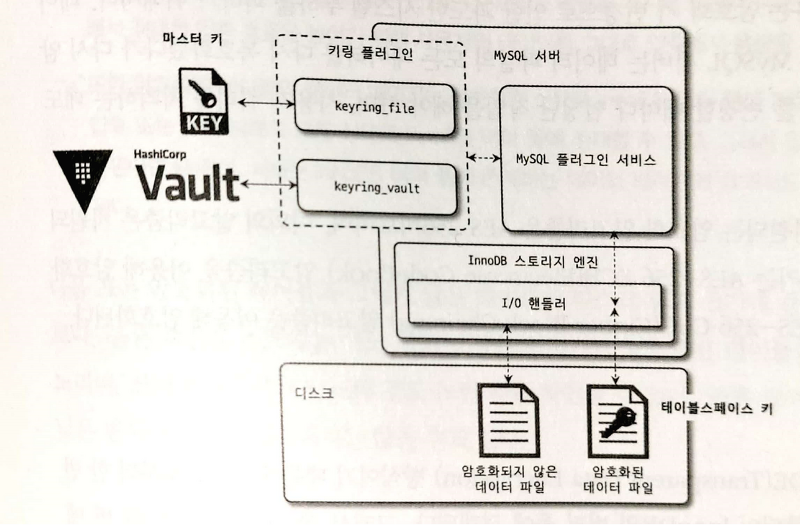

# 7. 데이터 암호화


#### 암호화 지원 범위
- 데이터 파일(테이블스페이스).
- 리두 로그 / 언두 로그.
- 복제를 위한 바이너리 로그.

## 7.1 MySQL 서버의 데이터 암호화

- 디스크 입출력 과정에서 암호화 진행
- InnoDB 스토리지 엔진의 I/O 레이어에 구현
- 사용자 쿼리에서는 동일한 처리 (Transparent data encryption / Data at Rest Encryption)

### 7.1.1 2단계 키 관리

MySQL 서버의 TDE에서 암호화 키는 키링 (KeyRing) 플러그인에 의해 관리.
- keyring_fine File-Based 플러그인
- keyring_encrypted_file Keyring 플러그인 [엔터프라이즈]
- keyring_okv KMIP 플러그인 [엔터프라이즈]
- keyring_aws Amazon Web Services Keyring 플러그인 [엔터프라이즈]

2단계 키관리를 제공
- ```마스터 키```와 ```데이블스페이스 키```로 구분
- HashiCorp Vault 같은 외부 키 관리 솔루션 혹은 디스크의 파일 (keyring_fine / keyring_encrypted_file 플러그인 사용)로 ```마스터 키```를 가져옴
- 테이블 생성 시에 해당 테이블을 위한 임의의 ```테이블스페이스 키``` 발급
- ```마스터 키```를 이용하여 ```테이블스페이스 키```를 암호화한 뒤 테이블 헤더에 저장

마스터 키의 변경
```
mysql> ALTER INSTANCE ROTATE INNNODB MASTER KEY;
```
- ```마스터 키```의 변경 시 기존 ```마스터 키```를 이용해 ```테이블스페이스 키```를 복호화한 뒤 새로 암호화.
- ```마스터 키```가 변경되는 동안 MySQL 서버의 ```테이블스페이스 키``` 자체와 데이터 파일의 데이터는 변경 X.
- 2단계 키관리는 이용함으로써 키변경에 의한 데이터 변경 필요 X.




암호화 알고리즘

- TDE: AES-256
- 테이블스페이스 키: AES-256 ECB
- 데이터 파일: AES-256 CBC

### 7.1.2 암호화와 성능

- 디스크에서 한번 읽은 데이터는 복호화되어 InnoDB 버퍼풀에 적재.
- 새로 데이터 페이지를 읽는 경우에는 복호화 수행하여 쿼리 지연.
- 암호화된 테이블이 변경되는 경우 추가시간이 걸림. (백그라운드에서 수행)
- AES 방식은 키의 길이보다 평문의 길이가 짧으면 비효율 적이지만, 일반적으로 데이터 페이지는 키보다 크기 때문에 평문과 암호문의 길이가 같음.
- 디스크 I/O에서 읽기의 경우 3-5배, 쓰기의 경우 5-6배 느려짐

암호화와 압축
- 암호화와 압축을 동시에 하는 경우 압축을 먼저 실행.
- 암호화시 결과가 랜덤한 바이트로 생성되는데 이를 압축하면 압축효율이 낮아짐.
- 압축된 데이터 또한 InnoDB 버퍼풀에 저장될 수 있음.

### 7.1.3 암호화와 복제

- 소스 서버와 레플리카 서버는 서로 다른 ```마스터 키```와 ```테이블스페이스 키```를 갖는다.
- 서버의 로컬 디렉토리에 ```마스터 키```를 관리하는 경우에는 자동으로 다른 값을 갖게됨.
- 외부 키 관리 솔루션을 사용하는 경우 서로 다른 키를 갖도록 설정이 필요.
- ```ALTER INSTANCE ROTATE INNNODB MASTER KEY``` 명령을 통해 ```마스터 키```를 변경하는 경우, 해당 명령은 레플리카 서버로 복제되지만 ```마스터 키```는 전달 X.
- 서버의 백업에서 TDE의 key ring 파일을 백업하지 않는경우, 파일을 찾지 못하면 백업 불가.

## 7.2 keyring_file 플러그인 설치

- TDE 플러그인은 서버 시작 단계에서도 가장 빨리 초기화 되어야 함.
- my.cnf 파일에 early-plugin-load 시스템 변수에 keyring_file 플러그인을 위한 라이브러리("keyring_file.so") 를 명시.

```
early-plugin-load = keyring_file.so
keyring_file_data = /var/.../.../tde_master.key
```

MySQL 서버의 설정 파일이 준비되면 MySQL 서버를 재시작하면 자동으로 keyring_file 플러그인이 초기화.

```
mysql> SHOW PLUGINS;
+---------------+----------+-------------+-----------------+-----------+
| Name          | Status    | Type       | Library         | License   |
+---------------+-----------+------------+-----------------+-----------+
| keyring_file  | ACTIVE   | KEYRING     | keyring_file.so |  GPL      |
...
```

- 플러그인만 초기화 상태 일 뿐 아직 마스터 키를 사용한적이 없기 때문에 실제 키링 파일의 내용은 비어있게 됨.
- 데이터 암호화 기능을 사용하는 테이블을 생성하거 마스터 로테이션을 실행하면 키링 파일의 마스터 키가 초기화.

``` 
linux> ls  -alh tde_master.key
-rw-r----- 1 matt 0B 7 27 14:24 tde_master.key

mysql> ALTER INSTANCE ROTATE INNODB MASTER KEY;

linux> ls  -alh tde_master.key
-rw-r----- 1 matt 187B 7 27 14:24 tde_master.key
```

## 7.3 테이블 암호화
### 7.3.1 테이블 생성


#### ex. 7.3.1 암호화 테이블 생성
- 테이블 생성 구문에 ```ENCRYPTION=Y``` 옵션 추가
```
mysql> CREATE TABLE tb_enc
(
    id INT,
    col1 VARCHAR(100),
    primary KEY(id)
) ENCRYPTION = 'Y';

mysql> INSERT INTO tab_encrypted values (1, 'test_data');

mysql> select * from tab_encrypted
```
|id|data     |
|--|---------|
|1 |test_data|


#### ex. 7.3.2 암호화 테이블 조회
- information_schema의 TABLELS 뷰 확인.
```
mysql> select table_schema,table_name,create_options
 from information_schema.tables
 where table_name='tb_enc';
```

| TABLE_SCHEMA | TABLE_NAME | CREATE_OPTIONS |
|--------------|------------|----------------|
| tdb          | tb_enc     | ENCRYPTION='Y' |


default_table_encrytion 환경변수를 ON으로 설정하면 기본으로 암호화 테이블 생성.

### 7.3.2 응용 프로그램 암호화와의 비교

- 응용 프로그램에서 직접 암호화 후 MySQL 서버에 저장.
- 인덱스의 기능을 100% 활용 불가.

#### ex. 7.3.3 음용 프로그램 암호화

- 생년월일을 암호화 하여 저장
- Query 1과 같이 암호화된 컬럼에 ```=``` 연산자를 이용한 조회 **가능**.
- Query 2와 같이 암호화된 컬럼에 ```BETWEEN``` **불가능**.
- Query 3와 같이 암호화된 컬럼을 이용한 ```ORDER BY``` **불가능**.

```
mysql> CREATE TABLE app_user (
    id BINGINT,
    enc_birth_year VARCHAR(50), /* 응용 프로그램에서 미리 암호화 */
    ...
    PRIMARY KEY (id),
    INDEX ix_birthyear (birth_year)
);

// Query 1
mysql> SELECT * FROM app_user WHERE enc_birth_year=#{encryptedYear};
// Query 2
mysql> SELECT * FROM app_user WHERE enc_birth_year BETWEEN #{encryptedMinYear} AND #{encyptedMaxYear};
// Query 3
mysql> SELECT * FROM app_user ORDER BY enc_birth_year LIMIT 10;
```

#### MySQL 암호화

- Index관련 작업을 마치고 디스크에 저장할 때만 암호화.
- Index를 사용하는데 있어 제약 X.
- MySQL 서버에 접근 가능하다면 누구나 평문 확인.

### 7.3.3 테이블스페이스 이동

- Export & Import.
- 테이블을 다를서버로 복사하는 경우, 특정 테이블의 데이터만 백업 / 복구하는 경우 사용.
- 레코드를 덤프 / 복구하는 방법보다 속도에 이점.
- 다음의 명령어를 통해 export.

```
mysql> FLUSH TABLES src_tb FOR EXPORT;
```

#### 암호화되지 않은 테이블
- src_tb의 저장되지 않은 변경사항들을 디스크에 기록후 src_tb를 잠금.
- src_tb의 구조를 src_tb.cfg파일로 기록.
- src_tb.ibd 파일과 src_tb.cfg파일을 목적지 서버로 복사.
- 복사가 완료되면 ```UNLOCK TABLES``` 명령을 실행해 src_tb의 잠금을 풀어야함.

#### 암호화된 테이블
- MySQL 서버는 임시로 사용할 ```마스터 키```를 발급하여 src_tb.cfp에 기록.
- 암호화된 테이블의 테이블의 ```테이블스페이스 키```를 기존 ```마스터 키```로 복호화한 뒤 임시 ```마스터 키```로 암호화.
- 새로 암호화된 ```테이블스페이스 키```를 데이터 파일의 헤더에 저장.
- 암호화된 테이블의 테이블스페이스 이동 기능 사용시에는 반드시 *.cfp 파일의 복사가 필요.

## 7.4 언두 로그 및 리두 로그 암호화
- 데이블 암호화를 적용해도 리두 로그 / 언두 로그 / 바이너리 로그는 평문으로 저장.
- innodb_undo_log_encrypt / inonodb_redo_log_encrypt 시스템변수를 통해 설정 (기본값 OFF).
- 암호화 활성 시점부터 암호화가 진행, 활성 이전 로그는 평문으로 저장.
- 암호화 비활성 시점부터 평문으로 저장, 비활성 이전 로그는 암호문으로 저장.

### 암호화 키
- 마스터 키와 리두 로그 / 언두 로그 파일을 위한 테이블스페이스 키를 발급.
- 해당 테이블스페이스 키는 마스터 키로 암호화되어, 리두 로그 / 언두 로그 파일에 저장.


## 7.5 바이너리 로그 암호화

- 바이너리 로그와 릴레이 로그는 디스크에 저장할 때만 암호화.
- SSL 설정을 통해 복제 멤버간의 네트워크에서 암호화 가능.

### 7.5.1 바이너리 로그 암호화 키 관리

- 바이너리 로그 / 릴레이 로그 파일의 데이터는 ```파일 키```로 암호화해서 디스크에 저장.
- ```파일 키```는 ```바이너리 로그 암호화 키```로 암호화해서 각 로그 파일의 헤더에 저장.

### 7.5.2 바이너리 로그 암호화 키 변경

```
mysql> ALTER INSTANCE ROTATE BINLOG MASTER KEY;
```
1. 증가된 시쿼스 번호와 함께 ```바이너리 로그 암호화 키``` 발급 후 키링 파일에 저장.
2. 바이너리 로그 파일과 릴레이 로그 파일 스위치 (새로운 로그 파일로 로테이션).
3. 새로 생성되는 바이너리 로그와 릴레이 로그 파일의 암호화를 위해 파일키 생성
4. 파일 키를 ```바이너리 로그 암호화 키```로 암호화해서 각 로그파일에 저장
5. 기존 바이너리 로그와 릴레리 로그 파일의 ```파일 키```를 읽어서 새로운 바이너리 로그 파일 키로 암호화해서 다시 저장.
6. 모든 바이너리 로그와 릴레이 로그 파일이 새로운 ```바이너리 로그 암호화 키```로 다시 암호화됐다면, 기존 ```바이너리 로그 암호화 키```를 키링 파일에서 제거.

- ```바이너리 로그 암호화 키```는 시퀀스 번호로 버전 관리가 이루어짐.
- 5번 작업이 오래 걸리기 때문에, 암호화 키를 연속적으로 변경하게 되면 여러개의 ```바이너리 로그 암호화 키```가 존재할 수 있음.
- 필요 없어진 ```바이너리 로그 암호화 키```는 키링 파일에서 제거.

### 7.5.3 mysqlbinlog 도구 활용

- ```바이너리 로그 암호화 키```는 MySQL 서버만 갖고 있기 때문에 MySQL 서버를 통하지 않고는 복호화 불가.
- mysqlbinlog 명령을 실행할 때 서버정보를 입력.

```
// --read-from-remote-server 사용
liunx> mysqlbinlog --read-from-remote-server -u root -p -vvv tdb-binlog.000055
...
BINLOG '
Ktr4YRMBAAAAOQAAAG4BAAAAAGgAAAAAAAEAA3RkYgAGdGJfZW5jAAIDDwKQAQIBAQACAS0YJA+w
Ktr4YR4BAAAAOgAAAKgBAAAAAGgAAAAAAAEAAgAC/wAEAAAAEABCaW5nbG9nIGVuYyBUZXN0i6Lz
Yw==
'/*!*/;
### INSERT INTO `tdb`.`tb_enc`
### SET
###   @1=4 /* INT meta=0 nullable=0 is_null=0 */
###   @2='Binglog enc Test' /* VARSTRING(400) meta=400 nullable=1 is_null=0 */
...
```

