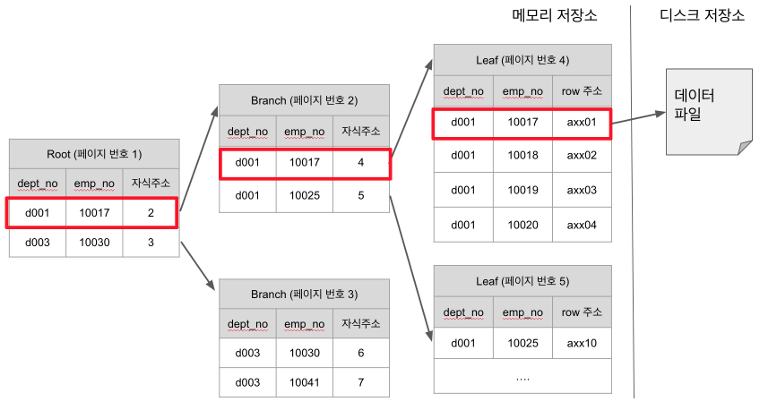
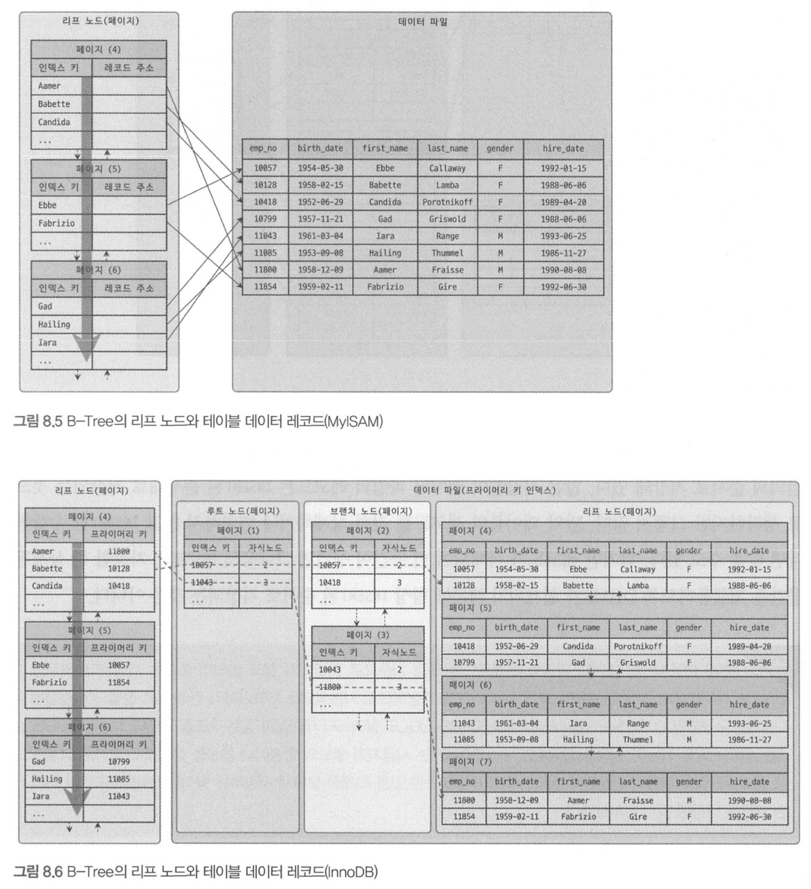
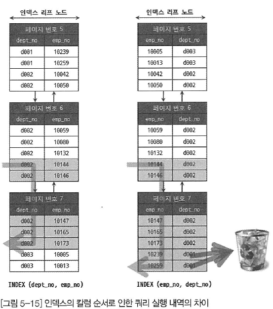
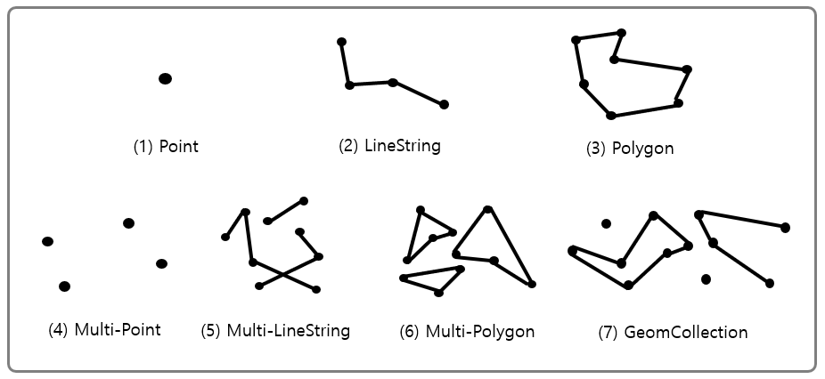
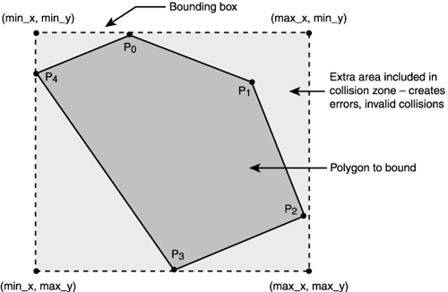
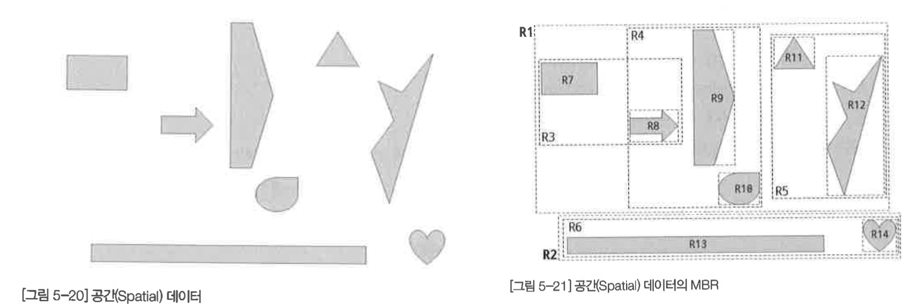
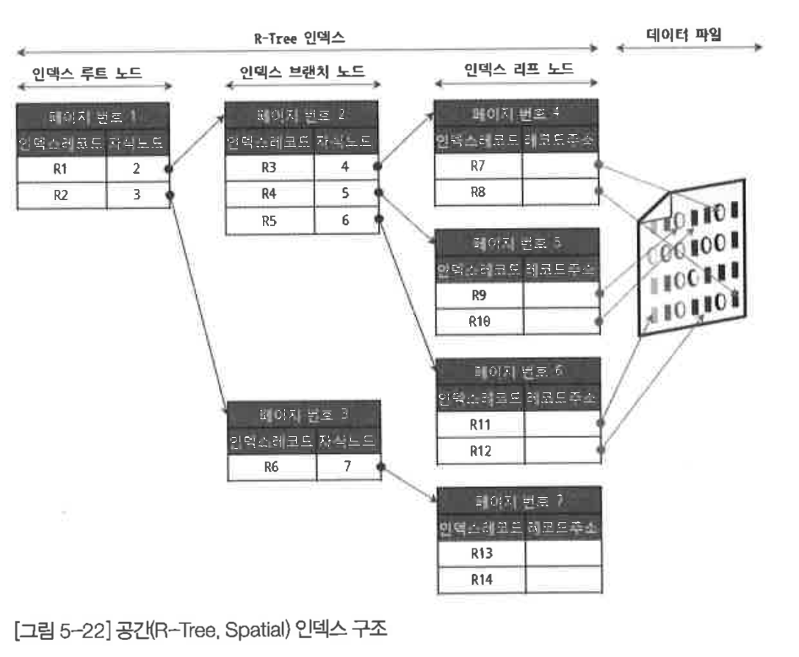
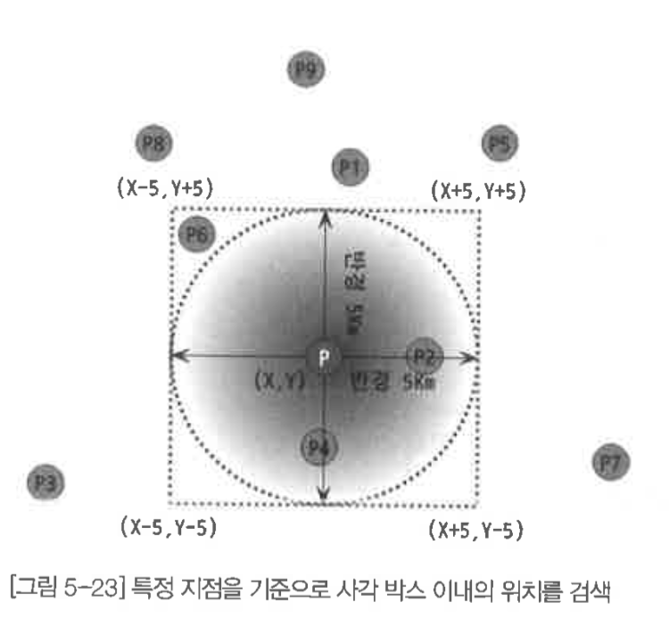

# 인덱스

## 디스크 읽기 방식

### 하드 디스크 드라이브(HDD)와 솔리드 스테이트 드라이브(SSD)
SSD는 HDD보다 랜덤 읽기에서 월등한 성능을 보이며 순차 I/O에서도 HDD보다 더 나은 성능을 보인다.
하지만 아직 HDD를 이용하는 시스템도 많다.

### 랜덤 I/O와 순차 I/O

랜덤 I/O의 작업부하가 순차 I/O에 비해서 훨씬 크며 이는 HDD뿐만 아니라 SSD에서도 마찬가지이다.
하지만 쿼리를 튜닝해서 랜덤 I/O를 순차 I/O로 바꿔서 실행할 방법은 그다지 많지 않다.
일반적으로 쿼리를 튜닝하는 것은 랜덤 I/O 자체를 줄여주는 것이 목적이라고 할 수 있다.

```
인덱스 레인지 스캔은 데이터를 읽기 위해 주로 랜덤 I/O를 사용하며, 풀 테이블 스캔은 순차I/O를 사용한다.
그래서 큰 테이블의 레코드 대부분을 읽는 작업에서는 인덱스를 사용하지 않고 풀 테이블 스캔을 사용하도록 유도할 때도 있다.
이런 형태는 OLTOP(On-Line Transaction Processing) 성격의 웹 서비스보다는 데이터 웨어하우스나 통계 작업에서 자주 사용된다.
```

## 인덱스란?

비유를 하자면 SortedList가 DBMS의 인덱스와 같은 자료구조이며, ArrayList는 데이터 파일과 같은 자료 구조라고 볼 수 있다.
SortedList 자료구조는 데이터가 저장될 때마다 항상 값을 정렬해야 하므로 저장하는 과정이 복잡하고 느리지만,
이미 정렬돼 있어서 아주 빨리 원하는 값을 찾아올 수 있다.
결론적으로 DBMS에서 인덱스는 데이터의 저장 성능을 희생하고 그 대신 데이터의 읽기 속도를 높이는 기능이다.

인덱스는 데이터를 관리하는 방식과 중복 값의 허용 여부 등에 따라 여러 가지로 나눠볼 수 있다.
이 분류는 인덱스를 좀 더 효율적으로 설명하기 위해 임의로 분류된 것이다.
일단 역할 별로는 Primary key와 Secondary key로 구분할 수 있다.

- Primary key는 이미 잘 아는 것처럼 그 레코드를 대표하는 칼럼의 값으로 만들어진 인덱스를 의미한다.
이 칼럼은 테이블에서 해당 레코드를 식별할 수 있는 기준값이 되기 때문에 우리는 이를 식별자라고도 부른다.
Primary key는 NULL 값을 허용하지 않으며 중복을 허용하지 않는 것이 특징이다.

- Primary key를 제외한 나머지 모든 인덱스는 Secondary Index로 분류한다.
Unique Index는 Primary key와 성격이 비슷하고 Primary key를 대체해서 사용할 수도 있다고 해서 대체 키라고도 하는데,
별도로 분류하기도 하고 그냥 Secondary Index로 분류하기도 한다.

데이터 저장 방식별로 구분할 경우 대표적으로 B-Tree 인덱스와 Hash 인덱스가 있다.
최근에는 Fractal-Tree 인덱스나 로그기반의 Merge-Tree 인덱스를 사용하는 DBMS도 개발되고 있다.

- B-Tree 알고리즘은 가장 일반적으로 사용되는 인덱스 알고리즘으로서, 상당히 오래전에 도입된 알고리즘이며 그만큼 성숙해진 상태다.
B-Tree 인덱스는 칼럼의 값을 변형하지 않고 원래의 값을 이용해 인덱싱하는 알고리즘이다.
MySQL 서버에서는 위치 기반 검색을 지원하기 위한 R-Tree 인덱스 알고리즘도 있지만, 결국 R-Tree 인덱스는 B-Tree의 응용 알고리즘으로 볼 수 있다.

- Hash 인덱스 알고리즘은 칼럼의 값으로 해시값을 계산해서 인덱싱하는 알고리즘으로, 매우 빠른 검색을 지원한다.
하지만 값을 변형해서 인덱싱하므로 전방(Prefix) 일치와 같이 값의 일부만 검색하거나 범위를 검색할 때는 해시 인덱스를 사용할 수 없다.
Hash 인덱스는 주로 메모리 기반의 데이터베이스에서 많이 사용한다.

데이터의 중복 허용 여부로 분류 하면 Unique 인덱스와 Non-Unique 인덱스로 구분할 수 있다.

인덱스의 기능별로 분류해보면 전문 검색용 인덱스나 공간 겁색용 인덱스 등을 예로 들 수 있다.

## B-Tree 인덱스

DB의 인덱싱 알고리즘 가운데 가장 먼저 도입되고 일반적으로 사용되는 알고리즘이며 가장 범용적으로 사용되는 인덱스 알고리즘이다.
B-Tree에는 여러가지 변형된 형태의 알고리즘이 있는데, 일반적으로 DBMS에서는 주로 B+-Tree 또는 B*-Tree가 사용된다.

### 구조 및 특성



최상위에 하나의 Root node가 존재하고 그 하위에 자식 노드가 붙어 있는 형태다.
트리 구조의 가장 하위에 있는 노드를 Leaf node라고 하고 트리 구조에서 Root node도 아니고 Leaf node도 아닌 중간의 node를 Branch node라고 한다.
데이터베이스에서 인덱스와 실제 데이터가 저장된 데이터는 따로 관리되는데, 인덱스의 Leaf node는 항상 실제 데이터 레코드를 찾아가기 위한 주솟값을 가지고 있다.

```
대부분 RDBMS의 데이터 파일에서 레코드는 특정 기준으로 정렬되지 않고 임의의 순서로 저장된다.
하지만 InnoDB 테이블에서 레코드는 클러스터되어 디스크에 저장되므로 기본적으로 프라이머리 키 순서로 정렬되어 저장된다.
이는 오라클의 IOT(Index organized table)나 MS-SQL의 클러스터 테이블과 같은 구조를 말한다.
다른 DBMS에서는 클러스터링 기능이 선택 사항이지만, InnoDB에서는 사용자가 별도의 명령이나 옵션을 선태가지 않아도 디폴트로 클러스터링 테이블이 생성된다.
클러스터링이란 비슷한 값을 최대한 모아서 저장하는 방식을 의미한다.
```

인덱스는 테이블의 키 칼럼만 가지고 있으므로 나머지 칼럼을 읽으려면 데이터 파일에서 해당 레코드를 찾아야 한다.
이를 위해 인덱스의 leaf node는 데이터 파일에 저장된 레코드의 주소를 가진다.



record 주소는 MyISAM 테이블의 생성 옵션에 따라 레코드가 테이블에 INSERT된 순번이거나 데이터 파일 내의 위치이다.
InnoDB 스토리지 엔진을 사용하는 테이블에서는 프라이머리 키가 ROWID의 역할을 한다.
MyISAM 테이블은 세컨더리 인덱스가 물리적인 주소를 가지는 반면
InnoDB 테이블은 프라이머리 키를 주소처럼 사용하기 때문에 논리적인 주소를 가진다고 볼 수 있다.

### B-Tree 인덱스 키 추가 및 삭제

#### 인덱스 키 추가

B-Tree에 저장될 때는 저장될 키 값을 이용해 B-Tree상의 적절한 위치를 검색해야 한다.
저장될 위치가 결정되면 레코드의 키 값과 대상 레코드의 주소 정보를 B-Tree의 leaf node에 저장한다.
leaf node가 꽉 차서 더는 저장할 수 없을 때는 leaf node가 분리돼야 하는데, 이는 상위 브랜치 노드까지 처리의 범위가 넓어진다.
이러한 작업 탓에 B-Tree는 상대적으로 쓰기 작업에 비용이 많이 드는 것으로 알려졌다.

MyISAM이나 MEMORY 엔진을 사용하는 테이블에서는 INSERT 문장이 실행되면 즉시 새로운 키 값을 B-Tree 인덱스에 변경한다.
하지만 InnoDB 스토리지 엔진은 이 작업을 조금 더 지능적으로 처리하는데, 필요하다면 인덱스 키 추가 작업을 지연시켜 나중에 처리할 수 있다.
하지만 프라이머리 키나 유니크 인덱스의 경우 중복 체크가 필요하기 때문에 즉시 B-Tree에 추가하거나 삭제한다.

#### 인덱스 키 삭제

해당 키 값이 저장된 B-Tree의 leaf node를 찾아서 그냥 삭제 마크만 하면 작업이 완료된다.
이렇게 삭제 마킹된 인덱스 키 공간은 계속 그대로 방치하거나 재활용할 수 있다.
인덱스 키 삭제로 인한 마킹 작업 또한 디스크 쓰기가 필요하므로 이 작업 역시 디스크 I/O가 필요한 작업이다.
MySQL 5.5 이상 버전의 InnoDB 스토리지 엔진에서는 이 작업 또한 버퍼링되어 지연 처리될 수도 있다.
MyISAM이나 MEMORY 스토리지 엔진의 테이블에서는 체인지 버퍼와 같은 기능이 없으므로 인덱스 키 삭제가 완료된 후 쿼리 실행이 완료된다.

#### 인덱스 키 변경

인덱스의 키 값은 그 값에 따라 저장될 leaf node의 위치가 결정되므로 
B-Tree의 키 값이 변경되는 경우에는 단순히 인덱스상의 키 값만 변경하는 것은 불가능하다.
B-Tree의 키 값 변경 작업은 먼저 키 값을 삭제한 후, 다시 새로운 키 값을 추가하는 형태로 처리된다.

#### 인덱스 키 검색

인덱스를 검색하는 작업은 B-Tree의 루트 노드부터 시작해 브랜치 노드를 거쳐 최종 leaf node까지 이동하면서 비교 작업을 수행하는데,
이 과정을 "트리 탐색"이라고 한다.
B-Tree 인덱스를 이용한 검색은 100% 일치 또는 값의 앞부분만 일치하는 경우에 사용할 수 있다.
부등호 비교 조건에서도 인덱스를 활용할 수 있지만, 인덱스를 구성하는 키 값의 뒷부분만 검색하는 용도로는 인덱스르 사용할 수 없다.
또한 인덱스를 이용한 검색에서 중요한 사실은 인덱스의 키 값에 변형이 가해진 후 비교되는 경우는 
절대 B-Tree의 빠른 검색 기능을 사용할 수 없다는 것이다.
이미 변형된 값은 B-Tree 인덱스에 존재하는 값이 아니다.
따라서 함수나 연산을 수행한 결과로 정렬한다거나 검색하는 작업은 B-Tree의 장점을 이용할 수 없으므로 주의해야 한다.

```
InnoDB 테이블에서 지원하는 레코드 잠금이나 넥스트 키락이 검색을 수행한 인덱스를 잠근 후 테이블 레코드르 잠그는 방식으로 구현돼있다.
따라서 UPDATE나 DELETE 문장이 실행될 때 테이블에 적절히 사용할 수 있는 인덱스가 없으면 불필요하게 많은 레코드를 잠근다.
```

### B-Tree 인덱스 사용에 영향을 미치는 요소

#### 인덱스 키 값의 크기

InnoDB 스토리지 엔진은 디스크에 데이터를 저장하는 가장 기본 단위를 페이지 또는 블록이라고 한다.
페이지는 InnoDB 스토리지 엔진의 버퍼 풀에서 데이터를 버퍼링하는 기본 단위이기도 하다.
인덱스도 결국은 페이지 단위로 관리되며, 루트와 브랜치, 그리고 leaf node를 구분한 기준이 바로 페이지 단위이다.

B-Tree는 이진트리가 아니며 자식 노드의 개수가 가변적인 구조다. 자식 노드의 개수는 인덱스 페이지 크기와 키 값의 크기에 따라 결정된다.
MySQL 5.7 버전부터는 InnoDB 스토리지 엔진의 페이지 크기를 innodb_page_size 시스템 변수를 이용해 
4~64KB 사이의 값을 선택할 수 있지만 기본값은 16KB이다.
인덱스의 값이 커지게 되면 한 인덱스 페이지 내에서 저장가능한 인덱스 값의 개수가 줄어든다.
즉 자식노드의 개수는 인덱스 값이 작을수록 크다. 이는 인덱스 크기가 클수록 디스크로부터 읽어야 하는 횟수가 늘어나고,
그만큼 느려진다는 것을 의미한다.

또한 인덱스 키 값의 길이가 길어진다는 것은 전체적인 인덱스의 크기가 커진다는 것을 의미한다.
하지만 인덱스를 캐시해 두는 InnoDB 버퍼 풀이나 MyISAM의 키 캐시 영역은 크기가 제한적이기 때문에 하나의 레코드를 위한 
인덱스 크기가 커지면 커질수록 메모리에 캐시해 둘 수 있는 레코드 수는 줄어든다.
그렇게 되면 자연해 메모리의 효율이 떨어지는 결과를 가져온다.

#### B-Tree 깊이

B-Tree 인덱스의 깊이는 상당히 중요하지만 직접 제어할 방법은 없다.
B-Tree의 깊이는 MySQL에서 값을 검색할 때 몇 번이나 랜덤하게 디스크를 읽어야 하는지와 직결되는 문제다.
결론적으로 인덱스 키 값의 크기가 커지면 커질수록 하나의 인덱스 페이지가 담을 수 있는 인덱스 키 값의 개수가 적어지고, 
그 때문에 같은 레코드 건수라 하더라도 B-Tree의 깊이가 깊어져서 디스크 읽기가 더 많이 필요하게 된다는 것을 의미한다.
(한편 실제로는 아무리 대용량 데이터 베이스라도 B-Tree의 깊이가 5단계 이상까지 깊어지는 경우는 흔치 않다.)

#### 선택도(기수성)

선택도(Selectivity) 또는 기수성(Cardinality)은 거의 같은 의미로 사용되며, 모든 인덱스 키 값 가운데 유니크한 값의 수를 의미한다.
인덱스 키 값 가운데 중복된 값이 많아지면 많아질수록 기수성은 낮아지고 동시에 선택도 또한 떨어진다.
인덱스는 선택도가 높을수록 검색 대상이 줄어들기 때문에 그만큼 빠르게 처리된다.

#### 읽어야 하는 레코드의 건수

인덱스를 통해 테이블의 레코드를 읽는 것은 인덱스를 거치지 않고 바로 테이블의 레코드를 읽는 것보다 높은 비용이 드는 작업이다.
일반적인 DBMS의 옵티마이저에서는 인덱스를 통해 레코드 1건을 읽는 것이 테이블에서 직접 레코드 1건을 읽는 것보다 
4~5배정도 비용이 더 많은 작업인 것으로 예측한다.
즉, 인덱스를 통해 읽어야 할 레코드의 건수가 전체 테이블 레코드의 20~25%를 넘어서면 인덱스를 이용하지 않고 테이블을 모두 직접 
읽어서 필요한 레코드만 가려내는 방식으로 처리하는 것이 효율적이다.

### B-Tree 인덱스를 통한 데이터 읽기

#### 인덱스 레인지 스캔

다음과 같은 경우를 말한다.

```SQL
mysql> SELECT * FROM employees WHERE first_name BETWEEN 'Ebbe' AND 'Gad';
```

이 경우 다음과 같은 순서로 쿼리가 실행된다.

- 인덱스에서 조건을 만족하는 값이 저장된 위치를 찾는다. 이 과정을 인덱스 탐색이라고 한다.
- 탐색된 위치로부터 필요한 만큼 인덱스를 차례대로 쭉 읽는다. 이 과정을 인덱스 스캔이라고 한다.
- 읽어 들인 인덱스 키와 레코드 주소를 이용해 레코드가 저장된 페이지를 가져오고 최종 레코드를 읽어 온다.

여기서 마지막 과정이 결국 랜덤 I/O이기 때문에 인덱스를 통해 읽어야 할 데이터 레코드가 20~25%를 넘으면 테이블의 데이터를
직접 읽는 것이 더 효율적인 처리 방식이 된다. 물론 쿼리가 필요로 하는 데이터에 따라 마지막 과정은 필요하지 않을 수 있다.

MySQL에서는 1번과 2번 단계의 작업이 얼마나 수행됐는지를 다음과 같이 확인할 수 있다.

```SQL
mysql> SHOW STATUS LIKE 'Handler_%';
+-----------------------------+----------+
| Variable_name               | Value    |
+-----------------------------+----------+
| Handler_read_first          | 71       |
| Handler_read_last           | 1        |
| Handler_read_key            | 567      |
| Handler_read_next           | 3447233  |
| Handler_read_prev           | 19       |
...
```

- Handler_read_first : 인덱스의 첫 번째 레코드를 읽은 횟수
- Handler_read_last : 인덱스의 마지막 레코드를 읽은 횟수
- Handler_ready_key : 1번 단계가 실행된 횟수
- Handler_read_next : 인덱스 정순으로 읽은 레코드 건수
- Handler_read_prev : 인덱스 역순으로 읽은 리코드 건수

#### 인덱스 풀 스캔

인덱스 레인지 스켄과 마찬가지로 인덱스를 사용하지만 인덱스 레인지 스캔과는 달리 인덱스의 처음부터 끝까지
 모두 읽는 방식을 인덱스 풀 스캔이라고 한다.
대표적으로 쿼리의 조건절에 사용된 칼럼이 인덱스의 첫 번째 칼럼이 아닌 경우 인덱스 풀 스캔 방식이 사용된다.
예를 들어, 인덱스는 (A, B, C)칼럼의 순서로 만들어져 있지만 쿼리의 조건절은 B 칼럼이나 C 칼럼으로 검색하는 경우다.

일반적으로 인덱스의 크기는 테이블의 크기보다 작으므로 직접 테이블을 처음부터 끝까지 읽는 것보다는 인덱스만 읽는 것이 효율적이다.
쿼리가 인덱스에 명시된 칼럼만으로 조건을 처리할 수 있는 경우 주로 이 방식이 사용된다.
인덱스뿐만 아니라 데이터 레코드까지 모두 읽어야 한다면 절대 이 방식으로 처리되지 않는다.

#### 루스(Loose) 인덱스 스캔

오라클과 같은 DBMS의 "인덱스 스킵 스캔"이라고 하는 기능과 작동방식은 비슷하다.
앞에서 소개한 두가지 스캔은 상반된 의미에서 타이트(Tight) 인덱스 스캔으로 분류한다.
루스 인덱스 스캔이란 말 그대로 느슨하게 또는 듬성듬성하게 인덱스를 읽는 것을 의미한다.
루스 인덱스 스캔은 인덱스 레인지 스캔과 비슷하게 작동하지만 중간에 필요치 않은 인덱스 키 값은 무시하고 다음으로 넘어가는 형태로 처리한다.
일반적으로 GROUP BY 또는 집합 함수 가운데 MAX() 또는 MIN() 함수에 대해 최적화를 하는 경우에 사용된다.

```SQL
mysql> SELECT dept_no, MIN(emp_no)
       FROM dept_emp
       WHERE dept_no BETWEEN 'd002' AND 'd004'
       GROUP BY dept_no;
```

이 쿼리에서 사용된 dept_emp 테이블은 dept_no와 emp_no라는 두 개의 칼럼으로 인덱스가 생성돼 있다.
또한 이 인덱스는 (dept_no, emp_no) 조합으로 정렬까지 돼 있어서 dept_no 그룹 별로 첫 번째 레코드의 emp_no 값만 읽으면 된다.
즉 인덱스에서 WHERE 조건을 만족하는 범위 전체를 다 스캔할 필요가 없다는 것을 옵티마이저는 알고 있기 때문에 조건에
 만족하지 않는 레코드는 무시하고 다음 레코드로 이동한다.
 루스 인덱스 스캔을 사용하려면 여러 가지 조건을 만족해야 하는데, 이러한 제약 조건은 10장에서 자세히 다룬다.

#### 인덱스 스킵 스캔

데이터베이스 서버에서 인덱스의 핵심은 값이 정렬돼 있다는 것이며, 이로 인해 인덱스를 구성하는 칼럼의 순서가 매우 중요하다.
예를 들어, employees 테이블에 다음과 같은 인덱스를 생성해보자.

```SQL
mysql> ALTER TABLE employees ADD INDEX ix_gender_birthdate (gender, birth_date);
```

이 인덱스를 사용하려면 WHERE 조건절에 gender 칼럼에 대한 비교 조건이 필수다.

```SQL
// 인덱스를 사용하지 못하는 쿼리
mysql> SELECT * FROM employees WHERE birth_date>='1965-02-01';
// 인덱스를 사용할 수 있는 쿼리
mysql> SELECT * FROM employees WHERE gender='M' AND birth_date>='1965-02-01';
```

두 쿼리 중 gender 칼럼이 없는 첫 번째 쿼리는 인덱스를 사용하려면 birth_date 칼럼부터 시작하는 인덱스를 새로 생성해야만 했다.
MySQL 8.0 버전부터는 옵티마이저가 gender 칼럼을 건너뛰어서 birth_date 칼럼만으로도 인덱스 검색이 가능하게 해주는 인덱스 스킵
스캔(Index skip scan) 최적화 기능이 도입됐다. 물론 MySQL8.0 이전 버전에서도 인덱스 스킵 스캔과 비슷한 최적화를 수행하는 루스 
인덱스 스캔이라는 기능이 있었지만 루스 인덱스 스캔 GROUP BY 작업을 처리하기 위해 인덱스를 사용하는 경우에만 적용할 수 있었다.
하지만 MySQL 8.0 버전에 도입된 인덱스 스킵 스캔은 WHERE 조건절의 검색을 위해 사용 가능하도록 용도가 훨씬 넓어진 것이다.

인덱스 스킵 스캔 기능을 비활성화 한 경우
```SQL
mysql> SET optimizer_switch='skip_scan=off';
mysql> EXPLAIN
       SELECT gender, birth_date
       FROM employees
       WHERE birth_date>='1965-02-01';

+----+------------+-------+---------------------+--------------------------+
| id | table      | type  | key                 | Extra                    | 
+----+------------+-------+---------------------+--------------------------+
|  1 | employees  | index | ix_gender_birthdate | Using where; Using index |
+----+------------+-------+---------------------+--------------------------+
```

위의 실행 계획에서 type 칼럼이 "index"라고 표시된 것은 인덱스를 처음부터 끝까지 모두 읽었다는 의미이다.
이  예제 쿼리는 인덱스에 있는 gender 칼럼과 birth_date 칼럼만 있으면 처리를 완료할 수 있기 때문에
ix_gender_birthdate 인덱스를 풀 스캔 한것이며, 만약 예제 쿼리가 employees 테이블의 모든 칼럼을 가져와야
했다면 테이블 풀 스캔을 실행했을 것이다.


인덱스 스킵 스캔 기능을 활성화 한 경우
```SQL
mysql> SET optimizer_switch='skip_scan=on';

mysql> EXPLAIN
       SELECT gender, birth_date
       FROM employees
       WHERE birth_date>='1965-02-01';

+----+-----------+-------+---------------------+----------------------------------------+
| id | table     | type  | key                 | Extra                                  |
+----+-----------+-------+---------------------+----------------------------------------+
| 1  | employees | range | ix_gender_birthdate | Using where; Using index for skip scan |
+----+-----------+-------+---------------------+----------------------------------------+
```

이번에는 쿼리의 실행 계획에서 type 칼럼의 값이 "range"로 표시됐는데, 이는 인덱스에서 꼭 필요한 부분만 읽었
다는 것을 의미한다. 그리고 실행 계획의 Extra 칼럼에 "Using index for skip scan"이라는 문구가 표히됐는데, 이는
ix_gender_birthdate 인덱스에 대해 인덱스 스킵 스캔을 활용해 데이터를 조회했다는 것을 의미한다. MySQL 옵티마이저는
우선 gender 칼럼에서 유니크한 값을 모두 조회해서 주어진 쿼리에 gender 칼럼의 조건을 추가해서 쿼리를 다시 실행하는 형태로 처리한다.

```SQL
mysql > SELECT gender, birth_date FROM employees WHERE gender='M' AND birth_date>='1965-02-01';
mysql > SELECT gender, birth_date FROM employees WHERE gender='W' AND birth_date>='1965-02-01';
```

인덱스 스킵 스캔은 MySQL 8.0 버전에서 새로이 도입된 기능이어서 아직 다음과 같은 단점이 있다.

- WHERE 조건절에 조건이 없는 인덱스의 선행 칼럼의 유니크한 값의 개수가 적어야 함
- 쿼리가 인덱스에 존재하는 칼럼만으로 처리 가능해야 함(커버링 인덱스) => 추후 개선 될것으로 보임

### 다중 칼럼(Multi-column) 인덱스 (a.k.a Concatenated Index)

다중 칼럼을 인덱스로 설정한다면 두 번째 칼럼은 첫 번째 칼럼에 세 번째 칼럼은 두 번째 칼럼에 의존하여 정렬된다.
이는 인덱스 내에서 칼럼의 위치를 아주 신증하게 결정해야하는 이유가 된다.
```
(1,2), (1,3), (1,4), (2,1) (2,2) ... 순으로 정렬됨
```

### B-Tree 인덱스의 정렬 및 스캔 방향

인덱스를 어느 방향으로 읽는 지에 따라 오름차순과 내림차순이 정해진다.

#### 인덱스의 정렬

MySQL 5.7 버전까지는 칼럼 단위로 정렬 순서를 혼합해서 인덱스를 생성할 수 없었다.
이를 위해서 -1을 곱한 값을 저장하는 우회 방법을 사용했었다.
```txt
MYSQL 5.7 버전에서 각각 ASC DESC키워드를 통해 column 정렬을 지정할 수 있는 것처럼 보이지만.
이는 앞으로 만들어질 버전에 대한 호환성을 위해 문법상으로만 제공된 것이다.
```
하지만 MySQL 8.0 버전부터는 다음과 같은 형태의 정렬 순서를 혼합한 인덱스도 생성할 수 있게 됐다.

```SQL
mysql> CREATE INDEX ix_teamname_userscore ON employees (team_name ASC, user_score DESC);
```

##### 인덱스 스캔 방향

인덱스가 정렬된 순서, 그리고 쿼리에서 요구하는 정렬 순서에 따라 실제 저장된 인덱스 스캔 방향이 결정된다.

##### 내림차순 인덱스

2개 이상의 칼럼으로 구성된 복합 인덱스에서 각각의 칼럼이 내림차순과 오름차순이 혼합된 경우에는 MySQL 8.0의
내림차순 인덱스로만 해결될 수 있다.

```SQL
mysql> CREATE INDEX ix_teamname_userscore ON employees (team_name ASC, user_score DESC);
```

한편 아래와 같은 경우 first_name 칼럼을 역순으로 정렬하는 요건만 있다면 다음 2개 인덱스 중에서 어떤 것을 선택하는 것이 좋을까?

```SQL
mysql> CREATE INDEX ix_firstname_asc ON employees (first_name ASC );
mysql> CREATE INDEX ix_firstname_desc ON employees (first_name DESC );
```

=> 역순 정렬 쿼리가 정순 정렬 쿼리보다 더 느리다.

다음과 같은 이유가 있다.

- 페이지 잠금이 인덱스 정순 스캔(Forward index scan)에 적합한 구조
- 페이지 내에서 인덱스 레코드가 단방향으로만 연결된 구조 (Linked List)

물론 데이터의 크기가 작다면 유의미한 차이가 느껴지지 않을 수 있으나 되도록이면 정순으로 읽는 것이 좋다.

### B-Tree 인덱스의 가용성과 효율성

#### 비교 조건의 종류와 효율성

다중 칼럼 인덱스에서 각 칼럼의 순서와 그 칼럼에 사용된 조건이 동등 비교("=")인지 아니면 크다(">") 또는 작다("<") 같은 범위 조건인지에
따라 각 인덱스 칼럼의 활용 형태가 달라지며, 그 효율 또한 달라진다.

```SQL
mysql> SELECT * FROM dept_emp WHERE dept_no='d002' AND emp_no >= 10114;
```

이 쿼리를 위해 dept_emp 테이블에 각각 칼럼의 순서만 다른 두 가지 케이스로 인덱스를 생성했다고 가정하자.
위 쿼리가 처리되는 동안 각 인덱스에 어떤 차이가 있었는지 살펴보자

- 케이스 A: INDEX(dept_no, emp_no)
- 케이스 B: INDEX(emp_no, dept_no)

케이스 A 인덱스는 "dept_no='d002' AND emp_no >=10144"인 레코드를 찾고, 그 이후에는 dept_no가 'd002'가
아닐 때까지 인덱스를 그냥 쭉 읽기만 하면 된다. 



케이스 B 인덱스에서는 7번의 비교과정 이후 최종적으로 dept_no='d002' 조건을 만족하는 레코드 5건을 가져온다.
케이스 A 인덱스에서 2번째 칼럼인 emp_no는 비교 작업의 범위를 좁히는 데 도움을 준다.
하지만 케이스 B 인덱스에서 2번째 칼럼인 dept_no는 비교 작업의 범위를 좁히는 데 아무런 도움을 주지 못하고,
단지 쿼리의 조건에 맞는지 검사하는 용도로만 사용됐다.
공식적인 명칭은 아니지만 케이스 A 인덱스에서의 두 조건(dept_no='d002'와 emp_no>=10144)과 같이 작업의 범위를 결정하는
조건을 '작업 범위 결정 조건'이라고 하고,
케이스 B 인덱스의 dept_no='d002' 조건과 같이 비교 작업의 범위를 줄이지 못하고 단순히 거름종이 역할만 하는 조건을 '필터링 조건'
또는 '체크 조건'이라고 표현한다.
작업 범위를 결정하는 조건은 많으면 많을수록 쿼리의 처리 성능을 높이지만 체크 조건은 많다고 해서 쿼리의 처리 성능을 높이지는 못한다.

#### 인덱스의 가용성

B-Tree 인덱스의 특징은 왼쪽 값에 기준해서 오른쪽 값이 정렬돼 있다는 것이다.
여기서 왼쪽이란 하나의 칼럼 내에서뿐만 아니라 다중 칼럼 인덱스의 칼럼에 대해서도 함께 적용된다.

- 케이스 A: INDEX(first_name)
- 케이스 B: INDEX(dept_no, emp_no)

하나의 칼럼으로 검색해도 값의 왼쪽 부분이 없으면 인덱스 레인지 스캔 방시의 검색기 불가능하다.
또한 다중 칼럼 인덱스에서도 왼쪽 칼럼의 값을 모르면 인덱스 레인지 스캔을 사용할 수 없다.

```SQL
mysql> SELECT * FROM employees WHERE first_name LIKE '%mer';
```

위의 조건도 동일한 이유로 왼쪽 부분이 고정되어 있지 않게 때문에 레인지 스캔을 사용할 수 없다.

```SQL
mysql> SELECT * FROM dept_emp WHERE emp_no>=10144;
```

마찬가지로 인덱스가 (dept_no, emp_no) 칼럼 순서대로 생성돼 있다면 인덱스의 선행 칼럼인 dept_no 조건 없이 emp_no 값으로만
검색하면 인덱스를 효율적으로 사용할 수 없다.

```TXT
해당 내용은 WHERE 조건절 뿐만이 아니라 GROUP BY, ORDER BY 절에도 똑같이 적용된다.
```

#### 가용성과 효율성 판단

B-Tree 인덱스의 특성상 다음 조건에서는 사용할 수 없다.
여기서 사용할 수 없다는 것은 작업 범위 결정 조건으로 사용할 수없다는 것을 의미하며, 경우에 따라서는 체크 조건으로 인덱스를 사용할 수는 있다.

- NOT-EQUAL로 비교된 경우("<>", "NOT IN", "NOT BETWEEN", "IS NOT NULL")
  - .. WHERE column <> 'N'
  - .. WHERE column NOT IN (10, 11, 12)
  - .. WHERE column IS NOT NULL

- LIKE '%??'(앞부분이 아닌 뒷부분 일치) 형태로 문자열 패턴이 비교된 경우
  - .. WHERE column LIKE '%승환'
  - .. WHERE column LIKE '_승환'
  - .. WHERE column LIKE '%승%'

- 스토어드 함수나 다른 연산자로 인덱스 칼럼이 변형된 후 비교된 경우
  - .. WHERE SUBSTRING(column, 1, 1) = 'X'
  - .. WHERE DAYOFMONTH(column) = 1

- NOT-DETERMINISTIC 속성의 스토어드 함수가 비교 조건에 사용된 경우
  - .. WHERE column = deterministic_function()

- 데이터 타입이 서로 다른 비교(인덱스 칼럼의 타입을 변환해야 비교가 가능한 경우)
  - .. WHERE char_column = 10
  - 더 자세한 내용은 15장 '데이터 타입' 참조

- 문자열 데이터 타입의 콜레이션이 다른 경우
  - .. WHERE utf8_bin_char_column = euckr_bin_char_column
  - 더 자세한 내용은 15.1.4절 '콜레이션(Collation)' 참조

다른 일반적인 DBMS에서는 NULL 값이 인덱스에 저장되지 않지만 MySQL에서는 NULL 값도 인덱스에 저장된다.
다음과 같은 WHERE 조건도 작업 범위 결정 조건으로 인덱스를 사용한다.

```SQL
mysql> .. WHERE column IS NULL ..
```

다중 칼럼으로 만들어진 인덱스는 어떤 조건에서 사용될 수 있고, 어떤 경우에 절대 사용할 수 없는지 살펴보자.
다음과 같은 인덱스가 있다고 가정해 보자.

```SQL
INDEX ix_test ( column_1, column_2, column_3, .., column_n )
```

- 작업 범위 결정 조건으로 인덱스를 사용하지 못하는 경우
  - column_1 칼럼에 대한 조건이 없는 경우
  - column_1 칼럼의 비교 조건이 위의 인덱스 사용 불가 조건 중 하나인 경우

- 작업 범위 결정 조건으로 인덱스를 사용하는 경우(i는 2보다 크고 n보다 작은 임의의 값을 의미)
  - column_1 ~ column_(i-1) 칼럼까지 동등 비교 형태("=" 또는 "IN")로 비교
  - column_i 칼럼에 대해 다음 연산자 중 하나로 비교
    - 동등 비교("=" 또는 "IN")
    - 크다 작다 형태(">" 또는 "<")
    - LIKE로 좌측 일치 패턴(LIKE '승환%')

## R-Tree 인덱스

공간 인덱스(Spatial Index)는 R-Tree 인덱스 알고리즘을 이용해 2차원의 데이터를 인덱싱하고 검색하는 목적의 인덱스다.
기본적인 내부 메커니즘은 B-Tree와 흡사하다.
B-Tree는 인덱스를 구성하는 컬럼의 값이 1차원의 스칼라 값인 반면, R-Tree 인덱스는 2차원의 공간 개념 값이라는 것이다.

최근 GPS나 지도 서비스를 내장하는 스마트 폰이 대중화되면서 SNS 서비스가 GIS와 GPS에 기반을 둔 서비스로 확장되고 있다.
MySQL의 공간 확장을 이용하면 간단하게 이러한 기능을 구현할 수 있다.
MySQL의 공간 확장에는 다음과 같이 크게 세 가지 기능이 포함돼 있다.

- 공간 데이터를 저장할 수 있는 데이터 타입
- 공간 데이터의 검색을 위한 공간 인덱스(R-Tree 알고리즘)
- 공간 데이터의 연산 함수(거리 또는 포함 관계의 처리)

### 구조 및 특성

MySQL은 공간 정보의 저장 및 검색을 위해 여러 가지 기하학적 도형(Geometry) 정보를 관리할 수 있는 데이터 타입을 제공한다.
대표적으로 MySQL에서 지원하는 데이터 타입은 다음과 같다.



| 공간데이터타입   | 정의                                             | SQL 예                                                                                                   |
|------------------|--------------------------------------------------|----------------------------------------------------------------------------------------------------------|
| Point            | 좌표 공간에서 한 지점의 위치를 표시              | POINT (10 10)                                                                                            |
| LineString       | 다수의 Point를 연결해주는 선분                   | LINESTRING (10 10, 20 25, 15 40)                                                                         |
| Polygon          | 다수의 선분들이 연결되어 닫혀 있는 상태인 다각형 | POLYGON ((10 10, 10 20, 20 20, 20 10, 10 10))                                                            |
| Multi-Point      | 다수 개의 Point 집합                             | MULTIPOINT (10 10, 30 20)                                                                                |
| Multi-LineString | 다수 개의 LineString 집합                        | MULTILINESTRING ((10 10, 20 20), (20 15, 30 40))                                                         |
| Multi-Polygon    | 다수 개의 Polygon 집합                           | MULTIPOLYGON ((( 10 10, 15 10, 20 15, 20 25, 15 20, 10 10 )) , (( 40 25, 50 40, 35 35, 25 10, 40 25 )) ) |
| GeomCollection   | 모든 공간 데이터들의 집합                        | GEOMETRYCOLLECTION ( POINT (10 10), LINESTRING (20 20, 30 40), POINT (30 15) )                           |

```
GEOMETRY 타입은 POINT LINESTRING POLYGON의 슈퍼 타입으로 3가지 객체를 모두 저장할 수 있다.
```

공간 정보의 검색을 위한 R-Tree 알고리즘을 이해하려면 MBR이라는 개념을 알고 있어야 한다.
MBR이란 "Minimum Bounding Rectangle"의 약자로 도형을 감싸는 최소 크기의 사각형을 의미한다.
이 사각형들의 포함 관계를 B-Tree 형태로 구현한 인덱스가 R-Tree 인덱스다.





위 그림에서 여러가지 도형들의 MBR을 3가지 레벨로 나누면

- 최상위 레벨: R1, R2
- 차상위 레벨: R3, R4, R5, R6
- 최하위 레벨: R7 ~ R 14

그림의 예제에서 최상위 MBR은 R-Tree의 루트 노드에 저장되는 정보이며, 차상위 그룹 MBR은 R-Tree의 브랜치 노드가 된다.
마지막으로 각 도형의 객체는 리프 노드에 저장되므로 그림과 같이 R-Tree 인덱스의 내부를 표현할 수 있다.



### R-Tree 인덱스의 용도

위 그림에서 알 수 있듯이 R-Tree는 각 도형의 포함 관계를 이용해 만들어진 인덱스다.
따라서 ST_Contains() 또는 ST_Within() 등과 같은 포함 관계를 비교하는 함수로 검색을 수행하는 경우에만 인덱스를 이용할 수 있다.
현재 출시되는 버전의 MySQL에서는 거리를 비교하는 ST_Distance()와 ST_Distance_Sphere() 함수는 공간 인덱스를 효율적으로 사용하지
못하기 때문에 공간 인덱스를 사용할 수 있는 ST_Contains() 또는 ST_Within()을 이용해 거리 기반의 검색을 해야 한다.



위 그림에서 가운데 위치한 P가 기준점이다. 기준점으로부터 반경 거리 5km 이내의 점들을 검색하려면 우선 사각 점선의 상자에 포함되는
(ST_Contains() 또는 ST_within() 함수 이용) 점들을 검색하면 된다.
여기서 ST_Contains()나 ST_Within() 연산은 사각형 박스와 같은 다각형으로만 연산할 수 있으므로 반경 5km를 그리는 원을 포함하는 최소 사각형으로
포함 관계 비교를 수행한 것이다.
점 P6는 기준점 P로부터 반경 5km이상 떨어져 있지만 최소 사각형 내에는 포함된다. P6를 빼고 결과를 조회하려면 조금도 복잡한 비교가 필요하다.
P6을 결과에 포함해도 무방하다면 다음 쿼리와 같이 ST_Contains()나 ST_Within() 비교만 수행하는 것이 좋다.
```SQL
-- // ST_Contains() 또는 ST_Within()을 이용해 "사각 상자"에 포함되 좌표 Px만 검색

mysql> SELECT * FROM tb_location
       WHERE ST_Contains(사각 상자, px);

mysql> SELECT * FROM tb_location
       WHERE ST_Within(px, 사각 상자);
```

P6을 반드시 제거해야 한다면 다음과 같이 ST_Contains() 비교의 결과에 대해 ST_Distance_Sphere() 함수를 이용해 다시 한번 필터링해야 한다.

```SQL
mysql> SELECT * FROM tb_location
       WHERE ST_Contains(사각 상자, px)
       AND ST_Distance_Sphere(p, px)<=5*1000;
```

## 전문 검색 인덱스

### 인덱스 알고리즘

전문 검색 인덱스는 문서의 키워드를 인덱싱하는 기법에 따라 크게 단어의 어근분석과 n-gram 분석 알고리즘으로 구분할 수 있다.
예전에는 구분자도 하나의 인덱싱 알고리즘처럼 생각됐지만 MySQL 8.0 버전부터는 구분자 방식은 이미 어근 분석과 n-gram
알고리즘에 함께 포함되기 때문에 별도로 언급하지 않는다.

#### 어근 분석 알고리즘

MySQL 서버의 전문 검색 인덱스는 다음과 같은 두 가지 중요한 과정을 거쳐서 색인 작업이 수행된다.

- 불용어(Stop Word) 처리
- 어근 분석(Stemming)

불용어 처리는 검색에서 별 가치가 없는 단어를 모두 필터링해서 제거하는 작업을 의미한다.
불용어의 개수는 많지 않기 때문에 알고리즘을 구현한 코드에 모두 상수로 정의해서 사용하는 경우가 많고, 
유연성을 위해 불용어 자체를 데이터베이스화해서 사용자가 추가하거나 삭제할 수 있게 구현하는 경우도 있다.
현재 MySQL 서버는 불용어가 소스코드가 정의돼 있지만, 이를 무시하고 사용자가 별도로 불용어를 정의할 수 있는 기능을 제공한다.

어근 분석은 검색어로 선정된 단어의 뿌리인 원형을 찾는 작업이다.
MySQL 서버에는 오픈소스 형태소 분석 라이브러리인 MeCab을 플러그인 형태로 사용할 수 있게 지원한다.
한글이나 일본어의 경우 영어와 같은 단어의 변형 자체는 거의 없기 때문에 어근 분석보다는 문장의 형태소를 분석해서 명사와 조사를 구분하는 기능이
더 중요한 편이다. MeCab은 일본어를 위한 형태소 프로그램이며 서구권 언어를 위한 형태소 분석기는 MongoDB에서 사용되는 Snowball이라는 오픈소스가 있다.
중요한 것은 각 국가의 언어가 서로 문법이 다르고 다른 방식으로 발전해왔기 때문에 형태소 분석이나 어근 분석 또한
언어별로 방식이 모두 다르다는 것이다. 그나마 한국어는 일본어와 많이 비슷하기 때문에 MeCab을 이용해 한글 분석이 가능하다.
하지만 MeCab이 제대로 작동하려면 MeCab 프로그램만 가져다 설치한다고 해결되는 것이 아니다. 우선 단어 사전이 필요하며, 문장을 해체해서 각 단어의 
품사를 식별할 수 있는 문장의 구조 인식이 필요하다. 문장의 구조 인식을 위해서는 실제 언어의 샘플을 이용해 언어를 학습하는 과정이 필요한데, 
이 과정은 상당한 시간이 필요한 작업이다. MeCab을 MySQL 서버에 적용하는 방법은 어렵지 않지만 한글에 맞게 완성도를 갖추는 작업은 많은 시간과 노력이 필요하다.

#### n-gram 알고리즘

MeCab을 위한 형태소 분석은 매우 전문적인 전문 알고리즘이어서 만족할 만한 결과를 내기 위해서는 많은 노력과 시간을 필요로 한다.
전문적인 검색 엔진을 고려하는 것이 아니라면 범용적으로 적용하기는 쉽지 않다.
그래서 이러한 단점을 보완하기 위한 방법으로 n-gram 알고리즘이 도입되었다.
형태소 분석이 문장을 이해하는 알고리즘이라면, n-gram은 단순히 키워드를 검색해내기 위한 인덱싱 알고리즘이라고 할 수 있다.

n-gram이란 본문을 무조건 몇 글자씩 잘라서 인덱싱하는 방법이다. 형태소 분석보다는 알고리즘이 단순하고 국가별 언어에 대한 이해와 준비 작업이
필요 없는 반면, 만들어진 인덱스 크기는 상당히 큰 편이다.
n-gram에서 n은 인덱싱할 키워드의 최소 글자 수를 의미하는데, 일반적으로는 2글자 단위로 키워드를 쪼개서 인덱싱하는 2-gram 방식이 많이 사용된다.
여기서도 2글자 키워드 방식의 2-gram을 다룬다.

MySQL 서버의 n-gram 알고리즘을 이해하기 위해 2-gram 알고리즘으로 다음 문장의 토큰을 분리하는 방법을 한번 살펴보자.

```txt
To be or not to be. That is the question
```

각 단어는 다음과 같이 띄어쓰기와 마침표를 기준으로 10개의 단어로 구분되고, 2 글자씩 중첩해서 토큰으로 분리된다.
```txt
To
be
or
no,ot
to
be
Th,ha,at
is
th,he
qu,ue,es,st,ti,io,on
```

MySQL 서버는 이렇게 생성된 토큰들에 대해 불용어를 걸러내는 작업을 수행하는데, 이때 불용어와 동일하거나 불용어를 포함하는 경우 걸러서 버린다.
MySQL 서버에 내장된 불용어는 다음과 같이 information_schema.innodb_ft_default_stopword 테이블을 통해 확인할 수 있다.

```SQL
mysql> SELECT * FROM information_schema.INNODB_FT_DEFAULT_STOPWORD;
```

물론 전문 검색을 더 빠르게 하기 위해 2단계 인덱싱(프런트엔드와 백엔드 인덱스)과 같은 방법도 있지만 MySQL 서버는 이렇게 구분된 토큰을
단순한 B-Tree 인덱스에 저장한다. 성능 향상을 위한 Merge-Tree 같은 기능을 가지고 있기도 하다.

#### 불용어 변경 및 삭제

that과 같은 경우에 a 철자가 불용어로 등록되 있기 때문에 "ha"나 "at"은 걸러져 버려진다.
이와 같은 불용어 처리는 사용자에게 도움되지 않을 수 있기 때문에 불용어 처리 자체를 완전히 무시하거나 MySQL 서버에 내장된 불용어 대신
사용자가 직접 불용어를 등록하는 방법을 권장한다.

##### 전문 검색 인덱스의 불용어 처리 무시

불용어 처리를 무시하는 방법은 두가지가 있다.

- 스토리지 엔진에 관계 없이 MySQL 서버의 모든 전문 검색 인덱스에 대해 불용어를 완전히 제거
  - MySQL 서버의 설정 파일(my.cnf)의 ft_stopword_file 시스템 변수에 빈 문자열을 설정
  - ft_stopword_file에 사용자가 직접 정의한 불용어 목록 파일을 지정하면 해당 목록이 적용된다.
- InnoDB 스토리지 엔진을 사용하는 테이블의 전문 검색 인덱스에 대해서만 불용어 처리를 무시
  - innodb_ft_enable_stopword 시스템 변수를 OFF로 설정
  - SET GLOBAL innodb_ft_enable_stopword=OFF;

##### 사용자 정의 불용어 사용

- ft_stopword_file='/data/my_custom_stopword.txt'
```SQL
mysql> CREATE TABLE my_stopword(value VARCHAR(30)) ENGINE = INNODB;
mysql> INSERT INTO my_stopword(value) VALUES ('MySQL');

mysql> SET GLOBAL innodb_ft_server_stopword_table='mydb/my_stopword';
mysql> ALTER TABLE tb_bi_gram ADD FULLTEXT INDEX fx_title_body(title, body) WITH PARSER ngram;
```

### 전문 검색 인덱스의 가용성

전문 검색 인덱스를 사용하려면 반드시 다음 두 가지 조건을 갖춰야 한다.

- 쿼리 문장이 전문 검색을 위한 문법(MATCH ... AGAINST ...)을 사용
- 테이블이 전문 검색 대상 칼럼에 대해서 전문 인덱스 보유

```SQL
mysql> CREATE TABLE tb_test (
    doc_id INT,
    doc_body TEXT,
    PRIMARY KEY (doc_id),
    FULLTEXT KEY fx_docbody (doc_body) WITH PARSER ngram
    ) ENGINE=InnoDB;
```

전문 검색 인덱스를 사용하려면 반드시 다음 예제와 같이 MATCH (...) AGAINST (...) 구문으로 검색 쿼리를 작성해야 하며,
전문 검색 인덱스를 구성하는 칼럼들은 MATCH 절의 괄호 안에 모두 명시돼야 한다.
```SQL
mysql> SELECT * FROM tb_test
       WHERE MATCH(doc_body) AGAINST('애플' IN BOOLEAN MODE);
```

## 함수 기반 인덱스

MySQL 8.0부터 함수 기반 인덱스를 지원, 다음과 같은 두가지 방법이 가능하다

- 가상 칼럼을 이용한 인덱스
- 함수를 이용한 인덱스

### 가상 칼럼을 이용한 인덱스

```SQL
mysql> CREATE TABLE user (
    user_id BIGINT,
    first_name VARCHAR(10),
    last_name VARCHAR(10),
    PRIMARY KEY (user_id)
);

mysql> ALTER TABLE user
  ADD full_name VARCHAR(30) AS (CONCAT(first_name, ' ', last_name)) VIRTUAL,
  ADD INDEX ix_fullname (full_name);

mysql> EXPLAIN SELECT * FROM user WHERE full_name='Matt Lee';
+----+-------------+-------+------+-------------+---------+-------+
| id | select_type | table | type | key         | key_len | Extra |
+----+-------------+-------+------+-------------+---------+-------+
|  1 | SIMPLE      | user  | ref  | ix_fullname | 1023    | NULL  |
+----+-------------+-------+------+-------------+---------+-------+
```

가상 칼럼이 VIRTUAL이나 STORED 옵션 중 어떤 옵션으로 생성됐든 상관없이 해당 가상 칼럼에 인덱스를 생성할 수 있다.
가상 칼럼은 테이블에 새로운 칼럼을 추가하는 것과 같은 효과를 내기 때문에 실제 테이블의 구조가 변경된다는 단점이 있다.
VIRTUAL과 STORED 옵션의 차이는 15.8에서 더 자세히 다룬다.

### 함수를 이용한 인덱스

```SQL
mysql> CREATE TABLE user (
    user_id BIGINT,
    first_name VARCHAR(10),
    last_name VARCHAR(10),
    PRIMARY KEY (user_id)
    INDEX ix_fullname ((CONCAT(first_name, ' ', last_name)))
);
```

함수를 직접 사용하는 인덱스는 테이블 구조는 변경하지 않고, 계산된 결괏값의 검색을 빠르게 만들어준다.
함수 기반 인덱스를 제대로 활용하려면 반드시 조건절에 함수 기반 인덱스에 명시된 표현식이 그대로 사용돼야 한다.
함수 생성 시 명시된 표현식과 쿼리의 WHERE 조건절에 사용된 표현식이 다르다면 MySQL 옵티마이저는 다른 표현식으로
간주해서 함수 기반 인덱스를 사용하지 못한다.

```SQL
mysql> EXPLAIN SELECT * FROM user WHERE CONCAT(first_name, ' ', last_name)='Matt Lee';
+----+-------------+-------+------+-------------+---------+-------+-------+
| id | select_type | table | type | key         | key_len | ref   | Extra |
+----+-------------+-------+------+-------------+---------+-------+-------+
|  1 | SIMPLE      | user  | ref  | ix_fullname | 1023    | const | NULL  |
+----+-------------+-------+------+-------------+---------+-------+-------+
```

## 멀티 밸류 인덱스

전문 검색 인덱스를 제외한 모든 인덱스는 레코드 1건이 1개의 인덱스 키 값을 가진다.
하지만 멀티 밸류(Multi-Value) 인덱스는 하나의 데이터 레코드가 여러 개의 키 값을 가질 수 있는 형태의 인덱스다.
일반적인 RDBS를 기준으로는 정규화에 위배되는 형태이지만 최근의 JSON 타입 데이터 지원으로 인해 추가되었다.

```SQL
mysql> CREATE TABLE user (
    user_id BIGINT AUTO_INCREMENT PRIMARY KEY,
    first_name VARCHAR(10),
    last_name VARCHAR(10),
    credit_info JSON,
    INDEX mx_creditscores ( (CAST(credit_info->'$.credit_scores' AS UNSIGNED ARRAY)) )
);

mysql> INSERT INTO user VALUES (1, 'Matt', 'Lee', '{"credit_scores":[360, 353, 351]}');
```

멀티 밸류 인덱스를 활용하기 위해서는 일반적인 조건 방식을 사용하면 안 되고, 반드시 다음 함수들을 이용해서 검색해야
옵티마이저가 인덱스를 활용한 실행 계획을 수립한다. 
- MEMBER OF()
- JSON_CONTAINS()
- JSON_OVERLAPS()
```SQL
mysql> SELECT * FROM user WHERE 360 MEMBER OF(credit_info->'$.credit_scores');
+---------+------------+-----------+------------------------------------+
| user_id | first_name | last_name | credit_info                        |
+---------+------------+-----------+------------------------------------+
| 1       | Matt       | Lee       | {"credit_scores": [360, 353, 351]} |
+---------+------------+-----------+------------------------------------+

mysql> EXPLAIN SELECT * FROM user WHERE 360 MEMBER OF(credit_info->'$.credit_scores');
+----+-------------+-------+------+-----------------+---------+-------+-------------+
| id | select_type | table | type | key             | key_len | ref   | Extra       |
+----+-------------+-------+------+-----------------+---------+-------+-------------+
|  1 | SIMPLE      | user  | ref  | mx_creditscores | 9       | const | Using where |
+----+-------------+-------+------+-----------------+---------+-------+-------------+
```
```TXT
CHAR/VARCHAR 타입에 대해서는 아직 지원되지 않는다 (8.0.21 버전 기준)
```

## 클러스터링 인덱스

InnoDB 스토리지 엔진에서만 지원된다.

### 클러스터링 인덱스

클러스터링 인덱스는 테이블의 프라이머리 키에 대해서만 적용되는 내용이다.
즉 프라이머리 키 값이 비슷한 레코드끼리 묶어서 저장하는 것을 클러스터링 인덱스라고 표현한다.
클러스터링 인덱스는 프라이머리 키 값에 의해 레코드의 저장 위치가 결정되므로 사실 인덱스 알고리즘이라기보다 테이블 레코드의 
저장 방식이라고 볼 수 있다. 그래서 "클러스터링 인덱스"와 "클러스터링 테이블"은 동의어로 사용되기도 한다.
일반적으로 InnoDB와 같이 항상 클러스터링 인덱스로 저장되는 테이블은 프라이머리 키 기반의 검색이 매우 빠르며, 
대신 레코드의 저장이나 프라이머리 키의 변경이 상대적으로 느리다.

프라이머리 키가 없는 경우
- 프라이머리 키가 있으면 기본적으로 프라이머리 키를 클러스터링 키로 선택
- NOT NULL 옵션의 유니크 인덱스(UNIQUE INDEX) 중에서 첫 번째 인덱스를 클러스팅 키로 선택
- 자동으로 유니크한 값을 가지도록 증가되는 칼럼을 내부적으로 추가한 후, 클러스터링 키로 선택

### 세컨더리 인덱스에 미치는 영향

InnoDB의 경우 클러스터링 키 값이 변경될 때마다 데이터 레코드의 주소가 변경되고 그때마다 해당 테이블의 모든 인덱스에 저장된
주솟값을 변경해야 할 것이다. 이런 오버 헤드를 제거하기 위해 InnoDB 테이블의 모든 세컨더리 인덱스는 해당 레코드가 저장된 주소가 
아니라 프라이머리 키 값을 저장하도록 구현돼 있다.

### 클러스터링 인덱스의 장점과 단점

장점
- 프라이머리 키로 검색할 때 처리 성능이 매우 빠름
- 테이블의 모든 세컨더리 인덱스가 프라이머리 키를 가지고 있기 때문에 인덱스만으로 처리 될 수 있는 경우가 많음
단점
- 테이블의 모든 세컨더리 인덱스가 클러스터링 키를 갖기 때문에 클러스터링 키 값의 크기가 클 경우 전체적으로 인덱스의 크기가 커짐
- 세컨더리 인덱스를 통해 검색할 때 프라이머리 키로 다시 한번 검색해야 하므로 처리 성능이 느림
- INSERT할 때 프라이머리 키에 의해 레코드의 저장 위치가 결정되기 때문에 처리 성능이 느림
- 프라이머리 키를 변경할 때 레코드를 DELETE하고 INSERT하는 작업이 필요하기 때문에 처리 성능이 느림

### 클러스터링 테이블 사용 시 주의사항

#### 클러스터링 인덱스 키의 크기

세컨더리 인덱스가 프라이머리 키를 포함하므로 프라이머리 키의 크기가 커지면 그만큼 세컨더리 인덱스가 커진다.

#### 프라이머리 키는 AUTO-INCREMENT 보다는 업무적인 칼럼을 생성 (가능한 경우)

#### 프라이머리 키는 반드시 명시할 것

#### AUTO-INCREMENT 칼럼을 인조 식별자로 사용할 경우

## 유니크 인덱스

### 유니크 인덱스와 일반 세컨더리 인덱스의 비교

#### 인덱스 읽기

유니크 인덱스가 그냥 인덱스 읽기보다 빠른 이유는 중복이 없어서이다.
따라서 유니크 여부는 읽기 속도에 큰 영향은 없다.

#### 인덱스 쓰기

유니크 인덱스는 레코들 쓸 때 중복된 값이 있는지 없는지 체크하는 과정이 한 단계 더 필요하다.
그래서 유니크하지 않은 세컨더리 인덱스의 쓰기보다 느리다.

### 유니크 인덱스 사용 시 주의사항

같은 칼럼에 대해 유니크 인덱스 일반 인덱스 중복 생성은 지양하는 것이 좋다.
똑같은 칼럼에 대해 프라이머리 키와 유니크 인덱스를 동일하게 생성하는 경우도 동일하다.

## 외래키

InnoDB에서만 외래키 생성이 가능. 다음과 같은 두 가지 특징이 있다.

- 테이블의 변경이 발생하는 경우에만 잠금 경합이 발생한다.

- 외래키와 연관되지 않은 칼럼의 변경은 최대한 잠금경합을 발생시키지 않는다.

### 자식 테이블의 변경이 대기하는 경우

| 작업 번호 | 커넥션-1                                        | 커넥션-2                                |
|-----------|-------------------------------------------------|-----------------------------------------|
| 1         | BEGIN;                                          |                                         |
| 2         | UPDATE tb_parent SET fd='changed-2' WHERE id=2; |                                         |
| 3         |                                                 | BEGIN;                                  |
| 4         |                                                 | UPDATE to_child SET pid=2 WHERE id=100; |
| 5         | ROLLBACK;                                       |                                         |
| 6         |                                                 | Query OK, 1 row affected                |

1번 커넥션이 id가 2인 레코드에 대해 쓰기 잠금을 획득한다.
2번 커넥션은 4번 작업에서 부모 테이블의 변경 작업이 완료될 때까지 대기한다.
1번 커넥션에서 ROLLBACK이나 COMMIT으로 트랜잭션을 종료하면 2번 커넥션의 대기 중이던 작업이 즉시 처리된다.
한편 자식 테이블의 외래키가 아닌 칼럼의 변경은 외래키로 인한 잠금확장이 발생하지 않는다.

### 부모 테이블의 변경 작업이 대기하는 경우

| 작업 번호 | 커넥션-1                                           | 커넥션-2                          |
|-----------|----------------------------------------------------|-----------------------------------|
| 1         | BEGIN;                                             |                                   |
| 2         | UPDATE to_child SET fd='changed-100' WHERE id=100; |                                   |
| 3         |                                                    | BEGIN;                            |
| 4         |                                                    | DELETE FROM tb_parent WHERE id=1; |
| 5         | ROLLBACK;                                          |                                   |
| 6         |                                                    | Query OK, 1 row affected          |

첫 번째 커넥션에서 부모 키 "1"을 참조하는 자식 테이블의 레코드를 변경하면 tb_child 테이블의 레코드에 대해 쓰기 잠금을 획득한다.
이 상태에서 2번 커넥션이 to_parent 테이블에서 id가 1인 레코드를 삭제하는 경우 이 쿼리는 to_child 테이블의 레코드에 대한 쓰기 잠금이
해제될 때까지 기다려야 한다. 
