# 9. 옵티마이저와 힌트

### 옵티마이저
- 최적의 실행 계획을 수립하는 작업 수행.
- 실행 계횔을 수립하기 위해 통계 데이터 이용.
- ```EXPLAIN```명령어를 사용하여 실행 계획 확인 가능.


## 9.1 개요

### 9.1.1 쿼리 실행 절차

1. SQL 파싱
   - 요청된 sql 문장을 쪼개서 MySQL 서버가 이해할 수 있는 수준(파스 트리)으로 분리.
   - SQL 파서에서 처리
   - Systax error 처리
   - SQL 파스트리 생성
2. 최적화 및 실행 계획 수립
   - SQL의 파싱 정보를 확인하면서 어떤 테이블로부터 읽고 어떤 인덱스를 이용해 테이블을 읽을지 선택.
   - 옵티마이저에서 처리
   - 불필요한 조건 제거 및 연산의 단순화
   - 여러 테이블을 조인하는 경우 읽는 순서 결정
   - 사용된 조건과 인덱스 통계 정보를 이용하여 사용할 인덱스 결정
   - 가져온 레코드를 임시 테이블에 넣고 가공해야하는지 결정
3. 실행
     - 2단계에서 결정된 테이블의 읽기 순서나 선택된 인덱스를 이용하여 스토리지 엔진으로부터 데이터를 가져옴.
     - MySQL과 스토리지 엔진이 함께 처리.

### 9.1.2 옵티마이저의 종류

### 규칙 기반 최적화 (Rule-based optimizer, RBO)
- 대상 테이블의 레코드 건수나 선택을 고려하지 않고, 옵티마이저에 내장된 우선 순위에따라 실행 계획 수립.
- 같은 쿼리에 대해서 거의 항상 같은 실행방법을 만듬.
- 사용자 데이터의 분포가 매우 다양하기 때문에 요새는 사용 X.

### 비용 기반 최적화 (Cost-based optimizer, CBO)
- 쿼리를 처리하기 위한 여러 방법을 만들고, 각 단위 작업의 비용 정보와 통계정보를 이용하여 계획별 비용 산출.
- 최소의 비용의 실행 계획을 선택하여 쿼리 실행.

## 9.2 기본 데이터 처리

### 9.2.1 풀 테이블 스캔과 풀 인덱스 스캔

### 풀 테이블 스캔
- 인덱스를  사용하지 않고 테이블의 데이터를 처음부터 끝까지 읽어서 요청 처리
- 실행 조건
  - 테이블 레코드 건수가 너무 작은 경우 (테이블 페이지 1개) 
  - WHERE나 ON절에 사용할 적절한 인덱스가 없는 경우
  - 인덱스 레인지 스캔을 사용할 수 있는 쿼리여도 옵티마이저가 판단한 조건 일치 건수가 너무 많은 경우.
- 최적화
  - InnoDB에서는 연속된 데이터 페이지를 읽는 경우, 백그라운드 스레드에서 Read ahead 작업을 진행.
  - 백그라운드 스레드에서는 지속적으로 버퍼풀에 데이터를 채우고, 포그라운드 스레드에서는 스레드는 버퍼풀에서 데이터를 가져다 사용.
  - 처음 몇 페이지는 포그라운드에서 읽지만 이후에 백그라운드에 위임
  - 한 번에 최대 64 페이지의 데이터까지 읽어서 버퍼풀에 저장.
  - ```innodb_read_ahead_threshold``` 시스템 변수를 변수를 이용하여 Read ahead를 시작할 임계값 설정.

### 풀 인덱스 스캔
- 인덱스를 처음부터 끝까지 스캔
- ```SELECT COUNT(*) FROM tb``` 와 같이 건수만 확인하는 경우 디스크 I/O를 줄이기 위해 index를 사용할 가능성 높음.
- 레코드에만 존재하는 칼럼이 필요한 경우 사용 X

### 9.2.2 병렬 처리

- 8.0 버전부터 한정된 용도로 지원
- innodb_parallel_read_threads 시스템 변수를 통해 하나의 쿼리를 최대 몇개의 쓰레드를 이용할지 설정.
- ```SELECT COUNT(*) FROM tb```와 같이 조건 없이 전체 건수를 가져오는 경우에만 사용 가능.
  
### 9.2.3 ORDER BY 처리(Using filesort)

### 인덱스 이용
- INSERT, UPDATE, DELETE 쿼리가 실행될 때 이미 인덱스 정렬돼 있어서 순서대로 읽기만 하면 되므로 빠름
- INSERT, UPDATE, DELETE 작업시 부가적인 추가/삭제가 필요하기 때문에 느림.
- 인덱스 때문에 디스크의 공간 필요.
- 인덱스 개수가 늘어날수록 InnoDB 버버 풀 메모리 차지.

### Filesort 이용
- 인덱스를 생성하지 않아도 되므로 인덱스 이용의 단점 X.
- 정렬할 레코드가 많지 않으면 메모리에서 처리하여 빠름.
- 정렬이 쿼리 실행 시 처리되므로, 레코드 건수가 많아지면 속도 저하.
- 실행 계획의 Extra column에서 ```Using filesort```를 확인하여 별도의 정렬 처리를 했는 지 확인.

#### 9.2.3.1 소트 버퍼

- 소트 버퍼 (Sort buffer)
  - 정렬을 수행하기 우해 별도의 메모리 공간을 할당.
  - ```sort_buffer_size``` 시스템 변수를 이용하여 최대 크기 지정.
  - 
- 멀티 머지 (Multi-merge)
  - 정렬할 레코드 건수가 소트 버퍼의 할당 공간보다 큰 경우, 레코드를 여러 조각으로 나눠 디스크에 임시 저장.
  - 디스크에 읽기 / 쓰기를 반복하면서 레코드를 정렬, 병합.
  - ```sort_buffer_size```로인한 큰 차이 없음. (56 KB ~ 1 MB가 적절)

#### 9.2.3.2 정렬 알고리즘

#### 9.2.3.2.1 싱글 패스 정렬 방식

- 소트 버퍼에 정렬 기준 칼럼을 포함해 SELECT 대상이 되는 칼럼 전부를 담아서 정렬을 수행
- 일반적으로 싱글 패스 정렬 방식으로 동작

ex. 9.2.1
```
mysql> SELECT emp_no, first_name, last_name
    FROM emplooyees,
    ORDER BY first_name;
```
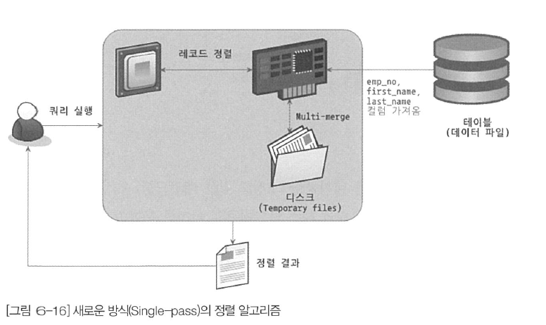

#### 9.2.3.2.2 투 패스 정렬 방식
- 정렬 대상 컬럼과 PK 만 소트버퍼에 담아서 정렬을 수행.
- 정렬된 순서대로 다시 PK로 테이블을 읽어서 SELECT할 컴럼을 가져옴.
- 레코드의 크기가 ``max_length_for_sort_data```보다 크거나 BLOB이난 TEXT 타입의 컬럼이 포함된 경우.

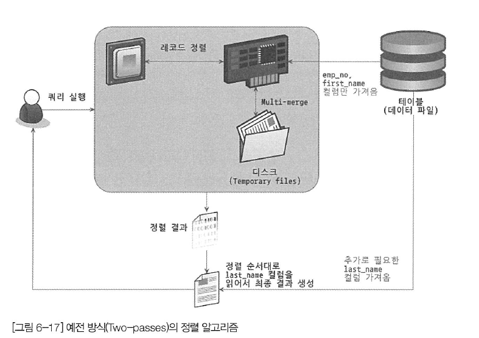


#### 9.2.3.3 정렬 처리 방법

#### 9.2.3.3.1 인덱스를 이용한 정렬
- ORDER BY에 명시된 컬럼이 제일 먼저 읽는 테이블(조인이 사용된 경우 드라이빙 테이블)에 속해야함.
- ORDER BY 순서대로 생성된 인덱스가 있어야함
- WHERE절에 첫 번째로 읽는 테이블의 컬럼에 대한 조건이 있다면, 그 조건과 ORDER BY는 같은 인덱스를 사용할 수 있어야함
- B-Tree 계열의 인덱스만 사용 가능 (R-Tree 예외)
- 여러 테이블이 조인되는 경우, Nested-loop 방식에서만 사용 가능.

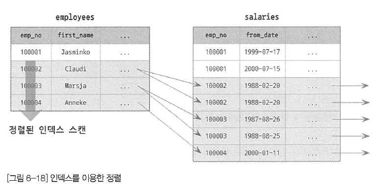


#### 9.2.3.3.2 조인의 드라이빙 테이블만 정렬
- 조인이 수행되면 레코드 건수와 크기가 늘어남 => 조인 전 첫 번째 테이블의 레코드를 정렬하고 조인을 실행.
- 드라이빙 테이블의 칼럼만으로 ORDER BY를 수행해야함.

#### ex. 9.2.3
```
SELECT * FROM employees e, salaries s
WHERE s.emp_no=e.emp_no
  AND e.emp_no BETWEEN 100002 ABD 100010
ORDER BY e.last_name;
```

1. 인덱스를 이용해 "emp_no BETWEEN 100001 AND 100010" 조건을 만족하는 9건을 검색
2. 검색 결과를 last_name 칼럼으로 정렬을 수행(Filesort)
3. 정렬된 결과를 순서대로 읽으면서 salaries 테이블과 조인을 수행해서 86건의 최종 결과를 가져옴(아래 그림의 오른쪽에 번호는 레코드가 조인되어 출력되는 순서를 의미).

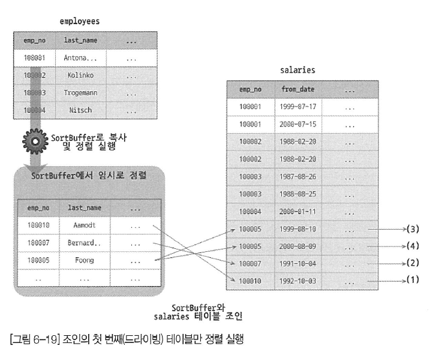

#### 9.2.3.3.3 임시 테이블을 이용한 정렬

- 조인의 결과가 임시 테이블에 저장되고, 그 결과를 다시 정렬.
- 정렬할 레코드 건수가 가장 많기 때문에 느림.
- 드리븐 테이블의 컬럼으로 인한 정렬.

#### ex. 9.2.4
```
SELECT * FROM employees e, salaries s
WHERE s.emp_no=e.emp_no AND e.emp_no BETWEEN 100002 AND 100010
ORDER BY s.salary;
```
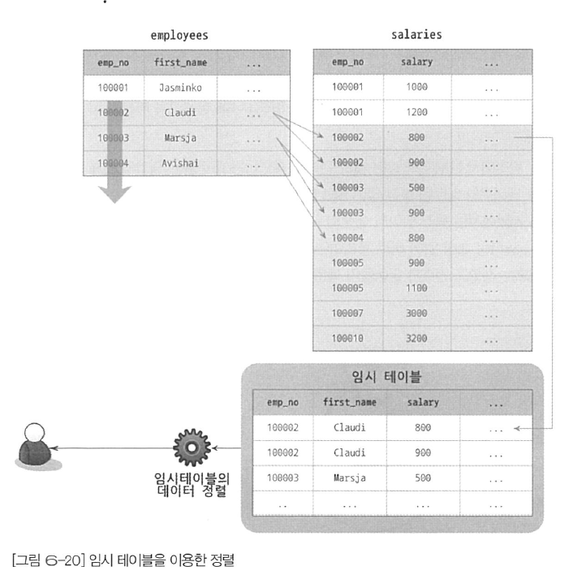

#### 9.2.3.3.4 정렬 처리 방법의 성능 비교

- LIMIT는 ORDER BY / GROUP BY 이후에 적용하므로 정렬의 성능을 높일 수 없음
- ORDER BY / GROUP BY는 쿼리가 느려지는 주요 원인.

#### 9.2.3.3.4.1 스트리밍 방식

- 서버 쪽에서 처리할 데이터가 얼마인지에 관계없이 조건에 일치하는 레코드가 검색될 때마다 바로바로 클라이언트로 전송.
- 클라이언트는 쿼리를 요청하고 곧바로 첫 번째 레코드를 전달 받음. (빠른 응답시간)
- 클라이언트는 곧바로 데이터 가공을 시작할 수 있음.
- 정렬 처리 방법 인덱스를 이용한 정렬 뿐만 스트리밍 방식으로 동작 가능.

#### 9.2.3.3.4.2 버퍼링 방식
- ORDER BY / GROUP BY 같은 처리는 스트리밍 처리를 불가능하게 만듬.
- 클라이언트는 레코드를 검색하고 정렬한 후에 데이터를 받을 수 있음.

#### ex. 9.2.5
- JOIN / ORDER BY / LIMIT이 함께 사용된 경우

```
SELECT *
FROM tb_test t1, tb_test2 t2
WHERE t1.col1=t2.col1
ORDER BY t1.col2
LIMIT 10;
```

- tb_test1이 드라이빙되는 경우
  
| 정렬 방식                | 읽어야 할 건수                        | 조인 횟수                                           | 정렬해야 할 대상 건수                                |
|--------------------------|---------------------------------------|-----------------------------------------------------|------------------------------------------------------|
| 인덱스 사용              | tb_test1 : 1건 <br> tb_test2 : 10건        | 1번                                                 | 0건                                                  |
| 드라이빙 테이블만        | 정렬 tb_test1 : 100건 <br> tb_test2 : 10건 | 10번                                                | 100건 <br> (tb_test1 테이블의 레코드 건수만큼 정렬 필요)  |
| 임시 테이블 사용 후 정렬 | tb_test1 : 100건 <br> tb_test2 : 1000건    | 100번 <br> (tb_test1 테이블의 레코드 건수만큼 조인 발생) | 1,000건 <br> (조인된 결과 레코드 건수를 전부 정렬해야 함) |

- tb_test2가 드라이빙되는 경우

| 정렬 방식                    | 읽어야 할 건수                     | 조인 횟수                                             | 정렬해야 할 대상 건수                                 |
|------------------------------|------------------------------------|-------------------------------------------------------|-------------------------------------------------------|
| 인덱스 사용                  | tb_test2 : 10건 <br> tb_test1 : 10건    | 10번                                                  | 0건                                                   |
| 드라이빙 테이블만 정렬       | tb_test2 : 1000건 <br> tb_test1 : 10건  | 10번                                                  | 1,000건 <br> (tb_test2 테이블의 레코드 건수만큼 정렬 필요) |
| 임시 테이블을 사용한 후 정렬 | tb_test2 : 1000건 <br> tb_test1 : 100건 | 1,000번 <br> (tb_test2 테이블의 레코드 건수만큼 조인 발생) | 1000건 <br> (조인된 결과 레코드 건수 를 전부 정렬해야 함)  |

#### 9.2.3.4 정렬 관련 상태 변수

```
mysql> FLUSH STATUS;
mysql> SHOW STATUS LIKE 'Sort%';
```
|variable_name|Value|Meaning|
|-------------|-----|-------|
|Sort_merge_passes|13|멀티 머지 처리 횟수|
|Sort_range|0|인덱스 레인지 스캔을 통한 검색된 결과에 대한 정렬 작업 횟수.|
|Sort_scan|1|풀 테이블 스캔을 통해 검색된 결과에 대한  정렬 작업 횟수.|
|Sort_rows|30024|지금까지 정렬한 전체 레코드 건수.|

### 9.2.4 GROUP BY 처리
GROUP BY에 사용된 조건은 인덱스를 사용한 처리 불가. => HAVING 절 튜닝은 무의미함.

#### 9.2.4.1 인덱스 스캔을 이용하는 GROUP BY (타이트 인덱스 스캔)
- 조인의 드라이빙 테이블에 속한 칼럼만 이용해 GROUP BY 칼럼으로 이미 인덱스가 있다면 그 인덱스를 차례로 읽으면서 그루핑 작업 수행.
- 정렬된 인덱스를 읽는 것이므로 추가적이니 정렬 작업과 내부 임시 테이블 필요 x.
- 쿼리 실행 계획의 Extra 컬럼에 ```Using index for group-by```/```Using temporary, Using filesort``` 표시 X.

#### 9.2.4.2 루스 인덱스 스캔을 이용하는 GROUP BY
- 인덱스의 레코드를 건너뛰면서 필요한 부분만 읽어서 가져오는 방식.
- 쿼리 실행 계획의 Extra 컬럼에 ```Using index for group-by``` 표시

#### ex. 9.2.6

- Salaries 테이블의 인덱스: (emp_no, from_date)
- 실행 순서
  1. (emp_no, from_date) 인덱스에서 emp_no의 첫번째 그룹키를 검색
  2. (emp_no, from_date) 인덱스에서 from_date가 WHERE 조건에 맞는 것만 검색. (emp_no = {group key} AND from_date = {from_date} 검색과 유사)
  3. (emp_no, from_date) 인덱스에서 다음 그룹키를 검색하여 반복
```
mysql> EXPLAIN
    SELECT emp_no
    FROM salaries
    WHERE from_date='1985-03-01'
    GROUP BY emp_no
```

- 인덱스의 유니크한 값의 수가 적을수록 성능 향상.
- 별도의 임시 테이블 X

#### 9.2.4.3. 임시 테이블을 사용하는 GROUP BY
- 인덱스를 전혀 사용하지 못하는 경우

#### ex. 9.2.7
- 묵시적 정렬 수행 X
- 쿼리 실행 계획의 Extra 컬럼에 ```Using temporary``` 표시
```
mysql> EXPLAIN
    SELECT e.last_name, AVG(s.salary)
    FROM employees e, salaries s
    WHERE s.emp_no=e.emp_no
    GROUP BY e.last_name;
```
#### ex. 9.2.8
- 쿼리 실행 계획의 Extra 컬럼에 ```Using temporary; Using filesort``` 표시
```
mysql> EXPLAIN
    SELECT e.last_name, AVG(s.salary)
    FROM employees e, salaries s
    WHERE s.emp_no=e.emp_no
    GROUP BY e.last_name
    ORDER BY e.last_name;
```

### 9.2.5 DISTINCT 처리

#### 9.2.5.1 SELECT DISTINCT
- 단순 SELECT에서는 GROUP BY와 동일하게 처리.
- 아래 두 쿼리는 동일한 동작 수행
```
mysql> SELECT DISTINCT emp_no FROM salaries;
mysql> SELECT emp_no FROM salaries GROUP BY emp_no;
```
- DISTINCT는 SELECT하는 레코드를 유니크하게함.
- 아래 예시에서 (first_name, last_name) 조합이 유니크.
- (1)과 (2)는 동일하게 동작
```
mysql> SELECT DISTINCT first_name, last_name FROM employees; // (1)
mysql> SELECT DISTINCT (first_name), last_name FROM employees; // (2)
```

#### 9.2.5.2 집합 함수와 함께 사용된 DISTINCT
- 집합 함수 내에서 사용돈 DISTINCT는 집합 함수의 인자로 전달된 컬럼값이 유니크한 것들을 가져옴
- ```COUNT(DISTINCT s.salary)``` 를 처리하기 위해 임시테이블 이용
```
mysql> SELECT COUNT(DISTINCT s.salary)
    FROM employees e, salaries s
    WHERE e.emp_no=s.emp_no
    AND e.emp_no BETWEEN 10001 AND 100100;
```
- ```COUNT()``` 를 처리하기 위해 두개의 임시테이블 이용
```
mysql> SELECT COUNT(DISTINCT s.salary)
        COUNT(DISTINCT e.last_name)
    FROM employees e, salaries s
    WHERE e.emp_no=s.emp_no
    AND e.emp_no BETWEEN 10001 AND 100100;
```
- 인덱스된 칼럼을 처리할 때는 임시테이블 생성 X
```
mysql> SELECT COUNT(DISTINCT emp_no) FROM employees;
```

### 9.2.6 내부 임시 테이블 활용
- MySQL 엔진이 스토리지 엔진으로부터 받아온 레코드를 정렬/그루핑할 때는 내부적인 임시테이블 이용.
- ```CREATE TEMPORARY TABLE```명령으로 생성한 테이블과는 다르게 동작. (쿼리 종료 후 삭제)
- 임시 테이블은 메모리에 생성했다가 크기가 커지면 디스크로 이동.

#### 9.2.6.1 메모리 임시 테이블과 디스크 임시 테이블
- 메모리 임시테이블 
  - MEMORY 스토리지 엔진 => TempTable 스토리지 엔진 변경
  - VARBINARY/VARCHAR와 같은 갈변길이 타입 지원
- 디스크 임시테이블
  - MyISAM 스토리지 엔진 => InnoDB 스토리지 엔진 변경
  - 트랜잭션 지원.

- temptable_max_ram으로 메모리 공간 제한 지정 (default 1GB)
- 메모리 공간 제한을 넘어가면 임시 테이블을 디스크에 기록.
- MMAP파일로 기록 / InnoDB 테이블로 기록 (temptable_use_mmap 변수로 설정. default ON)
- 메모리 임시 테이블을 MMAP 파일로 전환하는 것이 InnoDB 테이블로 전환하는 것보다 오버헤드 적음.
- 처음부터 디스크에 내부 임시테이블을 생성하는 경우는 InnoDB가 디폴트 (internal_tmp_disk_storage_engine 변수로 설정)

#### 9.2.6.2 임시 테이블이 필요한 쿼리
1. ORDER BY와 GROUP BY에 명시된 컬럼이 다른 쿼리
2. ORDER BY나 GROUP BY에 명시된 컬럼이 조인의  순서상 첫 번째 테이블이 아닌 쿼리
3. DISTINCT나 ORDER BY가 동시에 쿼리에 존재하는 경우 또는 DISTINCT가 인덱스로 처리되지 못하는 쿼리
4. UNION이나 UNION DISTINCT가 사용된 쿼리
5. 쿼리의 실행 계획에서 select_type이 DERIVED인 쿼리

- 3~5번 쿼리는 ```Using temporary```가 표시되지 않음에도 내부임시테이블 생성.
- 1~4번 쿼리는 유니크 인덱스를 가지는 내부임시테이블 생성.
- 유니크 인덱스가 없는 임시테이블은 일반적으로 처리속도가 상당히 느림.

#### 9.2.6.3 임시 테이블이 디스크에 생성되는 경우
- UNION이나 UNION ALL에서 SELECT되는 칼럼 중에서 길이가 512바이트 이상의 컬럼이 있는 경우.
- GROUP BY나 DISTINCT 칼럼에서 512바이트 이상인 크기의 컬럼이 있는 경우.
- 메모리 임시 테이블의 크기가 temptable_max_ram보다 큰 경우.

#### 9.2.6.4 임시 테이블 관련 상태 변수

```
mysql> FLUSH STATUS;

mysql> SELECT first_name, last_name
    FROM employees
    GROUP BY first_name, last_name;

mysql> SHOW SESSION STATUS LIKE 'Created_tmp%';
```
|variable_name|Value|Meaning|
|-------------|-----|-------|
|Created_tmp_tables|1|쿼리의 처리를 위해 만들어진 내부 임시 테이블의 개수를 누적. 메모리/디스크 구분 X|
|Created_tmp_disk_tables|1|디스크에 만들어진 임시테이블의 개수를 누적|

## 9.3 고급 최적화

서버의 옵티마이저가 실행계획을 수립할 때 통계 정보와 옵티마이저 옵션을 결합
옵티마이저 옵션은 조인 관련 옵션과 옵티마이저 스위치로 구분
### 9.3.1 옵티마이저 스위치 옵션
- optimizer_switch 시스템 변수를 통해서 관리
- 각각의 옵션은 default/on/off중에 하나를 선택

#### Reference: https://dev.mysql.com/doc/refman/8.0/en/switchable-optimizations.html

#### 9.3.1.1 MRR과 배치 키 액세스 (mrr & batched_key_access)

- MRR (Mulit-Range Read)
  - Nested Loop Join에서 조인 처리는 MySQL 엔진이 처리하지만, 실제 레코드를 검색/읽는 부분은 스토리지 엔진이 담당.
  - 기존 스토리지 엔진에서는 최적화 수행 X
  - MySQL 서버는 조인 대상 테이블 중 하나로부터 레코드를 읽어서 조인 버퍼에 버퍼링.
  - 조인 버퍼에 레코드기 가득차면 MySQL 엔진은 버퍼링된 레코드를 스토리지 엔진에 한번에 요청.
  - 스토리지 엔진은 읽어야할 레코드 들을 정렬된 순서로 접근하여 데이터 페이지에 접근하는 횟수를 최소화.
  - 이러한 방식을 MRR이라하며, MRR을 통한 조인을 BKA (Batched Key Access) 조인이라고함.
  - BKA는 부가적인 정렬 작업을 하게되어 성능에 악영향을 미치기도 함 (default OFF)

#### 9.3.1.2 블록 네스티드 루프 조인 (block_nested_loop)


#### Nested loop join
- 조인 연결 조건이 되는 칼럼에 모두 인덱스가 걸려있는 경우.
- 중첩된 반복문을 도는 형태.

#### Block nested loop join
- 조인 과정에서 조인 버퍼를 사용. (join_buffer_size를 통해서 설정)
- 쿼리 실행 계획에서 ```Using Join buffer```문구 출력.
- 조인 과정에서 드리븐 테이블의 인덱스 풀 스캔/풀 테이블 스캔을 피할 수 없는 경우.
- 드라이빙 테이블에서 읽은 레코드를 메모리에 캐시. 이후 드리븐 테이블과 메모리 캐시를 조인.
- join_buffer_size 시스템 변수로 크기 제한.

#### ex. 9.3.1
```
myslq> SELECT *
    FROM dept_emp de, employees e
    WHERE de.from_date > '1995-01-01' AND e.emp_no < 109004;
```


#### 9.3.1.3 인덱스 컨디션 푸시다운(index_condition_pushdown)

```
SELECT * FROM employees WHERE last_name='Acton' AND first_name LIKE '%sal';
```
#### 인덱스 컨디션 푸시다운 OFF

- 인덱스 비교는 InnoDB 엔진 /  first_name 조건은 MySQL 엔진에서 검사.
- 기존에는 인덱스 범위 제한 조건이 아닌 경우는 모두 읽어옴.
- 쿼리 실행 계획에 ```Using where``` 문구 출력.

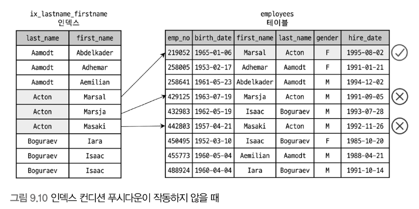


#### 인덱스 컨디션 푸시다운 OFF

- 인덱스에 포함된 칼럼 조건이 있다면, 스토리지 엔진으로 모아서 전달하도록 API 개선.
- 불필요한 정보는 필터링해서 테이블 읽기를 수행.
- 쿼리 실행 계획에 ```Using index condition``` 문구 출력.
  
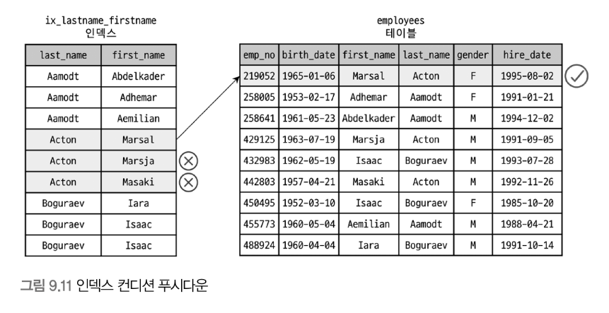

#### 9.3.1.4 인덱스 확장(use_index_extentions)
- InnoDB 스토리지 엔진을 사용하는 테이블에서 세컨더리 인덱스에 자동으로 추가된 프라이머리 키를 활용할지 결정.
- InnoDB 스토리지 엔진의 모든 세컨더리 인덱스는 프라이머리 키 값을 가짐.
- MySQL 최신 버전에서는 인덱스에 프라이머리 키가 포함되어 있는 것을 인지하고 실행 계획 수립.

#### ex. 9.3.2
- 아래 테이블 생성시 (from_date, dep_no, emp_no) 조합의 인덱스가 생성된 것처럼 동작.
```
CREATE TABLE dept_emp (
	emp_no INT NOT NULL,
    dept_no INT NOT NULL,
    from_date date NOT NULL,
    to_date date NOT NULL,
    PRIMARY KEY (dept_no, emp_no),
    KEY ix_fromdate (from_date)
) ENGINE=InnoDB;
```

#### 9.3.1.5 인덱스 머지(index_merge)

- 일반적으로 하나의 where문에 여러개의 인덱스를 사용할 수 있더라도 하나의 인덱스만 사용.
- 나머지 조건은 레코드를 읽어온 후 체크.
- 쿼리에 사용된 각 조건이 다른 인덱스를 사용하고, 그 조건을 만족하는 조건이 많은 경우 인덱스 머지를 실행계획 선택.

#### 9.3.1.6 인덱스 머지 - 교집합(index_merge_intersection)

```
mysql> SELECT COUNT(*) FROM employees
    WHERE first_name='Georgi' AND emp_no BETWEEN 10000 AND 20000;
```

- 인덱스의 교집합만 반환.
- 쿼리 실행 계획에 ```Using intersect```구문 출력

#### 9.3.1.7 인덱스 머지 - 합집합(index_merge_union)

- WHERE 절에 사용된 조건들이 OR 연산자로 연결된 경우에 사용.
- 쿼리 실행 계획에 ```Using union```구문 출력.

#### Union 알고리즘 (Priority queue)
- 각각의 조건에 대해 Primary key로 정렬된 결과 검색.
- 두개의 검색 결과에서 순차적으로 하나씩 가져오면서 비교하여 중복 제거.

#### 9.3.1.8 인덱스 머지 - 정렬 후 합집합(index_merge_sort_union)

- 인덱스 머지 작업 중 별도의 정렬이 필요한 경우.
- 쿼리 실행 계획에 ```Using sort_union```구문 출력.
- 다음 쿼리에서 BETWEEN 구문의 검색 결과는 프라이머리 키로 정렬되어있지 않음.
```
mysql> SELECT * FROM employees 
    WHERE first_name='Matt'
    OR hire_date BETWEEN '1987-03-01' and '1987-03-31'
```

#### 9.3.1.9 세미 조인(semijoin)

- 다른 테이블과 실제 조인을 수행하지 않고, 일치하는 조건의 레코드가 있는지만 검사.

- 세미 조인 형태
  - ```= (subquery)```
  - ```IN (subquery)```
- 세미 조인 최적화 방법
  - 세미 조인 최적화
  - IN-to-EXISTES 최적화
  - MATERIALIZATION 최적화
- 안티 세미 조인 형태
  - ```<> (subquery)```
  - ```NOT IN (subquery)```
- 안티 세미 조인 최적화 방법
  - IN-to-EXISTES 최적화
  - MATERIALIZATION 최적화

- 세미 조인 최적화 전략
  - Table Pull-out
  - Duplicate Weed-out
  - First Match
  - Loose Scan
  - Materialization

#### 9.3.1.10 테이블 풀-아웃(Table Pull0out)

```
mysql> SELECT * FROM exmployees e
    WHERE e.emp_no IN (
        SELECT de.emp_no 
        FROM dept_emp de 
        WHERE de.dept_no='d009'
    );
```

동작 방식
- 세미 조인의 서브쿼리에 사용된 테이블을 아우터 쿼리로 끄집어냄.
- 끄집에낸 아우터 쿼리를 조인 쿼리로 재작성

제한 사항/특성
- 세미 조인 서브쿼리에서만 사용 가능.
- 서브쿼리 부분이 UNIQUE 인덱스나 프라이머리 키 룩업으로 결과가 1건인 경우 사용 가능.
- Table pullout이 적용 되어도, 기존 쿼리에서 가능했던 최적화 방법 사용 가능.
- 서브쿼리의 모든 테이블이 아우터 쿼리로 끄집어내진다면 서브쿼리 자체는 없어짐.
- 서브쿼리를 조인으로 풀어서 사용하는 Tunning을할 필요 없음. (알아서 해줌)

#### 9.3.1.11 퍼스트 매치(firstmatch)
```
SELECT *
    FROM employees e 
    WHERE e.first_name='Matt'
    AND e.emp_no IN (
        SELECT t.emp_no FROM titles t
        WHERE t.from_date BETWEEN '1955-010-01' AND '1955-01-30'
    );
```
- employees 테이블의 레코드에 대해 titles 테이블에 일치하는 레코드 1건만 찾으면 더이상 titles 테이블 검색 X
- ```IN (subquery)``` 형태의 세미 조인을 ```EXISTS (subquery)``` 형태로 튜닝한 것과 비슷하게 실행.

제한 사항/특성
- FirstMatch 최적화에서 서브쿼리는 그 서브쿼리가 참조하는 모든 아우터 테이블을 먼저 조회된 이후에 실행.
- 쿼리 실행 계획에  ```FristMatch(table-N)```문구 출력.
- 상관 서브쿼리(Correlated subquery)에서도 사용.
- GROUP BY나 집합 함수가 사용된 서브쿼리으 최적화에는 사용 X

#### 9.3.1.12 루스 스캔(loosecan)
```
mysql> SELECT * 
    FROM departments d 
    WHERE d.dept_no IN (
        SELECT de.dept_no FROM dept_emp de
    );
```
- dept_emp 테이블의 프라이머리 키를 루스 인덱스 스캔으로 유니크한 dept_no만 읽음.
- 쿼리 실행 계획에  ```LooseScan```문구 출력.
- 내부는 동작은 조인으로 처리.

특성
- 루스 인덱스 스캔으로 서브쿼리 테이블을 읽고, 아우터 테이블을 드리븐으로 사용하여 조인.
- 서브 쿼리 부분이 루스 인덱스 스캔을 사용할 조건이 갖춰져야함. (아래와 같은 형태)
```
SELECT ... FROM ... WHERE expr IN (SELECT keypart1 FROM tab WHERE ...)
SELECT ... FROM ... WHERE expr IN (SELECT keypart2 FROM tab WHERE keypart1={constant} ...)
```

#### 9.3.1.13 구체화(Materialization)
```
mysql> SELECT *
    FROM employees e
    WHERE e.emp_no IN (
        SELECT de.emp_no FROM dept_emp de
        WHERE de.from_date='1995-01-1'
    );
```
- employees에 대한 조건이 subquery 외에는 없음.
- 세미 조인에 사용된 서브쿼리를 통째로 구체화해서 쿼리를 최적화.
- 서브쿼리 내에 GROUP BY가 있어도 사용 가능한 전략.
- 실행 계획의 select_type에 ```MATERIALIZED``` 노출

제약 사항/특성
- ```IN(subquery)```에서 서브쿼리는 상관 서브쿼리(Correlated subquery)가 아니어야함.
- 서브쿼리에 GROUP BY나 집합함수를 사용돼도 구체화 사용 가능.
- 내부 임시 테이블을 생성.

#### 9.3.1.14 중복 제거(Duplicated Weed-out)
```
mysql> SELECT * 
    FROM exployees e
    WHERE e.emp_no IN (
        SELECT s.emp_no 
        FROM salaries s 
        WHERE s.salary > 150000
    );
```
- 세미 조인 서브쿼리를 일반적인 INNER JOIN 쿼리로 바꿔서 실행 후, 마지막에 중복 레코드를 제거
- 실행 계획의 Extra 칼럼에 ```Start temporary```와 ```End temporary``` 출력 (처리 중 임시테이블 생성)
- 실제 내부 동작은 아래 GROUP BY로 실행하는 것과 같이 동작

```
mysql> SELECT e.*
    FROM employees e, salaries s
    WHERE e.emp_no=s.emp_no AND s.salary > 150000
    GROUP BY e.emp_no;
```

제약 사항/ 특성
- 서브쿼리가 상관 서브쿼리여도 사용 가능.
- 서브쿼리에 GROUP BY나 집합함수를 사용하는 경우에는 사용 불가.
- 서브쿼리의 테이블을 조인으로 처리하기 때문에 최적화할 수 있는 방법이 많음.

#### 9.3.1.15 컨디셔녀 팬아웃(condition_fanout_filter)
- 쿼리 실행을 수립하는 과정에서 검색한 레코드 중 얼마나 걸러질 지 예측. (쿼리 실행 계획의 filtered 컬럼)
- WHERE절에 사용한 컬럼의 인덱스 / 히스토그램으로부터 예측.
- 더 빠른 실행계획을 만들어낼 수 있으나, 실행 계획 수립에 추가 오버헤드 발생.

#### 옵티마이저의 예측
1. 레인지 옵티마이저를 통한 예측
2. 히스토그램을 이용한 예측
3. 인덱스 통계를 이용한 예측
4. 추측에 기반한 예측(Guesstimates)

#### 9.3.1.16 파생 테이블 머지(derived_merge)
```
mysql> SELECT  * 
    FROM (
        SELECT * FROM employees 
        WHERE first_name='Matt'
    ) derived_table
    WHERE derived_table.hire_date='1986-04-03';
```
- 내부적으로 임시테이블 생성
- first_name='Matt'인 레코드만 읽어서 임시테이블에 INSERT.
- 임시테이블을 다시 읽어서 hire_date='1986-04-03'인 레코드만 걸러서 반환.
- 임시테이블은 메모리에 생성되었다가, 크기가 커지면 디스크로 이동.
- 쿼리 실행 계획에 DERIVED select_type 라인이 생성.
  
#### 파생 테이블 머지
- 옵티마이저가 서브 쿼리를 외부 쿼리로 병합하여 임시테이블 생성 X
- 병합할 수 없는 경우
  - SUM / MIN / MAX와 같은 집계함수 혹은 윈도우 함수가 사용된 서브쿼리
  - DISTINCT가 사용된 서브쿼리
  - GROUP BY나 HAVING이 사용된 서브쿼리
  - LIMIT이 사용된 서브쿼리
  - UNION / UNION ALL을 포함하는 서브쿼리
  - SELECT 절에 사용된 서브쿼리
  - 값이 변경되는 사용자 변수가 사용된 서브쿼리

#### 9.3.1.17 인비저블 인덱스 (use_invisible_indexes)
- 8.0버전 부터는 인덱스의 가용상태 제어 기능 추가. (VISIBLE / INVISIBLE)
- use_invisible_indexes 옵션을 통해 옵티마이저가 INVISIBLE 상태의 인덱스도 사용 가능

#### 9.3.1.18 스킵 스캔(skip_scan)
```
인덱스 (gender, birth_date)

mysql> SELECT * FROM employees WHERE birth_date >= '1965-02-01';
```
- 선행 인덱스가 조건절에 포함되어 있지 않더라도 인덱스 사용 가능.
- 조건절에 포함되지 않은 인덱스가 소수의 유니크한 값을 가질 때만 실행

#### 9.3.1.19 해시 조인(hash_join)
- A 시점 : 쿼리가 실행된 후, 첫 번째 레코드를 찾아낸 시점(수직적 탐색이 완료된 시점이 되겠다.)
- B 시점 : A시점 이후 마지막 레코드를 찾아낸 시점을 의미한다.

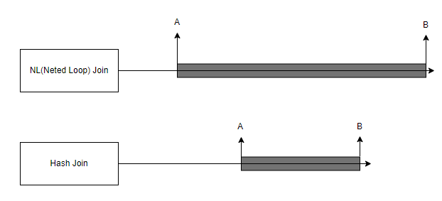

- NL 조인과 해시 조인은 같은 시점에 시작했지만, 해시조인이 먼저 끝남.
- 하지만 첫 번째 레코드를 찾아낸 시점, 즉 수직적 탐색이 완료된 시점은 해시 조인이 더 느리다는 것이다.
- 해시 조인을 사용한 쿼리는 최고 스루풋 전략에 적합하며, NL조인은 최고 응답 속도 전략에 적합.

#### 해시 조인의 사용
- 해시 조인은 NL 조인의 차선책 (조인 컬럼의 인덱스 X / 조인 새상 테이블 중 일부의 레코드가 매우 적음)
- 8.0.20 버전부터는 블락 네스티드 루프 조인을 사용하는 경우를 해시 조인으로 대체

#### ex. 9.3.3
- NL조인을 사용하지 못하도록 IGNORE INDEX 힌트를 사용하여 해시 조인을 사용.
```
SELECT *
FROM employees e IGNORE INDEX(PRIMARY, ix_hiredate)
INNER JOIN dept_emp de IGNORE INDEX(ix_empno_fromdate, ix_fromdate)
ON de.emp_no=e.emp_no AND de.from_date=e.hire_date;
```
#### 해시 조인의 동작
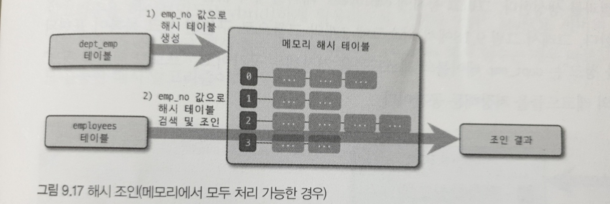
- 빌드 단계
  - 조인 대상 테이블 중 레코드가 적어서 해시 테이블로 만들기 용이한 테이블을 골라서 메모리에 해시 테이블을 생성(빌드)하는 작업
  - 빌드 테이블: 빌드 단계에서 해시테이블을 만들기 위해 사용되는 원본 테이블
- 프로브 단계
  - 빌드테이블이 아닌 나머지 테이블의 레코드를 읽어 해시 테이블과 일치하는 레코드를 찾는 과정
  - 프로브 테이블: 나머지 테이블

해시테이블을 메모리에 저장할 때 join_buffer_size 변수로 크기를 제어
- 클래식 해시 조인
  - 빌드 테이블과 프로브 테이블이 하나의 메모리에서 처리
- 그레이스 해시 조인
  - 빌드 테이블 / 프로브 테이블이 조인 버퍼 제한을 넘어가는 경우
  - 빌드 테이블 / 프로브 테이블이 청크로 분리되어 디스크에 저장
  - 각각의 청크를 메모리에 올려서 해시 조인을 실행

 #### 9.3.1.20 인덱스 정렬 선호(prefer_ordering_index)
 ```
mysql> SELECT *
    FROM employees
    WHERE hire_date BETWEEN '1985-01-01' AND '1985-02-01'
    ORDER BY emp_no;
 ```
 - 위의 쿼리는 두 방법중 하나의 실행계획 선택
   1. in_hiredate 인덱스를 이용해 hire_date BETWEEN '1985-01-01' AND '1985-02-01' 조건의 레코드를 찾은 다음 emp_no로 정렬.
   2. employees 테이블의 프라이머리 키인 emp_no를 순방향으로 읽으면서 hire_date 칼럼의 조건을 비교.
 - ORDER BY / GROUP BY를 인덱스를 사용해 처리 가능한 경우 쿼리 실행 계획에서 인덱스의 가중치를 높게 설정.
 - 레코드 건수가 많지 않음에도 2번을 선택하는 경우가 존재. 이때 prefer_ordering_index 옵티마이저 옵션을 off로 설정.

### 9.3.2 조인 최적화 알고리즘
```
myslq> SELECT *
    FROM t1, t2, t3, t4
    WHERE ...
```
#### 9.3.2.1 Exhaustive 검색 알고리즘
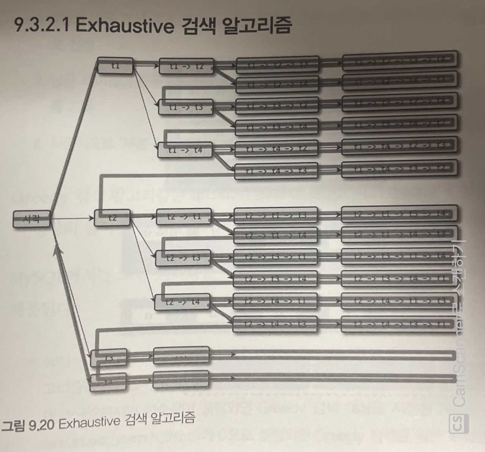
- 테이블 개수 N에 대해 N!만큼의 조합이 생성됨.
- 테이블의 개수가 많아질 때 매우 느려짐. 

#### 9.3.2.2 Greedy 검색 알고리즘
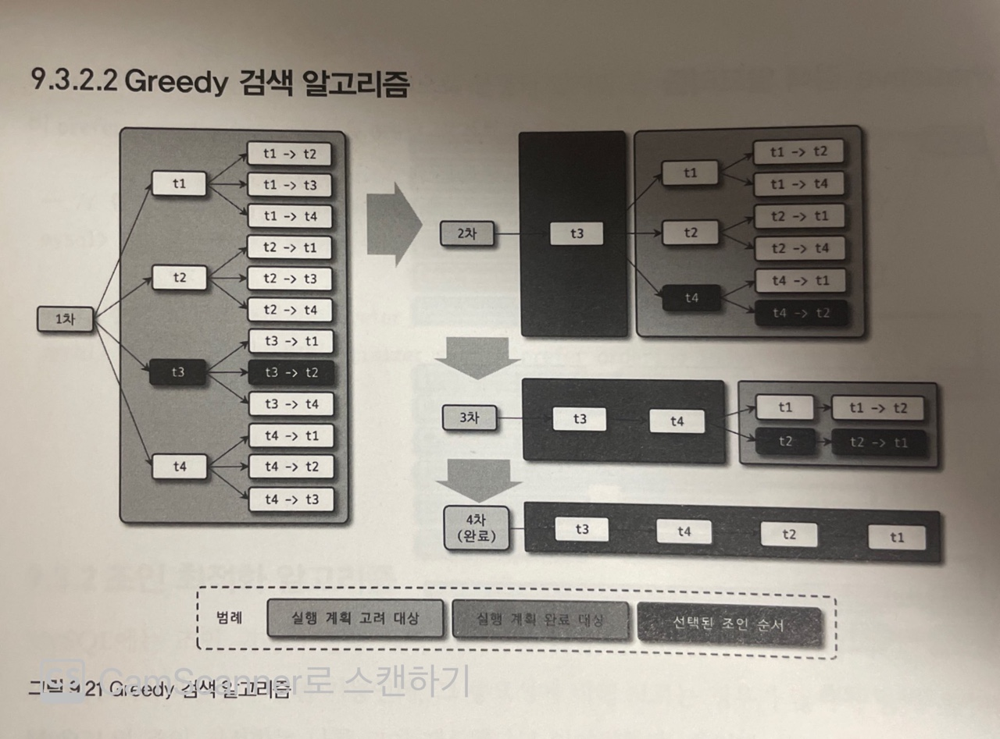
1. 전체 N개의 테이블 중 optimizer_search_depth 시스템 설정변수에 정의된 개수의 테이블로 가능한 조인 조합 생성.
2. 1번에서 생성된 조인 조합 중에서 최소 비용의 실행 계획 하나를 선정
3. 2번에서 선정된 실행 계획의 첫 번째 테이블을 부분 실행 계획의 첫 번쨰 테이블로 선정
4. 전체 N-1개의 테이블 중 optimizer_search_depth 시스템 설정 변수에 정의된 개수의 테이블로 가능한 조인 조합을 생성
5. 4번에서 생성된 조인 조합들을 하나씩 3번에서 생성된 부분 실행 계획에 대입해 실행 비용을 계산
6. 5번의 비용 계산 결과 최적의 실행 계획에서 두 번째 테이블을 3번에서 생성된 부분 실행 계획의 두 번째 테이블로 선정
7. 남은 테이블이 모두 없어질 때까지 4~6번 과정을 반복 실행하면서 부분 실행 계획에 테이블 조인 순서 기록
8. 최종적으로 부분 실행 계획이 테이블의 조인 순서로 결정

- optimizer_search_dept
  - Greedy 알고리즘과 Exhaustive 알고리즘 중 어떤 알고리즘을 사용할지 결정하는 변수.
  - 설정 값과 조인할 테이블 개수에 따라 알고리즘을 선택.
  - 기본값은 62. 0이면 항상 Greedy 알고리즘 선택.
  - optimizer_prune_level이 0으로 설정된 경우에는 4~5가 적당함.

- optimizer_prune_level
  - Heuristic 검색의 작동방식을 제어
  - Heuristic 검색은 조인 비용 계산도중 기존 비용보다 큰 경우에는 언제든지 포기.
  - 1으로 지정하면 Heuristic 검색을 지원 0이면 Heuristic을 적용 X.
  - 웬만하면 1로 지정하자.

## 9.4 쿼리 힌트
### 9.4.1 인덱스 힌트
- MySQL 서버에 옵티마이저 힌트가 도입되기 전에 사용하여 ANSI-SQL 표준 문법을 준수 X
- SELECT / UPDATE 명령에서만 사용 가능

#### 9.4.1.1 STRAIGHT_JOIN
```
mysql> SELECT STRAIGHT_JOIN
    e.first_name, e.last_name, d.dept_name
    FROM employees e, dept_emp de, departments d
    WHERE e.emp_no = de.emp_no
    AND d.dept_no=de.dept_no;

mysql> SELECT /*! STRAIGHT_JOIN */
    e.first_name, e.last_name, d.dept_name
    FROM employees e, dept_emp de, departments d
    WHERE e.emp_no = de.emp_no
    AND d.dept_no=de.dept_no;
```
- 조인시 드라이빙 테이블과 드리븐 테이블의 결정은 옵티마이저가 결정.
- 조인 순서를 강제하고 싶을 때 사용.
- FROM 절에 명시된 순서로 조인을 수행.

사용 기준
- 임시 테이블과 일반 테이블의 조인
  - 일반적으로 임시 테이블을 드라이빙 테이블로 선정
  - 대부분 옵티마이저가 적절한 조인 순서를 선택.
  - 옵티마이저가 실행 계획을 제대로 수립하지 못하여 성능저하가 발생하는 경우 사용.
- 임시 테이블끼리 조인
  - 임시 테이블은 항상 인덱스가 없음.
  - 크기가 작은 테이블을 드라이빙으로 선택.
- 일반 테이블끼리 조인
  - 한쪽 테이블의 조인컬럼에만 인덱스가 있다면, 인덱스가 없는 쪽을 드라이빙으로 선택.
  - 레코드 건수가 적은 테이블을 드라이빙 테이블로 선택.

#### 9.4.1.2 USE INDEX / FORCE INDEX / IGNORE INDEX
- 특정 인덱스를 사용하도록 유도.
  
#### 종류
- USE INDEX: 옵티마이저에 인덱스를 사용하도록 유도
- FORCE INDEX: 옵티마이저에 인덱스를 사용하도록 강하게 유도 (보통 USE INDEX 사용)
- IGRNORE INDEX: 특정 인덱스를 사용하지 못함. 풀 테이블 스캔 유도.

#### 용도 명시
- USE INDEX FOR JOIN: 여기서 JOIN이라는 키워드는 테이블 간 조인 뿐아니라 레코드 검색까지를 의미.
- USE INDEX FOR ORDER BY: 명시된 인덱스를 ORDER BY 용도로만 사용하도록 제한.
- USE INDEX FOR GROUP BY: 명시된 인덱스를 ORDER BY 용도로만 사용하도록 제한.

### ex. 9.4.1
```
mysql> SELECT * FROM employees USE INDEX(primary) WHERE emp_no = 10001;
mysql> SELECT * FROM employees FORCE INDEX(primary) WHERE emp_no = 10001;
// 최근 버전에서는 무시
mysql> SELECT * FROM employees IGNORE INDEX(primary) WHERE emp_no = 10001; 
// 풀 테이블 스캔
mysql> SELECT * FROM employees USE INDEX(ix_firstname) WHERE emp_no = 10001;
```
- 안쓰는걸 권장.
- 통계정보가 변할 수 있음.
- 데이터와 모델을 간소화하고 쿼리를 간결하게 만들도록 해야함.

#### 9.4.1.3 SQL_CALC_FOUND_ROWS
```
// SQL_CALC_FOUND_ROWS 사용
mysql> SELECT SQL_CALC_FOUND_ROWS * FROM employees WHERE first_name="Georgi' LIMIT 0, 20;
// LIMIT을 제외한 조건을 만족하는 레코드가 전체 몇 건이었는 반환.
mysql> SELECT FOUND_ROWS() AS total_record_count;
```
- LIMIT 사용시 만족하는 만큼의 레코드를 찾아도 끝까지 검색 수행하도록 제어.
- 사용자의 편의를 위한 기능이며, 사용하지 않는 것을 권장 (느림)

### 9.4.2 옵티마이저 힌트

#### Reference: https://dev.mysql.com/doc/refman/8.0/en/optimizer-hints.html

#### 9.4.2.1 옵티마이저 힌트 종류
- 인덱스: 특정 인덱스의 이름을 사용.
- 테이블 특정 테이블의 이름을 사용.
- 쿼리 블록: 특정 쿼리 블록에 사용. 힌트가 명시된 쿼리 블록에 대해서만 영향을 미침.
- 글로벌: 전체 쿼리에 영향.

#### 9.4.4.2 MAX_EXECUTION_TIME
```
mysql> SELECT /*+ MAX_EXECUTION_TIME(100) */ *
    FROM employees
    ORDER BY last_name LIMIT 1;
```
- 밀리초 단위의 시간 설정.
- 지정된 시간을 초과하면 쿼리 실패.

#### 9.4.2.3 SET_VAR
```
mysql> SELECT /*+ SET_VAR(optimizer_switch='index_merge_intersection=off') */ *
    FROM employees
    WHERE first_name='Georgi' AND emp_no BETWEEN 10000 AND 20000;
```
- 시스템변수를 일시적으로 변경.
- 조인 버퍼나 소트 버퍼의 크기도 변경.
- 모든 시스템 변수를 변경하지는 못함.

#### 9.4.2.4 SEMIJOIN & NO_SEMIJOIN
- 세미 조인의 최적화 방법 선택
- 서브쿼리에 명시 혹은 외부쿼리에 명시하고 쿼리블록을 지정.

|최적화 전략        |힌트                     |
|------------------|-------------------------|
|Duplicate Weed-out|SEMIJOIN(DUPSWEEDOUT)    |
|First Match       |SEMIJOIN(FIRSTMATCH)     |
|Loose Scan        |SEMIJOIN(LOOSESCAN)      |
|Materialization   |SEMIJOIN(MATERIALIZATION)|
|Table Pull-out    |없음                     |

```
// 서브쿼리에 힌트 입력.
mysql> SELECT * 
    FROM departments d
    WHERE d.dept_no IN
        (SELECT /*+ SEMIJOIN(MATERIALIZATION) */ de.dept_no
        FROM dept_emp de);

// 쿼리블록을 이용한 힌트 입력.
mysql> SELECT /*+ SEMIJOIN(@subq1 MATERIALIZATION) */ * 
    FROM departments d
    WHERE d.dept_no IN
        (SELECT /*+ QB_NAME(subq1) */ de.dept_no
        FROM dept_emp de);

// 특정 최적화 이용하지 않도록 지정.
mysql> SELECT * 
    FROM departments d
    WHERE d.dept_no IN
        (SELECT /*+ NO_SEMIJOIN(DUPSWEEDOUT, FIRSTMATCH) */ de.dept_no
        FROM dept_emp de);
```

#### 9.4.2.5 SUBQUERY
- 세미조인 최적화를 사용하지 못할때 사용.
- 주로 안티 세미 조인 최적화에 사용.

|최적화 전략     |힌트                     |
|---------------|-------------------------|
|IN-to-EXISTS   |SUBQUERY(INTOEXISTS)     |
|Materialization|SUBQUERY(MATERIALIZATION)|

#### BNL & NO_BNL & HASHJOIN & NO_HASHJOIN
- 블록 네스티드 루프, 해시 조인을 유도
- 8.0.20 이후부터는 HASHJOIN / NO_HASHJOIN이 동작 안함. BNL 힌트를 사용하면 해시 조인 유도.

#### 9.4.2.8 JOIN_FIXED_ORDER & JOIN_ORDER & JOIN_PREFIX & JOIN_SUFIX

- JOIN_FIXED_ORDER: STRAIGTH_JOIN 힌트와 동일하게 FROM절의 테이블 순서대로 조인 실행.
- JOIN_ORDER: 힌트에 명시된 테이블의 순서대로 조인.
- JOIN_PREFIX: 조인에서 드라이빙 테이블만 강제.
- JOIN_SUFIX: 조인에서 드리븐 테이블만 강제.

```
mysql> SELECT /*+ JOIN_FIXED_ORDER() */ *
    FROM employees e
        INNER JOIN dept_emp de ON de.emp_no=e.emp_no
        INNER JOIN departments d ON d.dept_no=de.dept_no;

mysql> SELECT /*+ JOIN_ORDER(d, de) */ *
    FROM employees e
        INNER JOIN dept_emp de ON de.emp_no=e.emp_no
        INNER JOIN departments d ON d.dept_no=de.dept_no;
        
mysql> SELECT /*+ JOIN_PREFIX(e, de) */ *
    FROM employees e
        INNER JOIN dept_emp de ON de.emp_no=e.emp_no
        INNER JOIN departments d ON d.dept_no=de.dept_no;

mysql> SELECT /*+ JOIN_SUFIX(de, e) */ *
    FROM employees e
        INNER JOIN dept_emp de ON de.emp_no=e.emp_no
        INNER JOIN departments d ON d.dept_no=de.dept_no;
```

#### 9.4.2.8 MERGE & NO_MERGE
- 서브쿼리의 아우터 쿼리와의 병합을 제어

```
mysql> SELECT /*+ MERGE(sub)*/ *
    FROM (SELECT *
        FROM employees
        WHERE first_name'Matt'
    ) sub LIMIT 10;

mysql> SELECT /*+ NO_MERGE(sub)*/ *
    FROM (SELECT *
        FROM employees
        WHERE first_name'Matt'
    ) sub LIMIT 10;
```
#### 9.4.2.9 INDEX_MERGE & NO_INDEX_MERGE
- 하나의 쿼리에서 여러개의 인덱스를 사용하는 인덱스 머지를 제어
```
mysql> SELECT /*+ NO_INDEX_MERGE(employees PRIMARY) */ *
    FROM employees
    WHERE first_name='Georgi' AND emp_no BETWEEN 10000 AND 20000;

mysql> SELECT /*+ NO_INDEX_MERGE(employees PRIMARY) */ *
    FROM employees
    WHERE first_name='Georgi' AND emp_no BETWEEN 10000 AND 20000;
```

#### 9.4.2.10 NO_ICP
- 인덱스 컨디션 푸시다운을 제어하는 힌트.
```
mysql> SELECT /*+ NO_ICP(employees ix_lastname_firstname) */ *
    FROM employees
    WHERE last_name='Acton' AND first_name LIKE '%sal';
```

#### 9.4.2.11 SKIP_SCAN & NO_SKIP_SCAN
- 스킨 스캔을 제어

```
mysql> SELECT /*+ NO_SKIP_SCAN(employees ix_gender_birthday) */ * 
    FROM employees 
    WHERE birth_date >= '1965-02-01';
```

#### 9.4.2.12 INDEX & NO_INDEX
- 예전에 사용되던 인덱스 힌트를 대체
  
|인덱스 힌트               |옵티마이저 힌트|
|-------------------------|--------------|
|USE INDEX|INDEX          |              |
|USE INDEX FOR GROUP BY   |GROUP_INDEX   |
|USE INDEX FOR ORDER BY   |ORDER_INDEX   |
|IGNORE INDEX             |NO_INDEX      |
|IGNORE INDEX FOR GROUP BY|NO_GROUP_INDEX|
|IGNORE INDEX FOR ORDER BY|NO_ORDER_INDEX|